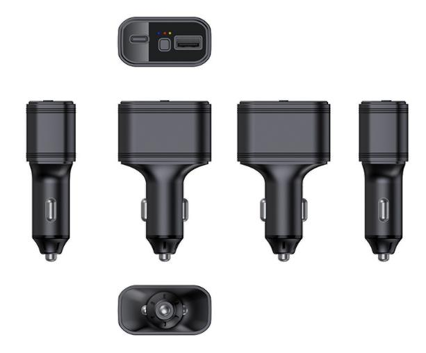

# GOTOP - G36

El G36 es un rastreador GPS compacto en formato de cargador para auto, diseñado para uso dentro del vehículo. Integra reportes continuos de ubicación con un cargador rápido USB dual, lo que permite enchufarlo a la toma de corriente del vehículo y ofrecer tanto funciones de carga como de rastreo. El posicionamiento se obtiene mediante GPS y BeiDou, y en entornos urbanos se complementa con WiFi y LBS; la conectividad celular incorporada transmite datos de ubicación y eventos a plataformas externas.

Como dispositivo compatible con Plaspy, el G36 suministra posiciones en tiempo real, eventos de alarma y el estado del equipo a la plataforma Plaspy para su representación en mapas, alertas, historial de rutas e informes. Esa combinación de carga a bordo y rastreo persistente hace del G36 una opción práctica para flotas, concesionarios y propietarios individuales que desean monitoreo básico antirobo y supervisión operativa integrada con los servicios de Plaspy.

## Características principales

- Dos puertos USB de carga rápida para mantener los dispositivos del conductor con energía mientras se realiza el seguimiento continuo del vehículo.
- Posicionamiento multimodal con GPS y BeiDou, complementado por WiFi y LBS para mejorar las fijaciones en áreas urbanas.
- Conjunto de alarmas configurable que incluye geocercas, corte de energía, batería baja, vibración y notificaciones por desconexión.
- Conectividad celular mediante Micro SIM para reporte en áreas amplias e integración con Plaspy.
- Pequeña batería de respaldo y antena integrada para cubrir cortes breves de la alimentación del vehículo.
- Factor de forma compacto tipo enchufe que combina la conveniencia de carga con capacidad telemétrica.

## Cómo funciona con Plaspy

Cuando se conecta en un vehículo, el G36 captura datos GNSS y los complementa con WiFi y LBS en zonas donde las señales GNSS son menos fiables. El dispositivo envía actualizaciones de ubicación y notificaciones de eventos a través de la red celular hacia Plaspy, que presenta ubicación en vivo, alertas, reproducción de trayectos e informes mediante su interfaz de monitoreo.

- Actualizaciones de ubicación en tiempo real y reproducción histórica de rutas disponibles en Plaspy para visibilidad y análisis.
- Eventos de geocerca enviados a Plaspy para activar alertas y acciones en flujos de trabajo para los operadores.
- Notificaciones de pérdida de energía y batería baja encaminadas a Plaspy para señalar posibles manipulaciones o necesidades de mantenimiento.
- Alarmas de vibración y desconexión reportadas a Plaspy para ayudar a detectar movimientos no autorizados o pérdida de conectividad.
- El estado del dispositivo y los flujos de eventos son utilizados por Plaspy para soportar monitoreo de flota, notificaciones e informes básicos.

## Casos de uso típicos

- Seguimiento de pequeñas y medianas flotas donde la implementación simple y la carga de dispositivos del conductor son prioridades.
- Monitoreo antirobo para autos de pasajeros y vehículos comerciales ligeros con alertas por geocerca y vibración.
- Vehículos de servicio y reparto que se benefician de la carga a bordo más la visibilidad continua de ubicación.
- Propietarios y concesionarios que buscan un accesorio de rastreo discreto que combine energía y telemetría.
- Cobertura de vehículos en plataformas comunes de 12 a 24 voltios donde se prefiere un rastreador compacto tipo enchufe.

## Por qué elegir este rastreador con Plaspy

El G36 es una opción práctica para organizaciones que requieren reportes de posición y eventos de alarma fiables sin instalaciones complejas. Su formato tipo cargador reduce el tiempo de instalación mientras mantiene los dispositivos del conductor con energía, y el equipo proporciona los datos de ubicación y eventos que Plaspy utiliza para mapas, alertas e historial de rutas.

Plaspy complementa al G36 recopilando los flujos del dispositivo e integrándolos en paneles de flota, reglas de alerta e informes. Para operaciones que comienzan con la ubicación y luego agregan telemetría más avanzada, emparejar unidades G36 con Plaspy ofrece una vía sencilla para escalar el monitoreo y la supervisión operativa.

Para saber más sobre Plaspy y cómo se soportan los dispositivos compatibles, visite https://www.plaspy.com. Las especificaciones y la disponibilidad de producto pueden cambiar con el tiempo, por lo que le recomendamos verificar los detalles técnicos actuales y la documentación del fabricante en el sitio oficial de GOTOP https://www.gotop.cc/.
