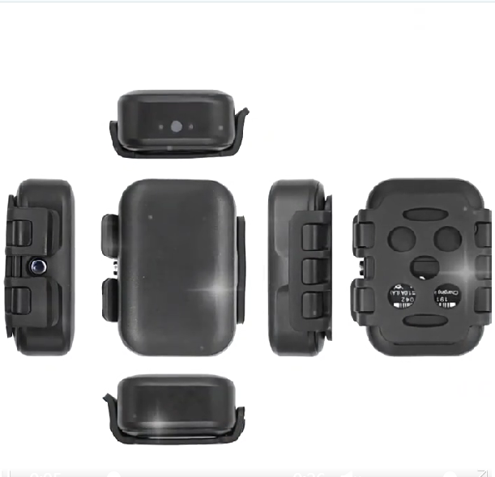

# GOTOP - G59

G59 Waterproof Pet Tracker

El G59 es un rastreador GPS compacto y con clasificación IP67 a prueba de agua, diseñado como etiqueta para collar para un registro confiable de mascotas tanto en entornos urbanos como al aire libre. Optimizado para uso continuo en exteriores, el G59 ofrece rastreo en tiempo real compatible con Plaspy en 4G LTE, mensajes de ubicación por SMS con enlaces de Google Maps y comunicación de voz bidireccional para que los dueños permanezcan conectados con sus mascotas dondequiera que vaguen.

El G59 combina robusta durabilidad con características orientadas a las mascotas: localización por sonido y luz, un altavoz de gran volumen para llamadas de voz remotas y monitoreo, podómetro y recordatorios de alimentación, alertas geocerca y notificaciones de batería baja. Construido con posicionamiento multi-modo \(GPS, BeiDou, Wi‑Fi y LBS\) y ahorro de energía inteligente mediante un sensor 3D, el G59 está diseñado para mantener a las mascotas seguras mientras entrega datos limpios y compatibles a Plaspy para rastreo, alertas e informes.

## Key Highlights

- Rastreador GPS compatible con Plaspy con seguimiento en tiempo real 4G LTE y enlaces de ubicación por SMS para acceso instantáneo a la posición en Google Maps.
- Etiqueta para collar con clasificación IP67 a prueba de agua: resistente a la lluvia y a inmersiones temporales, para que las mascotas puedan jugar y nadar sin perder la capacidad de seguimiento.
- Posicionamiento multi-modo \(GPS, BeiDou, Wi‑Fi, LBS\) para una mayor precisión en entornos urbanos entre rascacielos y zonas abiertas.
- Llamadas de voz bidireccionales, monitorización y grabación remota con un altavoz de gran tamaño para interacción directa y tranquilidad.
- Funciones de seguridad orientadas a mascotas: alertas de geovalla, localización por sonido y luz, pedómetro y recordatorios de alimentación, además de notificaciones de batería baja.
- Gestión inteligente de energía mediante un sensor 3D para una mayor autonomía en modo de espera y soporte de carga rápida para un rápido retorno.
- Formato compacto y adaptado al collar, en negro, para uso continuo en exteriores.

## Cómo funciona con Plaspy

Integrar el G59 con Plaspy proporciona a los dueños de mascotas una experiencia fluida y compatible con Plaspy para el rastreo en tiempo real, alertas y visibilidad de la actividad. El rastreador envía fijaciones de posición y mensajes de estado a través de redes 4G LTE y GSM; Plaspy recibe esos datos para mostrar la ubicación en vivo, el historial y las alertas en un único panel. Los dueños también pueden recibir mensajes de ubicación por SMS con un enlace de Google Maps, útil para compartir rápidamente o cuando la aplicación no esté disponible.

- Actualizaciones de ubicación en tiempo real y historial de posiciones a través de GPS/BeiDou/Wi‑Fi/LBS reportados a Plaspy.
- Alertas de geovalla y notificaciones de batería baja entregadas como alertas de Plaspy y por SMS cuando estén configuradas.
- Llamadas de voz remotas, monitorización y grabación disponibles para interacción de audio en vivo a través del dispositivo; la actividad de llamadas y el estado son visibles en los registros de Plaspy.
- Telemetría de actividad y rutinas de cuidado: el pedómetro y los recordatorios de alimentación proporcionan telemetría básica para el seguimiento de la actividad y recordatorios de la rutina.
- Apagado remoto a través de la app o SMS para conservar batería o gestionar el comportamiento del dispositivo; Plaspy puede reflejar el estado en línea/fuera de línea del dispositivo.

## Resumen técnico

| Conectividad | Seguimiento en tiempo real 4G LTE; GSM \(de respaldo\) |
| --- | --- |
| Bandas | GSM 850 / 900 / 1800 / 1900 |
| Posicionamiento | Métodos de posicionamiento GPS, BeiDou, Wi‑Fi y LBS |
| Energía y batería | Carga rápida soportada; sensor 3D para ahorro de energía inteligente; notificaciones de batería baja; apagado remoto vía app o SMS |
| Interfaces y características | Llamadas de voz remotas, monitorización y grabación; altavoz de gran tamaño; localización por sonido y luz; pedómetro y recordatorio de alimentación; alertas de geovalla |
| GNSS | GPS y BeiDou |
| Bluetooth | No especificado en la descripción del producto |
| Gestión remota | Control desde la app y comandos SMS para ubicación, apagado y notificaciones; los mensajes de ubicación por SMS incluyen enlace de Google Maps |
| Forma y tamaño | Etiqueta de collar compacta y resistente al agua, con clasificación IP67, disponible en negro |

## Casos de uso

- Paseos diarios de mascotas y rastreo urbano: el rastreo en tiempo real y el soporte Wi‑Fi/LBS ayudan a localizar a las mascotas en entornos densos.
- Mascotas al aire libre y de aventura: la impermeabilidad IP67 y el posicionamiento BeiDou/GPS mantienen activos los servicios de ubicación durante senderismo o juegos en el agua.
- Prevención de robo y recuperación rápida: alertas de geovalla, enlaces de ubicación en vivo y llamadas de voz remotas facilitan la rápida recuperación si se pierde o se lleva a una mascota.
- Telemetría de actividad y rutinas de cuidado: el pedómetro y los recordatorios de alimentación proporcionan telemetría básica para el seguimiento de la actividad y recordatorios de la rutina.
- Acceso compartido y notificación de emergencia: los enlaces de ubicación por SMS permiten compartir rápidamente la ubicación de la mascota cuando el acceso a la app es limitado.

## Por qué elegir este rastreador con Plaspy

El G59 combina hardware orientado a mascotas con la compatibilidad de Plaspy para ofrecer un rastreo fiable y fácil de gestionar para los propietarios que desean una visibilidad en tiempo real constante. Su mezcla de posicionamiento multi-modo, conectividad 4G LTE y construcción resistente al agua garantiza datos de ubicación precisos, ya sea en la ciudad o en exteriores. Los usuarios de Plaspy obtienen una vía de integración simple para alertas, historial y estado en vivo, mientras que características como voz bidireccional, geovallas y avisos de batería baja añaden capas prácticas de seguridad. Aunque el G59 está diseñado específicamente para mascotas y no para telemetría de vehículos, su rastreo en tiempo real y alertas anti-robos lo convierten en una solución sólida para la protección de mascotas y la monitorización cotidiana. Para clientes que necesiten funciones especializadas de vehículos, como telemetría basada en encendido, control de inmovilizador o monitorización de combustible, esos sistemas suelen implementarse en dispositivos enfocados a vehículos; el G59 está optimizado para uso con mascotas y monitorización complementaria.

