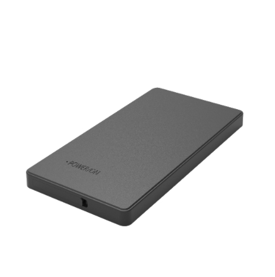

# GOTOP - G60

El GOTOP G60 es un rastreador magnético 4G compacto para activos y vehículos, diseñado para logística de larga duración, gestión de flotas y seguimiento discreto de contenedores. Con una carcasa resistente con grado IP65 y antenas internas, el G60 brinda actualizaciones de ubicación en tiempo real y telemetría de eventos confiable para flotas de alquiler, carga y otros activos que requieren montaje encubierto y amplia autonomía en modo espera.

Como dispositivo compatible con Plaspy, el G60 puede reportar posición y estado a Plaspy mediante SMS o GPRS. Esa compatibilidad convierte al G60 en una opción práctica para organizaciones que desean integrar un rastreador de montaje magnético y resistente en Plaspy para visibilidad continua, alertas y reproducción histórica de rutas sin necesidad de acceso físico frecuente a las unidades.

## Características principales

- Informes compatibles con Plaspy vía SMS o GPRS para integración en paneles de flota y flujos de notificaciones
- Soporte 4G LTE FDD y banda cuádruple GSM para amplia cobertura celular en diversas regiones
- Montaje magnético y carcasa con certificación IP65 para colocación discreta y uso rudo en campo
- Comportamiento de larga espera adecuado para vigilancia prolongada de activos y misiones logísticas
- Alarmas por vibración y movimiento además de notificaciones de batería baja para monitoreo basado en eventos
- Intervalos de reporte configurables y posicionamiento por fallback celular para equilibrar visibilidad y duración de batería

## Cómo funciona con Plaspy

Al integrarse con Plaspy, el G60 envía mensajes periódicos de ubicación y eventos que Plaspy procesa para ofrecer seguimiento en vivo, alertas y reproducción histórica. Plaspy utiliza esos datos para poblar mapas, líneas de tiempo y canales de notificación, permitiendo que gerentes de flota y equipos operativos supervisen activos de forma remota.

- Actualizaciones de ubicación en tiempo real entregadas a Plaspy por GPRS con SMS como canal de respaldo
- Eventos de alarma como vibración, movimiento y batería baja generan alertas en Plaspy y pueden activar reglas de notificación
- El posicionamiento por estaciones base celular actúa como respaldo automático cuando las señales satelitales se retrasan
- Los intervalos de reporte configurables permiten al equipo equilibrar frecuencia de actualización y tiempo de espera del dispositivo en Plaspy
- Consultas remotas de parámetros y comprobaciones de estado vía SMS permiten a los administradores verificar la condición del dispositivo sin recuperar la unidad

## Casos de uso típicos

- Seguimiento de vehículos de alquiler y flotas ligeras donde el montaje discreto y la larga autonomía son esenciales
- Rastreo de contenedores y carga que se beneficia de un montaje magnético robusto y una carcasa duradera
- Monitoreo antirrobo mediante alarmas de vibración y movimiento integradas en los flujos de alertas de Plaspy
- Vigilancia de activos de larga duración donde los reportes periódicos conservan batería manteniendo visibilidad
- Operaciones logísticas que requieren reproducción de rutas y registro de eventos para supervisión del transporte

## Por qué elegir este rastreador con Plaspy

El GOTOP G60 combina durabilidad práctica con opciones de reporte flexibles, lo que lo convierte en una excelente alternativa para operaciones que necesitan rastreadores discretos y de larga duración integrados en una plataforma de gestión de flotas. Su montaje magnético y su carcasa con protección IP reducen la complejidad de la instalación, mientras que los reportes por SMS y GPRS ofrecen vías sencillas para alimentar datos de ubicación y eventos en Plaspy para su monitoreo y análisis.

Si usted desea saber más sobre la gestión de dispositivos como el G60 con Plaspy, visite el sitio web de Plaspy en https://www.plaspy.com para explorar las funciones y capacidades de la plataforma. Las especificaciones del producto y la disponibilidad pueden cambiar con el tiempo, por lo que le recomendamos verificar los detalles técnicos actuales y la información del fabricante en el sitio oficial de GOTOP en https://www.gotop.cc/.
