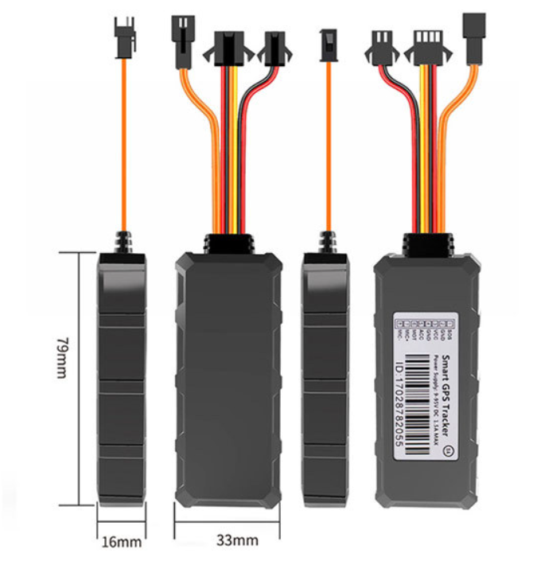

# GOTOP - GV3

El GV3 es un rastreador GPS compacto 4G para vehículos, diseñado para un monitoreo confiable de automóviles y flotas. Orientado al uso automotriz, el equipo ofrece seguimiento en tiempo real mediante 4G con respaldo 2G, geocercas, alertas de movimiento, notificaciones de emergencia SOS y soporte para inmovilizador remoto. Construido para entornos exigentes, el GV3 tiene certificación IP67 y un amplio rango de voltaje operativo, adecuado para autos, camiones, motocicletas y flotas mixtas.

Como dispositivo compatible con Plaspy, el GV3 integra su telemetría de ubicación y estado en la plataforma para una gestión centralizada de flotas y respuesta antirrobo. Al conectarse a Plaspy, el rastreador proporciona datos de posicionamiento, eventos de alarma y estados de entradas que pueden emplearse en mapas, alertas, reportes y supervisión operativa de la flota.

## Puntos clave

- Compatible con Plaspy para una integración directa en paneles de seguimiento en tiempo real y en sus flujos de trabajo
- Conectividad dual 4G con respaldo 2G para mantener actualizaciones de ubicación en áreas con cobertura variable
- Diseño robusto IP67 y amplio rango de operación 9–95V para uso en autos, camiones y motocicletas
- Posicionamiento GNSS de alta precisión con precisión típica de aproximadamente 5 metros para reproducción de rutas y localización
- Entradas orientadas a vehículos, incluyendo detección ACC de ignición, botón SOS, y alarmas por vibración y movimiento
- Soporte para inmovilizador remoto para facilitar respuestas antirrobo cuando se gestiona desde Plaspy
- Batería interna de respaldo que conserva la última ubicación conocida y alertas brevemente tras la pérdida de alimentación principal

## Cómo funciona con Plaspy

El GV3 envía su posición GPS y el estado del dispositivo a Plaspy para que los responsables de la flota puedan ver ubicaciones en vivo, recibir alarmas y analizar movimientos históricos. Plaspy ingiere la telemetría y la hace disponible en mapas, reglas de alerta e informes para apoyar la toma de decisiones operativas y las respuestas de seguridad.

- Actualizaciones de ubicación en tiempo real y telemetría visibles en los paneles de Plaspy para una visibilidad continua de la flota
- Estado de ACC e ignición reportado a Plaspy para distinguir eventos de motor encendido y apagado
- Geocercas, alarmas por movimiento y vibración enviadas a Plaspy para notificación inmediata y escalamiento
- Alertas por batería baja y corte de alimentación principal que activan flujos de trabajo de mantenimiento o recuperación en Plaspy
- Eventos del botón SOS reenviados a Plaspy para gestión rápida del incidente y notificación a despachadores
- Acciones de inmovilización remota coordinadas desde Plaspy cuando están autorizadas para apoyar la recuperación del vehículo

## Casos de uso típicos

- Rastreo de flotas comerciales para monitoreo de rutas, despacho y reporte de utilización
- Protección antirrobo con alarmas por vibración, reportes de ubicación y control remoto del inmovilizador
- Seguridad del conductor y respuesta a emergencias usando alertas SOS y notificaciones inmediatas al despacho
- Despliegues en flotas mixtas donde la amplia tolerancia de voltaje permite un solo modelo para varias clases de vehículos
- Historial de posiciones a largo plazo y aplicación de geocercas para supervisión de activos y cumplimiento

## Por qué elegir este rastreador con Plaspy

El GV3 combina funciones prácticas de rastreo automotriz con durabilidad y soporte de alimentación flexible, lo que lo convierte en una opción sólida para organizaciones que requieren datos de posición confiables y alertas oportunas. Usado con Plaspy, la telemetría del rastreador forma parte de un flujo de trabajo centralizado de gestión de flotas que incluye mapas, notificaciones automatizadas, reportes históricos y opciones de intervención como la inmovilización.

Para obtener más información sobre cómo Plaspy funciona con rastreadores compatibles como el GV3, visite https://www.plaspy.com. Las especificaciones del producto y la disponibilidad pueden cambiar con el tiempo; por favor verifique los detalles actuales en el sitio del fabricante https://www.gotop.cc/ para la información técnica más reciente.
