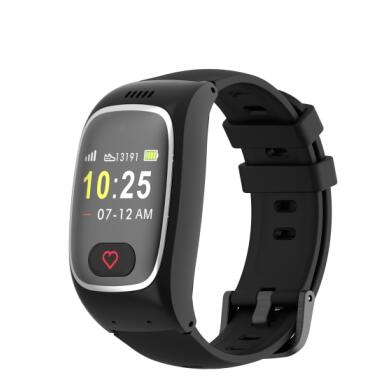

# GOTOP - L16

El L16 GPS Smart Watch es un rastreador GPS compacto y ponible, diseñado para usuarios vulnerables y necesidades de seguridad diarias. Compatible con Plaspy de fábrica, el L16 combina posicionamiento multimodo y telemetría de salud con llamadas de voz bidireccionales y una alarma SOS de un solo botón para que cuidadores, familiares y equipos de monitoreo puedan acceder a la información de rastreo en tiempo real y al estado a través de la plataforma de Plaspy.

El L16 está diseñado para un uso práctico diario: resistencia al agua y al polvo IP67, una batería de 680 mAh con operación de varios días, soporte BLE para posicionamiento local y periféricos, y una interfaz impulsada por RTOS en una pantalla TFT de 1.0 pulgada. Ya sea que necesite un rastreador GPS personal para una persona mayor, un niño o un trabajador aislado, el L16 integra ubicación, sensores de salud y funciones de emergencia en un formato ponible que se empareja de manera fluida con Plaspy para un monitoreo confiable y alertas.

## Puntos clave

- Rastreador GPS ponible compatible con Plaspy que ofrece rastreo en tiempo real y actualizaciones de estado a través de aplicaciones web y móviles.
- Posicionamiento multimodo \(GPS, Beidou, AGPS, LBS, Wi‑Fi, BLE\) para mejorar la precisión en entornos urbanos e interiores.
- Telemetría de salud integrada: informe de frecuencia cardíaca, SpO2, presión arterial y temperatura para habilitar la monitorización de salud a distancia.
- Respuesta a emergencias inmediata con alarma SOS de un solo botón y llamadas de voz bidireccionales directamente desde el reloj.
- Resistencia con clasificación IP67, adecuada para uso diario y exposiciones breves a agua y polvo.
- Autonomía de varios días \(680 mAh\) que admite varios días de uso típico y hasta una semana en modo de espera con 4G.
- Soporte BLE para posicionamiento local e interoperabilidad con sensores y periféricos Bluetooth.

## Cómo funciona con Plaspy

Al emparejarse con Plaspy, el L16 transmite ubicación y telemetría a la plataforma Plaspy para su visualización en tiempo real, reproducción histórica y alertas. Plaspy recopila las posiciones GNSS del dispositivo, telemetría de sensores, eventos de SOS y llamadas, y alertas del sistema, y luego pone esos datos a disposición de paneles, aplicaciones móviles y reglas de notificación para que gerentes y cuidadores puedan actuar con rapidez.

- Actualizaciones de ubicación y telemetría en tiempo real \(posiciones asistidas por GPS/Beidou/AGPS/LBS/Wi‑Fi/BLE\).
- Informe de datos de salud: frecuencia cardíaca, saturación de oxígeno \(SpO2\), presión arterial y temperatura.
- Eventos de alarma SOS y llamadas de voz bidireccionales reenviados a Plaspy para notificaciones instantáneas.
- Alertas de geocerca, avisos de batería baja y almacenamiento en servidor para reproducción histórica \(el servidor almacena datos hasta 30 días\).
- Soporte BLE para integración de sensores locales y eventos basados en proximidad.

## Visión técnica

| Conectividad | Cat-1 LTE \(Unisoc UIS8910\) y GSM \(2G\) |
| --- | --- |
| Bandas | GSM 850/900/1800/1900 MHz; LTE bands B1, B3, B7, B8, B38, B39, B40, B41 |
| CPU y GNSS | CPU Unisoc UIS8910 Cat‑1; GNSS MTK3333 \(GPS y Beidou compatibles indicados\) |
| Sensores | Sensores de frecuencia cardíaca, SpO2, presión arterial y temperatura; sensor G \(acelerómetro 3D opcional\) |
| Pantalla y OS | Pantalla TFT de 1.0 pulgadas \(128×64\) con RTOS \(ThreadX\) |
| Alimentación y batería | Batería Li‑Po de 680 mAh — 3–4 días con uso muy frecuente, 4–5 días con uso normal, 6–7 días en standby \(4G\) |
| SIM y Puertos | Compatibilidad con Nano‑SIM y eSIM; puerto magnético de carga de 2 pines; único botón SOS/Power |
| Bluetooth | BLE \(opcional BLE 5.0\) para posicionamiento local y emparejamiento de sensores |
| Resistencia al agua y al polvo | Clasificación IP67 |
| Materiales y formato | PC+ABS con caja de reloj LDS, correa deportiva de silicona de 18 mm; diseño ponible compacto |
| App y gestión remota | Funciona con apps web y móviles para monitoreo remoto, conteo de pasos, alertas y almacenamiento de datos en servidor \(hasta 30 días\) |
| Contenido del paquete | L16 GPS Smart Watch, manual de usuario en inglés, destornillador, pin, adaptador EU/UK, caja de regalo |

## Casos de uso

- Seguridad personal y protección para personas vulnerables — SOS y llamadas de voz bidireccionales para ayuda inmediata.
- Seguimiento de niños o personas mayores con telemetría de salud y alertas de geocerca para cuidadores y familiares.
- Protección para trabajadores aislados: rastreo en tiempo real, detección de caídas/actividad e integración de alarma de emergencia.
- Monitorización remota de la salud de un vistazo — frecuencia cardíaca, SpO2, presión arterial y temperatura disponibles a través de la app y paneles de Plaspy.
- Rastreo de activos o paquetes a corto plazo en escenarios donde un formato ponible y sensores BLE resultan útiles.

## Por qué elegir este rastreador con Plaspy

Elegir el L16 como rastreador GPS compatible con Plaspy aporta un equilibrio entre precisión de ubicación, telemetría de salud y comunicaciones de emergencia en un único dispositivo ponible. Su posicionamiento multimodo y el soporte de sensores BLE mejoran la fiabilidad en entornos mixtos, mientras la conectividad Cat‑1 LTE y la reserva GSM garantizan una entrega de datos constante a Plaspy para rastreo en tiempo real e informes. El botón SOS integrado y las llamadas bidireccionales simplifican los flujos de respuesta, y la batería de varios días del reloj reduce la carga de mantenimiento para cuidadores y administradores.

Para equipos y familias que utilizan Plaspy, el L16 amplía las capacidades de monitoreo más allá de los casos de uso estándar de rastreadores GPS al añadir métricas de salud e interoperabilidad con sensores locales. Es adecuado cuando la telemetría compacta y fiable y las alertas de emergencia rápidas son prioridades, lo que permite un monitoreo eficiente, intervenciones oportunas y registros históricos claros a través de la plataforma Plaspy.

