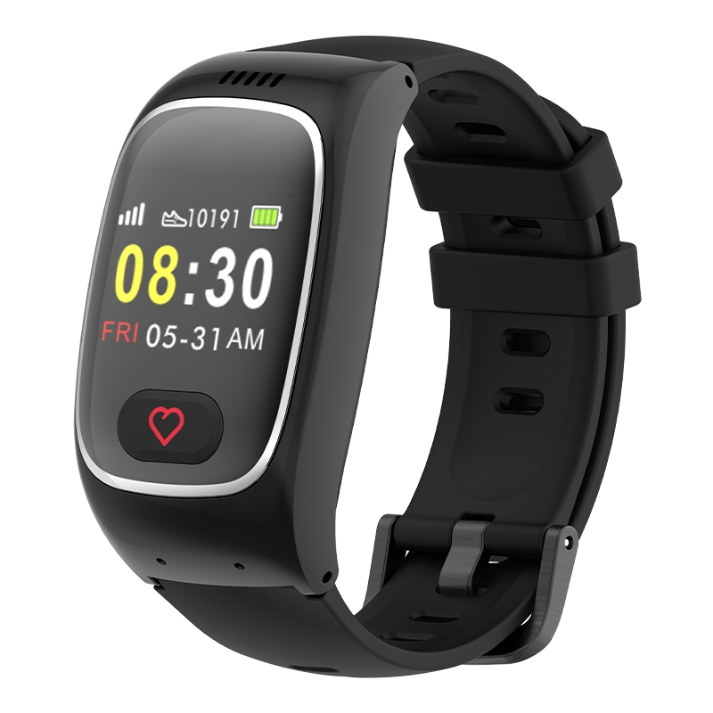

# GOTOP - L16 PRO

El L16 PRO es un rastreador GPS 4G compatible con Plaspy en formato de smartwatch, diseñado para ofrecer seguimiento en tiempo real confiable, telemetría de salud continua y seguridad cotidiana para personas mayores y usuarios vulnerables. Combina posicionamiento GPS en exteriores con asistencia BLE para ubicaciones en interiores, sensores integrados para frecuencia cardíaca, SpO2 y temperatura, además de funciones de seguridad como alarmas SOS y alertas por caída para facilitar el monitoreo personal y la respuesta rápida.

Al transmitir ubicación y lecturas de sensores a Plaspy, el L16 PRO se integra en una solución operativa de monitoreo para cuidadores y equipos. Plaspy procesa las transmisiones del reloj para ofrecer paneles, alertas, reglas de geocerca e informes históricos, permitiendo a los administradores supervisar ubicaciones, responder a incidentes y revisar tendencias de salud sin necesidad de sistemas separados.

## Aspectos destacados

- Rastreador GPS 4G en formato de smartwatch para monitoreo continuo de ubicación en tiempo real.
- Telemetría de salud integrada, incluyendo frecuencia cardíaca, SpO2 y temperatura, para visibilidad del estado continuo.
- Funciones orientadas a la seguridad: alarma SOS, detección de caídas, llamadas bidireccionales, alertas de geocerca y notificaciones de batería baja.
- Posicionamiento interior asistido por BLE 5.0 para mejorar la precisión cuando la recepción GPS es limitada.
- Diseño compacto y resistente al agua, optimizado para uso diario y con autonomía pensada para varios días.
- Cobertura celular global y almacenamiento en servidor con opciones de análisis para apoyar informes y revisión de tendencias.

## Cómo funciona con Plaspy

Al conectarse a Plaspy, el L16 PRO transmite datos de ubicación y sensores a la plataforma, donde se convierten en información útil. Plaspy recopila los datos del dispositivo y ofrece visibilidad configurable, herramientas de alerta e informes que se adaptan a flujos de trabajo de cuidado, seguridad y operaciones.

- Actualizaciones de ubicación en tiempo real y posicionamiento asistido para interiores visibles en mapas y listados de dispositivos en Plaspy.
- Ingesta de telemetría de salud para gráficos de tendencias, alertas por umbrales y revisión histórica en el panel de Plaspy.
- Eventos de SOS, caídas, geocercas y batería baja direccionados a las alertas de Plaspy para notificar de inmediato a equipos o cuidadores.
- Eventos de voz y llamadas bidireccionales correlacionados con alertas del dispositivo para apoyar los flujos de respuesta cuando sea necesario.
- Datos archivados y análisis disponibles para reportes, auditoría y supervisión operativa.

## Casos de uso típicos

- Monitoreo en residencias asistidas y cuidado de adultos mayores, donde la localización continua y las alertas fisiológicas ayudan a los cuidadores.
- Seguridad personal y protección de trabajadores solitarios mediante SOS y reglas de geocerca para personal remoto.
- Telemetría de salud a corto plazo y captura de tendencias para informar a cuidadores o clínicos.
- Seguimiento de personal en interiores y exteriores en campus, instalaciones de atención o edificios con cobertura variable.
- Supervisión unificada de personas y activos cuando rastreadores vestibles complementan rastreadores vehiculares o fijos en una misma cuenta de Plaspy.

## Por qué elegir este rastreador con Plaspy

El L16 PRO combina la comodidad de un dispositivo vestible con capacidades enfocadas en salud y seguridad, siendo una opción práctica para organizaciones que requieren ubicación en tiempo real y telemetría para personas, no únicamente para vehículos. Su combinación de GPS, posicionamiento interior asistido por BLE y múltiples sensores fisiológicos genera los tipos de datos que Plaspy está diseñado para recopilar, alertar y presentar a cuidadores y gestores.

Para equipos que buscan un dispositivo compacto y fácil de usar que alimente una plataforma central de monitoreo, el L16 PRO ofrece un vínculo claro entre la telemetría wearables y los flujos de trabajo de Plaspy. Plaspy convierte esas transmisiones en reglas de geocerca, alertas de incidentes e informes históricos para centralizar la supervisión, la respuesta y el análisis de personas y activos.

Conozca más sobre cómo Plaspy puede integrarse con dispositivos GPS vestibles y soluciones de monitoreo en https://www.plaspy.com. Las especificaciones del producto, disponibilidad y datos del fabricante pueden cambiar con el tiempo; verifique información técnica y soporte actual con el fabricante en https://www.gotop.cc/.
