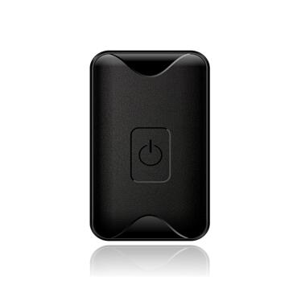

# GOTOP - Q1

El rastreador GPS GOTOP Q1 Mini es un dispositivo compacto y versátil que ofrece una variedad de funciones para diversas necesidades de seguimiento. Con su tamaño pequeño y diseño ligero, es altamente portátil y se puede colocar fácilmente en activos como motocicletas, automóviles o bicicletas eléctricas para fines de seguimiento y seguridad.

Una de las características destacadas del Q1 es su diseño resistente al agua, con una clasificación IPX7. Esto significa que puede resistir ser sumergido en agua hasta 1 metro durante un máximo de 30 minutos, lo que lo hace adecuado para su uso en entornos exteriores o en situaciones donde la exposición al agua es una preocupación.

El Q1 admite seguimiento en tiempo real y ubicación por SMS, lo que permite a los usuarios monitorear la ubicación de sus activos en tiempo real. También ofrece una función de alerta de movimiento, que puede enviar notificaciones cuando se detecta movimiento, brindando una capa adicional de seguridad.

Con sus antenas GPS y GSM incorporadas, el Q1 proporciona una posición precisa utilizando las tecnologías GPS y LBS \(Servicio basado en la ubicación\). Puede ser rastreado mediante SMS, plataformas web o aplicaciones móviles dedicadas, brindando a los usuarios múltiples opciones para monitorear sus activos.

El Q1 funciona con una batería de litio recargable de 700 mAh, que ofrece una buena duración de la batería para períodos de seguimiento prolongados. También cuenta con administración de ahorro de energía y alertas de batería baja para asegurarse de que los usuarios sean notificados cuando la batería esté baja.

En general, el rastreador GPS GOTOP Q1 Mini es un dispositivo confiable y lleno de funciones que es adecuado para el seguimiento de activos y fines de seguridad. Su tamaño pequeño, diseño resistente al agua y opciones de seguimiento lo convierten en una opción versátil para diversas necesidades de seguimiento.

### Características destacadas:

- Diseño mini portátil
- Clasificación de resistencia al agua IPX7
- Función de alerta de movimiento
- Seguimiento en tiempo real a través de GPRS/GPS
- Compatible con seguimiento mediante SMS, plataformas web y aplicaciones móviles
- Administración de ahorro de energía y alertas de batería baja
- Posicionamiento preciso con tecnologías GPS y LBS

### Especificaciones:

- Marca: GOTOP
- Modelo: Q1
- Tamaño: 48x27x17\(mm\)
- Peso: 33g
- Banda GSM: 850/900/1800/1900
- GPRS: MTK
- Banda cuádruple: GSM 850/900/1800/1900 MHz
- GPS: MT2503D, 50 canales
- Batería de litio recargable de 700mAh
- Sensor de vibración/movimiento incorporado
- Antena: Interna, Clase 12 de GPRS
- Precisión de posición: >=5m
- Arranque en frío:
- A-GPS: Servicio AssistNow Online y AssistNow Offline
- Sensibilidad: Seguimiento: \(R\)C161 dB, Arranques en frío: \(R\)C148 dB, Arranques en caliente: \(R\)C156 dB

