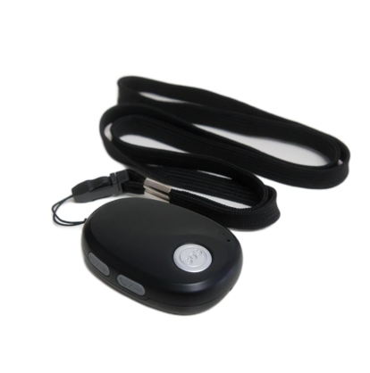

# GOTOP - Q20

El GOTOP Q20 es un rastreador GPS SOS 4G compacto y resistente diseñado para la seguridad personal y el monitoreo de pequeños activos. Pensado para niños, adultos mayores, trabajadores solitarios, mascotas y objetos de valor, el Q20 combina seguimiento en tiempo real, alarmas configurables, comunicación bidireccional y posicionamiento híbrido para mantener visibilidad en entornos urbanos, interiores y zonas remotas. Su carcasa sellada con protección IP67 y un botón SOS sobredimensionado están pensados para vigilancia continua de seguridad y escenarios de anti robo.

Al ser compatible con Plaspy desde el primer uso, el Q20 puede enviar información de ubicación y estado directamente a las herramientas de supervisión de Plaspy. Esta compatibilidad permite a las organizaciones usar los paneles, alertas e informes de Plaspy para centralizar la supervisión, reducir el trabajo de integración y aplicar reglas de notificación o escalamiento existentes a señales de SOS, detección de caídas y actualizaciones de posición periódicas del Q20.

## Características principales

- Compatible con Plaspy para una integración rápida en paneles de seguimiento en tiempo real y sistemas de alertas.
- Conectividad celular multinetwork para mantener cobertura de reporte en distintas regiones.
- Posicionamiento híbrido GPS más WiFi y LBS para mejorar la rapidez y precisión de la localización en entornos difíciles.
- Botón SOS grande y comunicación bidireccional para contacto directo y monitoreo remoto.
- Detección de caídas y man down para alertas de seguridad automatizadas.
- Diseño compacto con clasificación IP67 para resistencia al agua y portabilidad diaria.
- Almacenamiento en búfer de datos para conservar registros de posición durante pérdidas temporales de conectividad.

## Cómo funciona con Plaspy

Al emparejarse con Plaspy, el Q20 se convierte en una fuente de telemetría de ubicación y seguridad que Plaspy ingiere para monitoreo en vivo, reproducción histórica y distribución de alertas. El dispositivo reporta posiciones y estados a través de enlaces celulares y puede enviar cadenas de alarma para que Plaspy presente notificaciones oportunas a operadores y responsables.

- Actualizaciones de posición en vivo y reportes periódicos que alimentan los mapas y vistas de estado en Plaspy.
- Alertas SOS y notificaciones por voz bidireccional dirigidas a Plaspy para respuesta inmediata de operadores o tutores.
- Eventos de movimiento y detección de caídas enviados a Plaspy para que las reglas de incidentes y los flujos de escalamiento se disparen automáticamente.
- Fijaciones asistidas por WiFi y LBS que mejoran la visibilidad de la ubicación en interiores y zonas urbanas mostrada en el historial y el seguimiento en vivo de Plaspy.
- Subida de registros almacenados en búfer a Plaspy cuando se restablece la conectividad para preservar la continuidad.
- Tipos de alarmas e intervalos de reporte configurables para equilibrar capacidad de respuesta y consumo de datos dentro de Plaspy.

## Casos de uso típicos

- Monitoreo de seguridad personal para niños y adultos mayores con alertas SOS y de caída.
- Protección de trabajadores solitarios donde las notificaciones de man down y la comunicación bidireccional facilitan la respuesta.
- Seguimiento de mascotas y pequeños activos que necesitan un dispositivo compacto, resistente al agua y con posicionamiento híbrido.
- Despliegues temporales para eventos o trabajadores por contrato donde la rápida implementación y la supervisión centralizada son claves.
- Escenarios de anti robo y recuperación que se benefician del historial de posiciones en búfer y el seguimiento en tiempo real.

## Por qué elegir este rastreador con Plaspy

El Q20 ofrece una combinación práctica de portabilidad, durabilidad y funciones de seguridad que se integran de forma natural con las capacidades de monitoreo y notificación de Plaspy. Su posicionamiento híbrido y conectividad multinetwork reducen los puntos ciegos, mientras que el almacenamiento en búfer ayuda a preservar la continuidad del seguimiento. SOS, voz bidireccional y detección de caídas generan eventos accionables que Plaspy puede enrutar a operadores, listas de escalamiento o tutores sin necesidad de integraciones personalizadas extensas.

Si su operación requiere un rastreador personal compacto que se integre en una plataforma más amplia de monitoreo de flotas o seguridad, el Q20 con Plaspy es una opción directa. La compatibilidad minimiza la carga de configuración y permite que los equipos se concentren en reglas, notificaciones y flujos operativos en vez de en la integración de dispositivos a bajo nivel.

Para conocer más sobre cómo Plaspy puede soportar rastreadores Q20 y programas de flota o seguridad más amplios visite https://www.plaspy.com. Las especificaciones del producto, disponibilidad y detalles del fabricante pueden cambiar con el tiempo, por lo que le recomendamos verificar la información técnica actual en el sitio oficial de GOTOP https://www.gotop.cc/.
