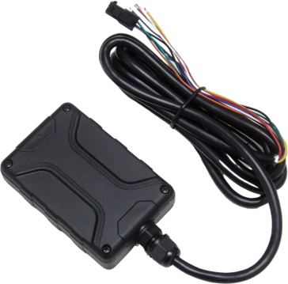

# GOTOP - S7

El Rastreador GPS a prueba de agua S7 es un rastreador GPS robusto, compatible con Plaspy, diseñado para el seguimiento de vehículos y activos en coches, motos, barcos y flotas comerciales. Con protección IP66 contra el agua, un amplio rango de entrada DC de 8–92 V e antenas GPS/GSM integradas, el S7 ofrece seguimiento en tiempo real y telemetría fiables para aplicaciones exigentes de exteriores y gestión de flotas.

El S7 se integra a la perfección con Plaspy para ubicación en tiempo real, alertas e informes históricos. Construido alrededor de los módulos Quectel EG915U \(4G/2G\) y Quectel L70-R \(GNSS\), el S7 ofrece posicionamiento preciso, monitoreo de combustible que lee el medidor de combustible original del vehículo \(no se necesita sensor de combustible externo\), detección de ACC/encendido y un puerto RS232 configurable para cámaras, RFID u otros periféricos — lo que lo convierte en una opción flexible para anti-robo, telemetría y optimización de flotas.

## Aspectos clave

- Compatible con Plaspy para seguimiento en tiempo real, alertas e integración de telemetría en la nube.
- Carcasa impermeable IP66 y antenas integradas para uso fiable en exteriores en coches, motos y barcos.
- 4G FDD-LTE con respaldo 2G cuádruple banda \(Quectel EG915U\) para una amplia cobertura de red y fiabilidad del roaming.
- GNSS de alta sensibilidad \(Quectel L70-R, -165 dBm\) que ofrece una precisión típica de posición de ~10 m.
- Detección de robo y llenado de combustible integrada y soporte para el medidor de combustible original del vehículo — no se necesita sensor de combustible externo.
- E/S flexible que incluye ACC \(entrada digital\), entrada analógica de 12 bits \(0–36V, predeterminada 0–5V; convertible a digital por comando\), salida de drenaje abierto \(activo en bajo, máx 500 mA\) y RS232 para periféricos.
- Batería interna de respaldo de 700 mAh con horas de operación ante pérdidas de energía; diseño compacto de bajo consumo para despliegues prolongados.

## Cómo funciona con Plaspy

El S7 envía telemetría y datos de posición de forma segura a Plaspy mediante su módem 4G/2G. Plaspy procesa coordenadas GPS, estado del motor/encendido, lecturas de sensores analógicos y datos procedentes de RS232 para ofrecer mapas en vivo, alertas de geocercas, paneles de telemetría e informes históricos. Las alertas y los flujos de trabajo automatizados en Plaspy pueden activarse por cambios en el encendido, anomalías de combustible, movimiento o condiciones de manipulación reportadas por el S7.

- Actualizaciones de ubicación y telemetría en tiempo real mediante 4G \(con respaldo 2G\) para un reporte continuo.
- Detección de encendido/ACC mediante la entrada digital para el registro de viajes y eventos de motor encendido/apagado.
- Monitoreo de combustible y detección de robo/llenado utilizando el medidor de combustible original del vehículo o sensores externos a través de la entrada analógica/RS232.
- Inmovilizador remoto o control de relé mediante la salida de drenaje abierto \(configurable\) para respuesta anti-robo.
- Integración con periféricos RS232 \(cámaras, RFID, lectores de huellas\) para enriquecer la telemetría y los datos de eventos de Plaspy. Aunque el S7 no incluye sensores Bluetooth a bordo, Plaspy admite dispositivos BLE y puede correlacionar datos de sensores Bluetooth cuando se utiliza con puertas de enlace compatibles.

## Visión técnica

| Conectividad | FDD-LTE B1/B3/B5/B7/B8/B20/B28; respaldo 2G cuádruple banda 850/900/1800/1900 MHz \(Quectel EG915U\) |
| --- | --- |
| Bandas | B1/B3/B5/B7/B8/B20/B28 \(LTE\) + 850/900/1800/1900 MHz \(2G\) |
| Alimentación y batería | Entrada DC 8–92 V con protección de grado industrial; batería interna 700 mAh. Modo de espera 7.8 mA; 37–185 mA durante ciclos de rastreo de 10 s. Respaldo ~8 horas con informe cada 30 s, ~12.8 horas con informe cada 300 s. |
| Interfaces | 1 entrada digital \(predeterminada ACC\), 1 × 12-bit entrada analógica \(0–36V, predeterminada 0–5V; convertible a digital por comando\), 1 salida de drenaje abierto \(bajo activo, máx 500 mA\), RS232 puerto, USB interno. |
| GNSS | Módulo GNSS Quectel L70-R; sensibilidad -165 dBm; precisión típica ~10 m; arranque en frío ~35 s, arranque en caliente ~1 s. |
| Bluetooth | N/A \(sin Bluetooth a bordo\) |
| Memoria | 8 MB de memoria flash \(almacenamiento para ~10,200 unidades de datos GPRS o 320 registros de SMS\) |
| Indicadores de estado | 3 LEDs para estado de GPS / GSM / alimentación externa |
| Físico | Dimensiones 80 × 53 × 21 mm; peso 162 g; carcasa impermeable IP66. |
| Entorno | Rango de operación -20°C a 70°C; humedad 5%–95% |
| Periféricos opcionales | Dispositivos compatibles con RS232 como cámaras, lectores RFID, escáneres de huellas, sensores ultrasónicos de combustible \(a través del puerto RS232 configurable\) |
| Cableado | VCC \(rojo\), GND \(negro\), IN2/ACC \(blanco\), AD1 analógico \(azul\), pines RS232: DC5V \(naranja\), GND \(negro\), TX \(verde\), RX \(morado\) |

## Casos de uso

- Gestión de flotas: seguimiento en tiempo real de vehículos, registro de trayectos, informes basados en el encendido y operación de bajo consumo para despliegues prolongados.
- Antirrobo e inmovilización: detectar movimientos no autorizados, generar alertas y usar la salida configurable para controlar inmovilizadores o relés.
- Optimización de gestión de combustible: detectar robos y llenados de combustible y monitorear el medidor de combustible original sin añadir sensores externos, reduciendo la complejidad de la instalación.
- Monitoreo de activos comerciales y flotas de alquiler: el amplio rango de voltaje de entrada \(8–92 V\) y la protección industrial hacen que el S7 sea adecuado para camiones, furgonetas y vehículos de alquiler.
- Integraciones perimetrales y especializadas: conectar cámaras, RFID o dispositivos biométricos al puerto RS232 para capturar telemetría vinculada a eventos en los paneles de Plaspy.

## Por qué elegir este rastreador con Plaspy

El Rastreador GPS a prueba de agua S7 es un dispositivo práctico y compatible con Plaspy para organizaciones que requieren seguimiento en tiempo real fiable, manejo robusto de energía y telemetría de combustible integrada sin instalaciones de retrofit complicadas. Su amplia tolerancia de voltaje, clasificación IP66 y antenas internas reducen las restricciones de instalación, mientras que los módulos celulares y GNSS de Quectel proporcionan conectividad robusta y posicionamiento preciso.

Combinado con Plaspy, el S7 se convierte en una solución completa para flotas y activos: transmite GPS en vivo, eventos de encendido, lecturas analógicas de combustible y datos de periféricos RS232 a Plaspy para paneles centralizados, alertas y análisis. Esta combinación admite flujos de trabajo de anti-robo, monitoreo de combustible basado en telemetría y gestión de flotas escalable, proporcionando fiabilidad y visibilidad operativa para flotas comerciales y activos móviles.

