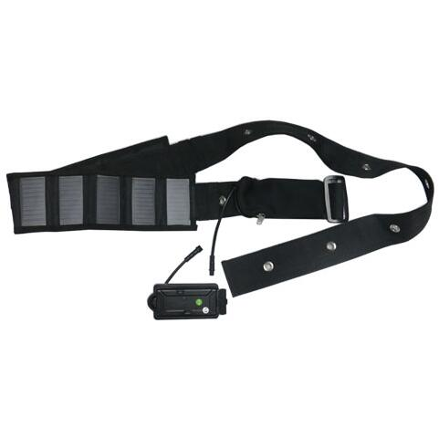

# GOTOP - T0500

El GOTOP T0500 es un rastreador GPS con asistencia solar diseñado para el monitoreo prolongado de ganado y animales de gran tamaño. Robusto y con clasificación IPX7 para inmersión al aire libre, el T0500 combina una batería interna recargable de gran capacidad con paneles solares integrados para reducir las labores de mantenimiento y mantener los dispositivos activos durante despliegues prolongados en campo. Está pensado para montaje seguro en collares e incorpora alertas por manipulación y corte de collar para facilitar la respuesta rápida en casos de robo o escape.

Como dispositivo compatible con Plaspy, el T0500 se integra con la plataforma para ofrecer visibilidad de ubicación en tiempo real, reproducción histórica de rutas y alertas instantáneas. Plaspy procesa la posición y la telemetría del T0500 para que usted pueda supervisar el rebaño, recibir notificaciones de manipulación o batería baja y revisar el historial de movimiento desde las interfaces web y móviles de Plaspy para control operativo e informes.

## Aspectos destacados

- Alimentación asistida por energía solar con batería interna recargable de gran capacidad para minimizar visitas de mantenimiento
- Actualizaciones de ubicación en tiempo real y reproducción de rutas históricas cuando se utiliza con Plaspy
- Diseño robusto e impermeable IPX7, adecuado para condiciones exteriores severas e inmersión
- Montaje seguro en collar con alertas por corte de collar y manipulación para apoyar flujos de trabajo anti robo
- Posicionamiento GPS con respaldo por LBS para mantener cobertura en diversos entornos
- Detección de movimiento integrada para generar alertas de actividad y optimizar el ahorro de energía

## Cómo funciona con Plaspy

Al integrarse con Plaspy, el T0500 envía datos de ubicación y eventos a la nube de Plaspy para que los equipos puedan monitorear animales en tiempo real, recibir alertas y analizar movimientos históricos. Plaspy organiza la telemetría entrante en paneles, notificaciones e informes que se adaptan a los flujos de trabajo de gestión ganadera.

- Paneles de seguimiento en vivo que muestran posiciones actuales y movimientos recientes
- Alertas de corte de collar y manipulación enviadas a Plaspy para notificación y respuesta rápida
- Alertas de movimiento para identificar desplazamientos anómalos o inactividad prolongada
- Notificaciones de batería baja y estado de energía para programar mantenimiento de forma proactiva
- Reproducción de rutas históricas y enlaces de mapa para revisión y elaboración de informes posteriores a eventos
- Procesamiento con respaldo LBS para mantener visibilidad de ubicación cuando la señal GPS es limitada

## Casos de uso típicos

- Rastreo distribuido de ganado en grandes estancias y áreas de pastoreo para conocimiento de ubicación
- Monitoreo anti robo con alertas instantáneas por corte de collar enviadas a Plaspy para acción rápida
- Despliegues de larga duración en pasturas remotas donde la recarga solar reduce los intercambios de batería
- Análisis de rutas y comportamiento mediante reproducción histórica para planificar rotaciones de pasturas y manejo del pastoreo
- Monitoreo remoto de animales de alto valor que requieren telemetría y alertas confiables

## Por qué elegir este rastreador con Plaspy

El T0500 es una opción práctica para organizaciones que necesitan seguimiento confiable y de bajo mantenimiento para ganado y animales de gran tamaño. Su diseño robusto y asistido por energía solar reduce la carga operativa, mientras que el montaje en collar y las alertas de manipulación ofrecen protecciones específicas para activos pastoriles. Al combinarse con Plaspy, la telemetría del T0500 se convierte en información accionable mediante vistas en tiempo real, alertas y reproducción histórica adaptadas a la gestión de rebaños y la respuesta ante robos.

La compatibilidad con Plaspy facilita la incorporación de dispositivos T0500 a los flujos de trabajo de monitoreo e informes existentes, de modo que los equipos puedan escalar el seguimiento de animales junto con otros activos. Para más detalles sobre Plaspy y cómo se integra este rastreador con la plataforma, visite https://www.plaspy.com. Las especificaciones del producto, la disponibilidad y los datos del fabricante pueden cambiar con el tiempo, por lo que se recomienda verificar las especificaciones actuales en el sitio del fabricante https://www.gotop.cc/.
