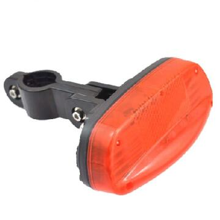

# GOTOP - T1600

El T1600 Bike GPS Tracker es una solución de seguimiento para bicicletas compatible con Plaspy, diseñada para uso prolongado en exteriores y protección robusta contra el robo. Construido alrededor de un módulo GPS de 50 canales U‑BLOX y un chipset MTK GPRS, el T1600 ofrece datos de posición fiables, alertas de movimiento configurables y múltiples canales de notificación \(SMS, plataforma web y aplicación móvil\). Su batería interna recargable de 5200 mAh, su carcasa impermeable IPX7 y su opción de carga única mediante un Flower Drum Dynamo hacen del T1600 la solución ideal para ciclistas, flotas de alquiler y monitoreo de activos al aire libre que requieren rastreo en tiempo real confiable y de bajo mantenimiento.

Diseñado para integrarse de forma fluida con Plaspy, el T1600 ofrece seguimiento en tiempo real, reproducción de historial y notificaciones inmediatas de manipulación/batería baja para que los gestores de flotas y los propietarios de bicicletas actúen con rapidez. La compatibilidad con Plaspy extiende la telemetría del dispositivo a paneles centralizados para la gestión de flotas, alertas de incidentes y analítica de rutas —ayudando a los equipos a prevenir robos, supervisar el uso y mantener activos a lo largo de despliegues prolongados.

## Key Highlights

- Rastreador GPS compatible con Plaspy con seguimiento en tiempo real y reproducción de rutas históricas para una visibilidad clara de la flota y respuesta ante robos.
- Autonomía excepcional: batería interna de 5200mAh de litio‑ion recargable con consumo extremadamente bajo — más de 200 días en modo de espera en condiciones típicas.
- Diseño robusto para exteriores: clasificación IPX7 y carcasa resistente para instalación a largo plazo en bicicletas y activos al aire libre.
- Sensor de vibración/movimiento incorporado y alertas de manipulación configurables para detectar intentos de robo o movimientos no autorizados.
- LED de alta intensidad visible en la parte trasera y lateral que aumenta la visibilidad del ciclista y sirve como elemento disuasorio al activarse ante eventos de alarma.
- Carga flexible: admite carga desde un Flower Drum Dynamo para mantener la unidad alimentada durante la marcha, reduciendo el tiempo de inactividad para uso a larga distancia.
- Varias vías de notificación — SMS, plataforma web y app móvil — para alertas oportunas y compartir ubicación \(soporte de enlaces de Google Maps\).

## How It Works with Plaspy

El T1600 transmite datos de posición y eventos vía GPRS o SMS y es plenamente utilizable dentro de las vistas de gestión de dispositivos y mapas de Plaspy. Al combinarlo con Plaspy, la ubicación, las alertas de movimiento y el estado de la batería circulan hacia los paneles de Plaspy para monitoreo en tiempo real, reproducción de rutas históricas y alertas automatizadas. Las integraciones típicas incluyen telemetría centralizada, alertas por geocerca y enlaces de ubicación compartidos que utilizan URLs de Google Maps para un acceso sencillo.

- Actualizaciones de ubicación y telemetría en tiempo real vía GPRS \(Clase 12\) o SMS para redundancia y amplia cobertura.
- Alertas de movimiento/manipulación activadas por el sensor de vibración a bordo para notificaciones antirrobo rápidas.
- Reproducción de rutas históricas y enlaces exportados de Google Maps para investigación de incidentes y análisis de trayectos.
- Alertas de batería baja y umbrales de alarma configurables para mantener la disponibilidad del dispositivo durante despliegues prolongados.
- Fuente de datos lista para Plaspy para gestión de flotas y paneles de telemetría; para características adicionales como control de encendido/inmovilizador, monitorización de combustible o sensores Bluetooth, Plaspy puede integrar periféricos compatibles o modelos de rastreadores alternativos.

## Technical Overview

| Connectivity | GSM / GPRS \(GPRS Class 12\) con soporte SMS |
| --- | --- |
| Bands | GSM 850 / 900 / 1800 / 1900 MHz |
| GNSS | módulo GPS de 50 canales U‑BLOX G7020‑ST; compatible con A‑GPS AssistNow |
| Position Accuracy | &gt;= 5 metros en condiciones de buena señal |
| Cold/Warm/Hot Start | Arranque en frío &lt; 27 s, Arranque tibio &lt; 5 s, Arranque caliente ≈ 1 s \(típico\) |
| Power & Battery | Batería interna recargable de 5200mAh de litio‑ion; consumo de energía extremadamente bajo con >200 días de espera \(típico\). Soporta carga desde un Flower Drum Dynamo durante la marcha. |
| Waterproof Rating | IPX7 \(carcasa impermeable para uso al aire libre\) |
| Sensors & Alerts | Sensor de vibración/movimiento incorporado, alertas de batería baja, alarmas configurables, watchdog CPU para evitar fallos del sistema |
| Antennas | Antenas GPS y GSM internas |
| Physical | 135 x 58 x 58 mm; ~220 g |
| Notifications & Platforms | SMS, plataforma web y app móvil; enlaces de Google Maps para compartir ubicaciones fácilmente |

## Use Cases

- Protección anti‑robo de bicicletas — alertas de movimiento, LED disuasorio visible y notificaciones oportunas de Plaspy para recuperar bicicletas robadas.
- Monitoreo de flotas y bicicletas de alquiler — rastrea uso, historial de rutas y estado de la batería para flotas de alquiler dispersas sin recargas frecuentes.
- Turismo de larga distancia y recorridos de resistencia — capacidad de cargarse desde un dynamo y una larga autonomía soportan viajes prolongados con carga de red limitada.
- Seguimiento de activos al aire libre — despliegues a largo plazo de equipos o activos eventuales que requieren impermeabilidad y larga duración de la batería.
- Analítica de uso y telemetría — rutas históricas y registros de eventos recopilados para análisis de rendimiento y planificación operativa.

## Why Choose This Tracker with Plaspy

El T1600 es un rastreador GPS construido específicamente para ofrecer larga duración de batería, protección impermeable y una compatibilidad directa con Plaspy para flotas de bicicletas y activos al aire libre. Su confiable stack de hardware U‑BLOX/MTK garantiza un posicionamiento consistente y una señal GPRS eficiente, mientras que la opción de carga mediante Dynamo y la autonomía extendida reducen los ciclos de mantenimiento y el tiempo de inactividad. Cuando está conectado a Plaspy, la telemetría y las alertas del T1600 alimentan de forma directa los flujos de trabajo de gestión de flotas para tracking en tiempo real, respuesta a incidentes y análisis histórico. Para organizaciones que buscan un rastreador GPS duradero y de bajo mantenimiento para anti‑robo de bicicletas, flotas de alquiler o despliegues prolongados al aire libre, el T1600 ofrece una opción equilibrada y lista para integrarse.

