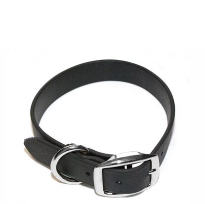

# GOTOP - TE-200

El TE-200 Mini Pet Tracker de GOTOP es un rastreador GPS compacto pensado para el monitoreo de mascotas y el seguimiento de pequeños activos. Con unas dimensiones aproximadas de 55 x 35 x 15 mm y alrededor de 35 g, combina un módulo GNSS U‑blox 7 con conectividad GSM GPRS cuatribanda y reportes por SMS para ofrecer actualizaciones continuas de posición, alertas y un registro interno que almacena puntos cuando hay falta de cobertura. Su tamaño reducido y carcasa resistente lo hacen adecuado para collares, mochilas o fijación discreta a objetos portátiles.

Como dispositivo compatible con Plaspy, el TE-200 puede enviar posiciones en tiempo real, eventos de movimiento y alarmas configurables a los paneles y reportes de Plaspy. Los usuarios de Plaspy pueden consultar el historial de ubicaciones, recibir alertas de geovalla y batería baja, y beneficiarse de la recarga automática de puntos almacenados después de interrupciones de cobertura, lo que convierte al TE-200 en una opción práctica para propietarios y gestores de pequeños activos que desean visibilidad de ubicación integrada en la plataforma Plaspy.

## Características principales

- Informes compatibles con Plaspy vía GPRS y SMS para visualización en vivo y alertas en los paneles de Plaspy
- Diseño compacto y ligero (55 x 35 x 15 mm; ~35 g) apto para collares de mascotas y pequeños activos
- GNSS U‑blox 7 para posicionamiento preciso y seguimiento confiable del historial
- Monitoreo de voz bidireccional para comprobaciones situacionales y comunicación remota básica
- Buffer de registro interno con reenvío tras periodos sin cobertura para preservar el historial de ubicaciones
- Clasificación IP67 resistente al agua para uso en exteriores y entornos húmedos
- Alarmas configurables como geovalla, detección de movimiento y notificaciones de batería baja

## Cómo funciona con Plaspy

El TE-200 transmite actualizaciones de ubicación y mensajes de estado por GPRS o SMS, que Plaspy procesa y muestra en mapas, líneas de tiempo y flujos de alertas. Cuando el dispositivo almacena puntos sin conexión, dichos puntos se reenvían automáticamente una vez que vuelve la conexión celular, de modo que Plaspy mantiene un registro continuo. La integración está orientada a ofrecer visibilidad, alertas e historial más que a la configuración directa del dispositivo desde la plataforma.

- Ubicación y telemetría en tiempo real aparecen en los mapas y vistas de línea de tiempo de Plaspy
- Alertas de geovalla, movimiento y batería baja se reenvían a Plaspy para notificación inmediata y registro
- El monitoreo de voz puede usarse junto con el rastreo en Plaspy para verificar la situación de una mascota o activo
- La recarga de datos almacenados tras periodos sin cobertura ayuda a mantener completo el historial en Plaspy
- Los reportes con coordenadas estándar permiten a Plaspy enlazar ubicaciones con servicios de mapas para enrutamiento y contexto

## Casos de uso típicos

- Seguimiento y seguridad de mascotas con ubicación en vivo, alertas de geovalla y comprobaciones situacionales por voz
- Monitoreo de pequeños activos como mochilas, equipos o bienes portátiles
- Seguimiento de equipo para actividades al aire libre donde la impermeabilidad y el tamaño compacto son importantes
- Artículos de alquiler a corto plazo y activos compartidos que requieren historial de ubicación simple y alertas por movimiento
- Visibilidad de última milla para pequeños paquetes o envíos de mensajería sin instalaciones complejas

## Por qué elegir este rastreador con Plaspy

El TE-200 combina un diseño compacto con funciones de continuidad prácticas que benefician a propietarios de mascotas y gestores de pequeños activos que necesitan actualizaciones de posición confiables y alertas sencillas. Su buffer interno y el reenvío automático reducen el riesgo de lagunas en los datos cuando la cobertura es intermitente, mientras que el monitoreo de voz y las alarmas configurables añaden flexibilidad operativa cuando se utiliza junto con Plaspy.

Si usted está evaluando rastreadores compactos para usar con Plaspy, el TE-200 es una opción directa que equilibra tamaño, durabilidad exterior y funcionalidad telemática básica. Para obtener más información sobre Plaspy y cómo funcionan los dispositivos compatibles en paneles y reportes visite https://www.plaspy.com. Las especificaciones, disponibilidad y detalles del fabricante pueden cambiar con el tiempo, por lo que verifique la información técnica actual y la documentación oficial en el sitio del fabricante https://www.gotop.cc/.
