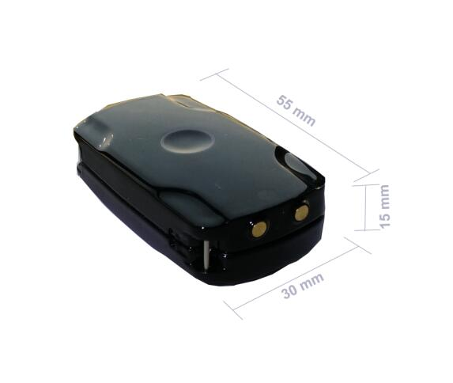

# GOTOP - TK-120

El GOTOP TK-120 es un mini rastreador GPS diseñado para un seguimiento confiable y discreto. Su tamaño reducido lo hace adecuado para monitorear personas, activos, vehículos y mascotas. El dispositivo combina posicionamiento por satélite GPS con la red GSM para determinar la ubicación y ofrece tanto respuestas de ubicación por SMS como envío de informes por GPRS, proporcionando métodos de seguimiento flexibles.

Al ser un modelo compatible con Plaspy, el TK-120 puede alimentar la plataforma con actualizaciones de ubicación para visualización en mapas, generación de informes y supervisión operativa. Su capacidad para transmitir coordenadas por SMS y enviar datos periódicos por GPRS lo hace adaptable tanto para usuarios que necesitan consultas simples por SMS como para quienes requieren seguimiento continuo a través de una plataforma como Plaspy.

## Aspectos destacados

- Factor de forma pequeño y discreto, apto para colocación oculta y uso en espacios reducidos
- Opciones duales de localización: respuestas por SMS con enlaces a Google Maps y reportes por GPRS
- Intervalos de reporte configurables por el usuario para actualizaciones programadas
- Útil para monitorear personas, activos, vehículos y mascotas en distintos entornos
- Información de ubicación sencilla que puede visualizarse rápidamente mediante enlace a Google Maps
- Opción práctica cuando el tamaño reducido y la flexibilidad en los reportes son prioridades

## Cómo funciona con Plaspy

Al integrarse con Plaspy, el TK-120 puede enviar datos de ubicación a la plataforma para monitoreo y gestión centralizados. Plaspy recibe las actualizaciones de posición enviadas por el dispositivo y las muestra en mapas en tiempo real y en registros históricos, lo que permite a administradores y responsables de flotas mantener visibilidad operativa.

- Reciba informes periódicos de posición del rastreador y muéstrelos en los mapas de Plaspy
- Use las actualizaciones de ubicación para obtener visibilidad en tiempo real y supervisión sencilla de rutas
- Configure alertas y notificaciones en Plaspy basadas en cambios de posición o patrones de movimiento
- Genere historiales de ubicación e informes de actividad para revisión operativa y cumplimiento
- Combine los datos del TK-120 con otros dispositivos en Plaspy para una monitorización consolidada de activos y flotas

## Casos de uso típicos

- Monitoreo discreto de objetos personales o activos móviles de alto valor
- Localización de vehículos para pequeñas flotas o autos particulares
- Seguimiento y protección de mascotas durante salidas o viajes
- Despliegues temporales donde se requiere un rastreador pequeño y fácil de ocultar
- Situaciones que exigen comprobaciones rápidas de posición vía SMS y registro a largo plazo mediante reportes en plataforma

## Por qué elegir este rastreador con Plaspy

El GOTOP TK-120 es una opción práctica para organizaciones y particulares que necesitan un rastreador compacto que admita tanto consultas de ubicación por SMS como reportes basados en plataforma. Su reducido tamaño y opciones de reporte sencillas facilitan su incorporación a Plaspy para monitoreo en mapa, alertas e informes sin añadir complejidad innecesaria.

Si desea evaluar el TK-120 para su despliegue con Plaspy, revise cómo encajan los reportes por SMS y GPRS en sus necesidades operativas y considere este dispositivo cuando la discreción y el intercambio simple de ubicación sean prioritarios. Para saber más sobre Plaspy y cómo puede centralizar el seguimiento de dispositivos como el TK-120 visite https://www.plaspy.com. Las especificaciones y la disponibilidad del producto pueden cambiar con el tiempo, por lo que le recomendamos verificar los detalles actuales con el fabricante en https://www.gotop.cc/.
