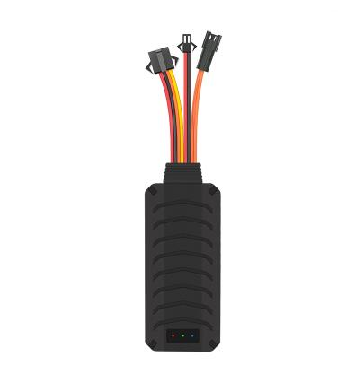

# GOTOP - TK-206

El TK-206 es un rastreador vehicular compacto GSM/GPRS/GPS diseñado para ofrecer seguimiento y recuperación de vehículos de forma confiable y discreta. Como uno de los rastreadores de alto rendimiento más pequeños de GOTOP, está pensado para montaje oculto en automóviles y vehículos comerciales ligeros, proporcionando actualizaciones continuas de ubicación, alertas por geovallas, señal SOS e inmovilización remota que facilitan la respuesta ante robos y el monitoreo de seguridad.

Este modelo es compatible con Plaspy desde el primer momento, por lo que resulta una opción práctica para organizaciones y propietarios que desean integrar un rastreador probado en flujos centralizados de seguimiento y gestión de flotas. Los reportes del TK-206 mediante GPRS y SMS, junto con sus funciones de alarma y control remoto de relé, permiten a Plaspy mostrar la ubicación en vivo, reproducir historial y enviar notificaciones oportunas a operadores y administradores.

## Características principales

- Factor de forma compacto y discreto, adecuado para instalación oculta en automóviles y vehículos comerciales ligeros
- Seguimiento en tiempo real y reportes vía GPRS con SMS como método alternativo para mayor flexibilidad de conectividad
- Funciones antirrobo integradas, incluyendo corte de motor por relé e inmovilizador remoto además de un botón SOS dedicado
- Monitorización por voz mediante micrófono integrado para ayudar en la verificación de incidentes
- Posicionamiento basado en UBLOX GNSS con alta sensibilidad y precisión práctica para seguimiento vehicular
- Monitoreo de alimentación y alertas por manipulación, como batería baja y corte de alimentación principal, para mejorar la protección del activo
- Amplio rango de voltaje de operación para soportar distintos sistemas eléctricos de vehículos

## Cómo funciona con Plaspy

Al conectarse a Plaspy, el TK-206 actúa como fuente telemétrica que envía datos de ubicación y eventos a la plataforma, permitiendo que los equipos monitoreen vehículos, reciban alertas y revisen trazas históricas. Plaspy muestra la unidad en mapas, genera notificaciones basadas en las alarmas del dispositivo y archiva la telemetría para análisis operativo e informes.

- Actualizaciones en tiempo real de ubicación y estado enviadas a Plaspy vía GPRS con SMS como respaldo
- Eventos de corte de motor e inmovilización remota que se pueden gestionar desde la plataforma para apoyar procedimientos ante robo
- Alertas de geovalla, activaciones del botón SOS, batería baja y cortes de alimentación que se transmiten a Plaspy para notificación inmediata
- Eventos de monitorización por voz desde el micrófono del dispositivo que pueden utilizarse en Plaspy para ayudar en la evaluación de incidentes
- Plaspy puede combinar los datos de ubicación y eventos del TK-206 con otra información de la flota para respaldar reportes y supervisión operativa

## Casos de uso típicos

- Flotas que requieren protección antirrobo y recuperación mediante inmovilización remota y compartición rápida de ubicación
- Seguridad de vehículos particulares con alertas SOS y monitoreo remoto para respuesta ante emergencias
- Operaciones de entrega y logística que necesitan ubicación en tiempo real, verificación de rutas y reproducción de historial
- Programas de alquiler y vehículo compartido que buscan notificaciones por geovalla, alertas por manipulación y opciones de control remoto
- Protección de vehículos estacionados y detección de manipulación mediante alarmas de vibración y corte de alimentación

## Por qué elegir este rastreador con Plaspy

El TK-206 combina un diseño de hardware compacto con las funciones antirrobo y de seguimiento que suelen requerir los administradores de flota y los propietarios de vehículos. Su soporte para canales de reporte estándar y tipos de eventos facilita una integración limpia en plataformas centralizadas como Plaspy, proporcionando visibilidad consistente y un sistema de alertas simple y efectivo.

Para organizaciones que buscan un rastreador confiable y discreto que alimente a Plaspy para mapeo, notificaciones y análisis histórico, el TK-206 representa una opción pragmática. Para obtener más información sobre Plaspy y cómo puede aprovechar los datos del TK-206 para visibilidad de flota y control operativo visite https://www.plaspy.com. Las especificaciones del producto, disponibilidad y detalles del fabricante pueden cambiar con el tiempo, por lo que le recomendamos verificar la información técnica y accesorios actuales en el sitio oficial de GOTOP https://www.gotop.cc/.
