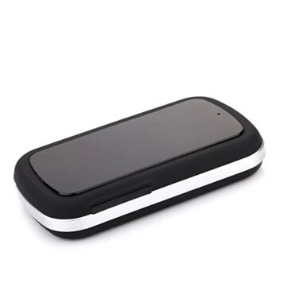

# GOTOP - TK-208

El GOTOP TK-208 es un rastreador GPS personal compacto diseñado para ofrecer reportes de ubicación confiables. Combina posicionamiento por satélite GPS con métodos de comunicación celular para enviar coordenadas de longitud y latitud a un teléfono vía SMS o a un servidor remoto para su visualización en línea. El equipo es adecuado para uso personal, vehículos y mascotas, e integra funciones prácticas como monitoreo de voz, geocercas, alertas por batería baja, alarmas por movimiento y vibración, así como un modo de reposo para optimizar el consumo de energía.

Como dispositivo compatible con Plaspy, el TK-208 puede alimentar actualizaciones de posición y eventos en la plataforma para un monitoreo y generación de informes centralizados. Su soporte para reportes a servidor y por SMS facilita la integración en los flujos de trabajo de Plaspy, y la larga autonomía junto con la opción de fijación magnética lo hacen útil en despliegues que requieren bajo mantenimiento y colocación flexible. Plaspy puede aprovechar los datos del rastreador para ofrecer visibilidad, alertas y reportes históricos de ubicación que apoyen la supervisión operativa.

## Aspectos clave

- Rastreador GPS personal apto para personas, vehículos y mascotas
- Envía ubicación por SMS o a un servidor mediante datos celulares
- Larga autonomía en espera para reducir los intervalos de mantenimiento
- Geocercas y múltiples tipos de alarma para notificaciones basadas en ubicación
- Función de monitoreo de voz para escuchar el entorno del dispositivo
- Imán opcional de sujeción fuerte para fijación segura en superficies metálicas

## Cómo funciona con Plaspy

El TK-208 se integra con Plaspy para entregar actualizaciones de ubicación en tiempo real y alertas de eventos junto con otros dispositivos de su flota o inventario de activos. Plaspy procesa los mensajes de posición y alarma enviados por el rastreador y los muestra en paneles y reportes que facilitan la toma de decisiones operativas.

- Reciba actualizaciones de ubicación en Plaspy cuando el dispositivo transmita mediante reportes a servidor
- Convierta disparadores de geocerca y alarmas en notificaciones y flujos de trabajo de alertas en Plaspy
- Visualice recorridos históricos y puntos de posición recientes en las herramientas de mapeo y reporte de Plaspy
- Use alertas de batería baja, movimiento y vibración para activar mantenimientos o respuestas operativas
- Combine los datos del TK-208 con información de otros dispositivos en Plaspy para un monitoreo consolidado

## Casos de uso típicos

- Seguridad personal y monitoreo de trabajadores que operan en solitario
- Seguimiento de vehículos para asignaciones temporales o vigilancia discreta
- Localización y recuperación de mascotas que se alejan
- Rastreo temporal de activos cuando la fijación sencilla y la larga autonomía son clave
- Situaciones que requieren monitoreo de voz remoto o registros periódicos de presencia

## Por qué elegir este rastreador con Plaspy

El GOTOP TK-208 es una opción práctica cuando necesita un rastreador pequeño y versátil que pueda reportar posiciones a un servidor o a un teléfono. Su combinación de reporte de ubicación, alarmas configurables y larga autonomía lo hace adecuado para despliegues con mantenimiento poco frecuente y flujo de datos sencillo. Al integrarlo con Plaspy, el TK-208 forma parte de una solución de monitoreo más amplia que ofrece mapeo, alertas y reportes históricos sin añadir complejidad.

Elegir el TK-208 con Plaspy es especialmente útil para equipos que buscan integrar de forma simple reportes de ubicación por SMS o por servidor en una única plataforma de monitoreo. Las características del dispositivo coinciden con capacidades comunes de Plaspy como alertas, historial de rutas y visibilidad centralizada, lo que permite escalar las tareas de rastreo manteniendo bajos los costos operativos.

Para más detalles sobre Plaspy y cómo la plataforma puede usar los datos del GOTOP TK-208, visite https://www.plaspy.com. Las especificaciones del producto, disponibilidad y funciones del fabricante pueden cambiar con el tiempo, por lo que le recomendamos verificar los detalles técnicos y las opciones de accesorios directamente con el fabricante en https://www.gotop.cc/.
