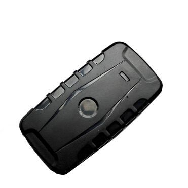

# GOTOP - TK-209B

El rastreador GPS TK-209B de GOTOP es un dispositivo de seguimiento con una batería de larga duración, diseñado especialmente para la gestión de flotas, seguimiento de activos y alquiler de vehículos. Con una capacidad de batería de hasta 400 días en modo de espera, este rastreador ofrece una solución confiable y duradera para monitorear la ubicación de tus activos.

El TK-209B cuenta con una clasificación IP67 a prueba de agua, lo que significa que puede soportar condiciones climáticas adversas y seguir funcionando sin problemas. Además, su diseño con un súper imán permite una fácil instalación sin necesidad de conectar cables, lo que lo hace ideal para ocultar y transportar de manera discreta.

Entre las características destacadas del TK-209B se incluyen:

- Banda cuádruple: 850/900/1800/1900 MHZ
- GPS integrado de antena / GSM
- Seguimiento vía SMS o GPRS
- Tiempo en espera de hasta 400 días
- Clasificación IP67 a prueba de agua
- Súper imán para una fácil instalación
- Alarma de batería baja
- Alarma de vibración
- Alarma de movimiento
- Plataforma de seguimiento multi-idioma
- Tensión de carga: 5V
- Batería de 20000mAh

Con el rastreador GPS TK-209B de GOTOP, puedes tener la tranquilidad de saber la ubicación de tus activos en todo momento, sin importar las condiciones climáticas o la duración de la batería. Su diseño resistente y sus características avanzadas lo convierten en una opción confiable para la gestión de flotas y el seguimiento de activos.

