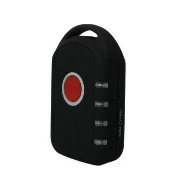

# GOTOP - TL-206

El GOTOP TL-206 es un rastreador GPS personal compacto diseñado para el seguimiento y monitoreo en tiempo real de personas, vehículos y mascotas. Utiliza satélites GPS para obtener posiciones y puede transmitir coordenadas mediante SMS o enviando datos a un servidor designado usando la conexión de datos del dispositivo. Con una carcasa muy pequeña y una autonomía en espera anunciada de hasta 200 horas, el TL-206 está pensado para situaciones que requieren seguimiento continuo y discreto.

Como dispositivo compatible con Plaspy, el TL-206 puede reenviar sus datos de ubicación a una plataforma de rastreo para visualización en mapas, alertas y revisión histórica. Plaspy puede integrar el TL-206 en flujos de trabajo de monitoreo centralizados, permitiendo a gestores de flota, cuidadores y equipos de seguridad ver posiciones, recibir notificaciones de geovallas y SOS, y administrar dispositivos desde un tablero único.

## Características principales

- Factor de forma reducido, aproximadamente 65 mm x 40 mm x 18 mm, ideal para transporte o montaje discreto
- Localización y seguimiento en tiempo real con reportes de posición vía SMS o subida de datos al servidor
- Larga autonomía en espera de hasta 200 horas para uso prolongado entre cargas
- Función de voz bidireccional que permite comunicación directa con el dispositivo
- Chipset de posicionamiento integrado que ofrece buena precisión incluso en condiciones de señal débil
- Funciones de seguridad como botón SOS y monitoreo configurable de geovallas

## Cómo funciona con Plaspy

El TL-206 puede configurarse para enviar su ubicación y estado a un servidor de rastreo, lo que permite que Plaspy reciba y presente esos datos para monitoreo en vivo y análisis histórico. En Plaspy, el TL-206 opera como un activo monitoreado estándar que aporta actualizaciones de ubicación y notificaciones de eventos para supervisión operativa.

- Visualización de posición en tiempo real sobre los mapas de Plaspy para rastrear activos en vivo
- Configuración de geovallas y alertas para notificarle cuando el dispositivo entre o salga de zonas definidas
- Manejo de SOS y alertas para exponer eventos de emergencia dentro de los flujos de trabajo de Plaspy
- Registros históricos de rutas y eventos para informes y revisiones dentro de Plaspy
- Lista centralizada de dispositivos y estado básico para facilitar la gestión de flotas o activos personales

## Casos de uso típicos

- Seguimiento de seguridad personal para niños, adultos mayores y personas vulnerables
- Monitoreo de mascotas para perros u otros animales en exteriores
- Rastreo antirrobo para vehículos pequeños, equipos y bienes portátiles
- Vigilancia remota para personal de campo o personal en viajes
- Uso empresarial cuando se requiere un rastreador compacto con larga autonomía para reportes de ubicación ocasionales

## Por qué elegir este rastreador con Plaspy

El TL-206 combina una huella muy pequeña con opciones sencillas de reporte de posición, lo que lo hace práctico cuando la discreción y la autonomía de batería son importantes. Sus funciones de voz bidireccional y botón SOS añaden una capa adicional de comunicación directa y notificación de emergencias que complementa las capacidades de monitoreo y alertas centralizadas de Plaspy.

Para organizaciones e individuos que necesitan integrar rastreadores personales compactos en una plataforma de seguimiento más amplia, el TL-206 ofrece un equilibrio entre portabilidad, seguimiento continuo y funciones de seguridad. Al usarse con Plaspy, el dispositivo puede formar parte de una vista operacional que respalde la conciencia de ubicación, alertas por geovalla e informes básicos sin añadir complejidad innecesaria.

Para saber más sobre cómo Plaspy puede mostrar y administrar dispositivos como el GOTOP TL-206 visite https://www.plaspy.com. Las especificaciones y la disponibilidad del producto pueden cambiar con el tiempo, por lo que le recomendamos verificar los detalles y la compatibilidad actual en el sitio del fabricante https://www.gotop.cc/.
