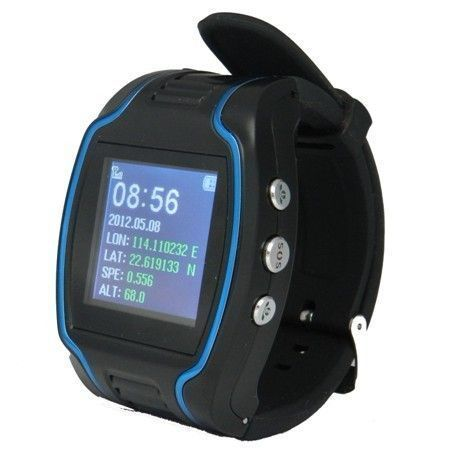

# GOTOP - TV-680

El rastreador GPS GOTOP TV-680 cuenta con un microchip GPS sofisticado que lee continuamente su ubicación a través de los satélites de órbita baja en todo el mundo. Utiliza la infraestructura GSM a través de una tarjeta SIM para transmitir su ubicación actual a través de la red celular de los principales proveedores. Este rastreador puede ser utilizado para proteger y localizar a nuestros ancianos y niños, así como para fines de seguridad y protección de la propiedad.

Este rastreador GPS ofrece varias formas de obtener la ubicación del dispositivo. Puede hacer una llamada telefónica al número autorizado y recibir un mensaje con la información de longitud y latitud, que se puede buscar en el mapa de Google para encontrar una dirección específica. También se puede utilizar el modo de mensajes cortos \(SMS\) enviando un mensaje al dispositivo para recibir una respuesta de posicionamiento.

Además, el rastreador GPS GOTOP TV-680 permite la comunicación bidireccional. Puede llamar a números preestablecidos pulsando los botones correspondientes, y también puede recibir llamadas y responder a través del botón SOS o de forma automática después de 30 segundos. Esto proporciona una forma conveniente de comunicarse con el dispositivo y con otras personas en caso de emergencia.

### Características destacadas:

- Microchip GPS sofisticado para una ubicación precisa
- Transmisión de ubicación a través de la red celular
- Protección y localización de ancianos y niños
- Modo de llamada telefónica y mensajes cortos \(SMS\)
- Comunicación bidireccional con números preestablecidos
- Botón SOS para emergencias

