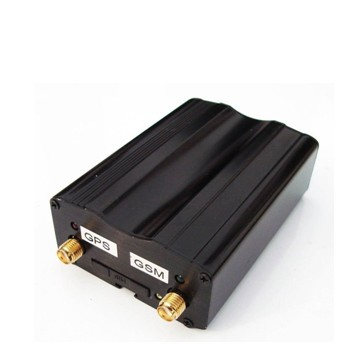

# GOTOP - VT360

El VT360 es un rastreador GPS profesional para vehículos diseñado para ofrecer un seguimiento confiable en tiempo real y facilitar la gestión de flotas. Basado en un módulo GNSS SiRFstar III de alta sensibilidad y comunicaciones GSM/GPRS probadas, el VT360 proporciona posicionamiento preciso, informes basados en tiempo y distancia, y el envío instantáneo de ubicaciones mediante enlaces SMS a Google Maps. Una batería interna de respaldo conserva la telemetría durante cortes de la alimentación principal, manteniendo la visibilidad cuando más importa.

Como dispositivo compatible con Plaspy, el VT360 se integra de forma directa con plataformas que aceptan telemetría estándar por SMS y GPRS. Su soporte para alarmas basadas en eventos, entradas analógicas para monitoreo de combustible o temperatura, y funciones de control remoto como inmovilizador lo convierten en una opción práctica para gestores de flota que desean importar datos de ubicación y eventos a Plaspy para mapas, alertas e informes.

## Características principales

- Compatible con Plaspy mediante SMS y GPRS para seguimiento en tiempo real e integración de flotas
- Posicionamiento GNSS de alta sensibilidad con precisión adecuada para rastreo vehicular
- Alarmas de seguridad y eventos completas incluyendo SOS, geocerca, área ciega, batería baja y exceso de velocidad
- Función de corte remoto del motor y soporte de escucha remota para flujos de trabajo anti robo
- Informes basados en tiempo y distancia además de soporte de kilometraje para registros operativos
- Entrada analógica para monitoreo de sensores de combustible o temperatura que soporta flujos de telemetría
- Batería interna de respaldo que conserva los reportes durante interrupciones de la alimentación principal

## Cómo funciona con Plaspy

Cuando se configura para reenviar sus mensajes, el VT360 transmite actualizaciones de ubicación y estado a Plaspy, donde esos mensajes se muestran en mapas en vivo, se convierten en alertas y se registran para informes históricos. Plaspy puede utilizar la telemetría entrante y los mensajes de eventos del VT360 para alimentar paneles operativos y reglas de notificación.

- Las ubicaciones y la telemetría en tiempo real aparecen en los mapas de Plaspy cuando el dispositivo envía datos por GPRS o SMS
- Las alarmas por eventos como SOS, geocerca, área ciega, exceso de velocidad y batería baja se convierten en alertas en Plaspy para una respuesta rápida
- Los informes por tiempo y distancia y la información de kilometraje se capturan para reportes de flota y registros de cumplimiento
- El inmovilizador remoto y el control de salidas pueden activarse mediante comandos gestionados a través de Plaspy cuando su flujo de trabajo lo permite
- Las entradas de sensores analógicos para combustible o temperatura proporcionan telemetría que Plaspy puede graficar e incluir en informes de tendencias

## Casos de uso típicos

- Protección y recuperación de vehículos de flota mediante SOS, geocerca y corte remoto del motor para salvaguardar activos de alto valor
- Rastreo de rutas y kilometraje para reportes operativos y conciliación de facturación
- Monitoreo del comportamiento del conductor con alertas por exceso de velocidad y revisión histórica de rutas en Plaspy para procesos de capacitación
- Monitoreo de combustible y temperatura vía entradas analógicas para reducir pérdidas y apoyar el mantenimiento preventivo
- Escucha remota e investigación de incidentes para aportar contexto adicional durante acontecimientos críticos

## Por qué elegir este rastreador con Plaspy

El VT360 es adecuado para organizaciones que necesitan un rastreador confiable que se integre de forma directa con una plataforma de gestión de flotas como Plaspy. Su equilibrio entre posicionamiento preciso, salidas de telemetría estándar y funciones de alarma basadas en eventos lo hace práctico para flujos de trabajo comunes de flotas y seguridad sin requerir integraciones complejas.

Si usted desea un dispositivo que brinde visibilidad continua, soporte para entradas de sensores y funciones de control remoto que puedan gestionarse desde Plaspy, el VT360 es una opción capacitada a considerar. Obtenga más información sobre Plaspy y cómo se utilizan los dispositivos compatibles en el sitio principal https://www.plaspy.com. Las especificaciones y la disponibilidad del producto pueden cambiar con el tiempo, por lo que le recomendamos verificar los detalles actuales en el sitio del fabricante https://www.gotop.cc/ antes de comprar.
