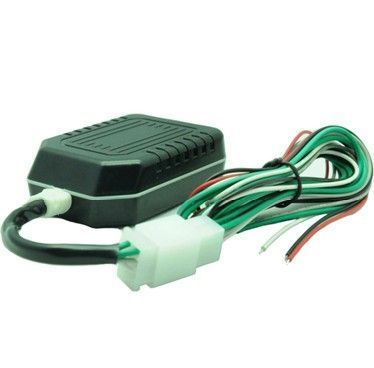

# GOTOP - VT-106

El GOTOP VT-106 es un rastreador GPS compacto diseñado para ofrecer localización precisa y confiable en motocicletas. Emplea satélites GPS para posicionamiento y la red GSM GPRS existente para transmitir información de ubicación y estado. El dispositivo permite enviar coordenadas por SMS y subir datos a un servidor designado, e incluye características prácticas para motos como carcasa resistente al agua, imán integrado para un montaje seguro y una batería interna de respaldo.

Como dispositivo compatible con Plaspy, el VT-106 puede alimentar a Plaspy con datos de ubicación, alarmas y estado para una gestión y visibilidad centralizadas. Al transmitir coordenadas y mensajes de alarma a un servidor, Plaspy recibe esos datos y los presenta junto con otros activos para seguimiento en vivo, reproducción de historial y generación de reportes operativos. Esto convierte al VT-106 en una opción adecuada para organizaciones que requieren hardware específico para motocicletas que opere con Plaspy en flujos de trabajo de monitoreo y seguridad.

## Aspectos clave

- Diseñado para seguimiento de motocicletas con carcasa compacta resistente al agua e imán integrado para montaje seguro
- Usa GPS para posicionamiento y GSM GPRS para transmitir coordenadas y estado al servidor
- Soporta reportes por SMS y carga de datos vía GPRS para opciones de rastreo flexibles
- Incluye alarmas como geocerca, batería baja, exceso de velocidad y pérdida de alimentación principal para monitoreo activo
- Capacidad de inmovilización remota cortando el circuito y el suministro de combustible para mayor control de seguridad
- Antenas GPS y GSM integradas y batería interna de respaldo de 1000 mAh para operación continua ante cortes de energía

## Cómo funciona con Plaspy

Al integrarse con Plaspy, los datos enviados por el VT-106 se procesan en vistas de ubicación, alertas y reportes que apoyan la gestión de flotas y el monitoreo de seguridad. Plaspy recibe mensajes de coordenadas y alarmas del rastreador y los traduce en información accionable dentro de una sola plataforma.

- Visualización en tiempo real de la ubicación de las motocicletas en los mapas de Plaspy para supervisión operativa
- Reproducción de rutas históricas e historial de ubicaciones para auditorías y análisis de viajes
- Gestión de alarmas y notificaciones en Plaspy para activaciones de geocerca, batería baja y exceso de velocidad
- Reportes de estado e indicadores de salud del dispositivo para monitorear eventos de alimentación principal y batería de respaldo
- Uso de señales de inmovilización remota mediante flujos de trabajo de Plaspy cuando la configuración del dispositivo lo permite

## Casos de uso típicos

- Seguimiento de flotas de motocicletas para mensajería y servicios de entrega
- Protección de activos y respuesta ante robos de motocicletas personales o corporativas
- Monitoreo de scooters y bicicletas de alquiler para controlar uso y recorridos
- Operaciones de servicio en campo o última milla que requieren rastreadores compactos en vehículos de dos ruedas
- Vigilancia de seguridad donde son útiles geocercas y capacidades de parada remota

## Por qué elegir este rastreador con Plaspy

El GOTOP VT-106 combina hardware práctico orientado a motocicletas con las capacidades de envío de datos que Plaspy necesita para flujos básicos de rastreo y alarma. Su combinación de reportes vía SMS y GPRS, características integradas de montaje y batería de respaldo lo hacen apropiado para vehículos que requieren un rastreador compacto y resistente. Para organizaciones que usan Plaspy, el VT-106 puede aportar reportes de ubicación y señales de alarma consistentes que Plaspy convertirá en monitoreo, alertas y reportes.

Si desea saber más sobre cómo el VT-106 puede integrarse en su configuración de rastreo con Plaspy visite https://www.plaspy.com para explorar las funciones de la plataforma y las opciones de integración. Las especificaciones del producto y su disponibilidad pueden cambiar con el tiempo, por lo que le recomendamos verificar los detalles actuales con el fabricante en https://www.gotop.cc/ antes de tomar decisiones de compra o despliegue.
