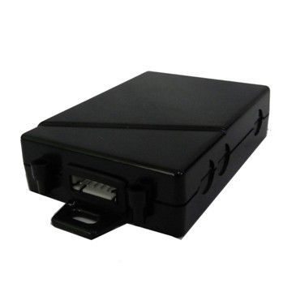

# GOTOP - VT-320

El GOTOP VT-320 es un dispositivo compacto de rastreo GPS/GSM/GPRS diseñado principalmente para el seguimiento en tiempo real de motocicletas y la seguridad vehicular. Pensado para ofrecer posiciones estables incluso en entornos complejos, el VT-320 admite varios modos de rastreo, incluidos intervalos por tiempo, por distancia y reportes vía SMS o GPRS. También integra funciones de seguridad prácticas como botón de pánico SOS, alarma de geocerca, alarma por exceso de velocidad, sensor de movimiento incorporado para ahorro de energía y la posibilidad de cortar el motor de forma remota.

Como dispositivo compatible con Plaspy, el VT-320 puede enviar datos de ubicación y alertas a Plaspy para obtener visibilidad centralizada y supervisión de la flota. Plaspy puede aprovechar la información del VT-320 para mostrar posiciones en tiempo real, gestionar eventos de geocerca y exceso de velocidad, y recopilar datos de kilometraje para informes. Su amplio rango de alimentación y su formato compacto lo hacen una opción versátil para instalaciones en motocicletas y vehículos de 12V o 24V que necesitan una integración sencilla con las herramientas de monitoreo y reporte de Plaspy.

## Principales características

- Diseñado para el seguimiento en tiempo real de motocicletas y la seguridad vehicular
- Opciones de rastreo múltiples, incluyendo reportes por SMS y GPRS
- Funciones de seguridad como botón de pánico SOS, alarma de geocerca y alarma por exceso de velocidad
- Sensor de movimiento integrado para ahorrar energía y optimizar la operación
- Soporte para corte remoto de motor y reporte de kilometraje para supervisión de flotas
- Amplio rango de alimentación de 6V a 24V y diseño compacto para instalación sencilla

## Cómo funciona con Plaspy

Cuando se usa junto con Plaspy, el VT-320 suministra actualizaciones de posición y eventos de alarma que Plaspy presenta en un panel centralizado para supervisión e informes. Plaspy puede aprovechar las funciones integradas del rastreador para mejorar la visibilidad operativa y agilizar la respuesta ante incidentes de seguridad.

- Visualización de ubicaciones en tiempo real en los mapas de Plaspy para monitoreo en vivo de vehículos individuales o de flotas completas
- Alertas de geocerca y exceso de velocidad enviadas a Plaspy para notificación inmediata e historial de eventos
- Datos de kilometraje e intervalos de rastreo importados para informes y análisis de rutas
- Eventos de alarma SOS dirigidos a los flujos de alerta de Plaspy para una toma de conciencia rápida
- El uso de salidas del rastreador, como el corte remoto de motor, puede coordinarse desde Plaspy cuando la configuración del dispositivo lo permita

## Casos de uso típicos

- Rastreo en tiempo real y monitoreo antirrobo para motociclistas individuales
- Seguimiento de flotas para taxis, autobuses, vehículos de reparto y camiones ligeros
- Rastreo y recuperación remota de activos móviles y equipos
- Servicios basados en ubicación que requieren actualizaciones frecuentes de posición y enlaces de mapa por SMS
- Flujos de trabajo de seguridad y respuesta a emergencias usando alertas SOS y geocercas

## Por qué elegir este rastreador con Plaspy

El VT-320 es una opción práctica para organizaciones que buscan un rastreador pequeño y económico con funciones básicas de seguridad y reporte. Su compatibilidad con reportes por SMS y GPRS, junto con su amplio rango de alimentación, lo hace adecuado para flotas mixtas que incluyen motocicletas y vehículos de 12V o 24V. Estas características facilitan implementaciones sencillas a la vez que proporcionan la telemetría y las señales de alarma que Plaspy utiliza para monitoreo e informes.

Combinar el VT-320 con Plaspy ofrece a los equipos una plataforma centralizada para ver ubicaciones, gestionar alertas y generar reportes de kilometraje y eventos sin configuraciones complejas. Para más información sobre cómo Plaspy puede trabajar con dispositivos compatibles como el GOTOP VT-320 visite https://www.plaspy.com. Las especificaciones del producto y su disponibilidad pueden cambiar con el tiempo, por lo que se recomienda verificar los detalles técnicos actuales y las indicaciones del fabricante en el sitio oficial de GOTOP https://www.gotop.cc/.
