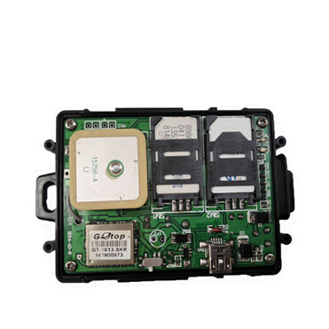

# GOTOP - VT-330

El VT-330 Dual SIM Car GPS Tracker es un rastreador GPS compacto y fiable que es compatible con Plaspy para monitoreo en tiempo real y gestión de flotas. Diseñado para motocicletas, carritos de golf eléctricos y vehículos estándar, el VT-330 combina posicionamiento por satélite SiRF-Star III con comunicación GSM/GPRS y capacidad de doble SIM para maximizar la disponibilidad de la red y mantener la ubicación del vehículo, alertas SOS y telemetría básica fluyendo hacia Plaspy para supervisión y respuesta.

Con una batería de respaldo de 850 mAh, un rango de tensión de operación de +9V a +36V y un rango ambiental robusto, el VT-330 soporta operación continua en condiciones exigentes. Su formato discreto de 80 × 58 × 22 mm y su inmovilizador con relé lo hacen idóneo para despliegues anti‑hurto, monitoreo de rutas y seguimiento general de activos donde se requiera una precisión de posición fiable e una integración sencilla con Plaspy.

## Principales características

- Rastreador GPS compatible con Plaspy para un rastreo en tiempo real y gestión de flotas confiables.
- Conectividad GSM/GPRS de doble SIM para mayor resiliencia de red y roaming.
- Motor GNSS SiRF‑Star III con ~10 m de precisión de posición \(2D RMS\) y rápido reacoplamiento.
- Batería de respaldo integrada de 850 mAh y rango de alimentación de +9V a +36V para operación continua.
- Caja compacta y ligera \(80×58×22 mm, 90 g\) para montaje discreto en vehículos o activos.
- Botón SOS integrado, 2 entradas digitales y 2 salidas, además del relé suministrado para inmovilización remota.
- Alta tolerancia ambiental \(‑30°C a 75°C, 5%–95% de humedad no condensante\) para condiciones de campo exigentes.

## Cómo funciona con Plaspy

El VT-330 envía datos de posición GNSS y telemetría del vehículo a Plaspy a través de GSM/GPRS, lo que permite mapas en vivo, alertas e informes históricos. El soporte de doble SIM reduce las caídas de datos al permitir que el dispositivo cambie entre operadores; Plaspy recibe actualizaciones continuas de ubicación y de eventos para una supervisión de flotas eficiente y flujos de trabajo anti‑hurto.

- Actualizaciones de ubicación y telemetría en tiempo real vía GSM/GPRS a Plaspy para seguimiento en vivo y reproducción de rutas.
- Los eventos del botón SOS se entregan a Plaspy para que los operadores puedan activar respuestas inmediatas.
- Las entradas digitales pueden reportar estado de puertas, encendido o alarma a Plaspy cuando están conectadas a señales del vehículo.
- Control remoto de inmovilización a través del relé/ salidas incluidas: Plaspy puede iniciar la inmovilización cuando esté configurado con el cableado del vehículo y permisos de la plataforma.
- Nota sobre sensores Bluetooth: la especificación del VT-330 no lista Bluetooth; Plaspy también puede aceptar datos de sensores Bluetooth de rastreadores compatibles cuando haya disponibilidad.

## Resumen técnico

| Conectividad | Módulos de comunicación GSM/GPRS |
| --- | --- |
| Bandas | GSM 900/1800/1900 MHz o GSM 850/900/1800/1900 MHz \(variantes del modelo\) |
| SIM | Soporte para SIM de 3 V; ranuras dual SIM |
| Alimentación y Batería | Entrada +9V a +36V; batería de respaldo integrada de 850 mAh |
| Interfaces | 1 botón SOS, 1 botón de encendido/apagado, 2 entradas digitales, 2 salidas, relé suministrado para inmovilización |
| GNSS | Con conjunto SiRF‑Star III; L1 1575.42 MHz; 20 canales; sensibilidad ‑158 dB; precisión de posición ~10 m \(2D RMS\); precisión de velocidad 0.1 m/s; precisión temporal 1 μs; reacq ~0.1 s, hot start ~1 s, warm ~38 s, cold ~42 s; datum WGS‑84 |
| Límites operativos | Límite de altitud 18,000 m; límite de velocidad 515 m/s \(1000 nudos\) |
| Bluetooth | No especificado en la documentación suministrada |
| Gestión remota | No especificado \(no se detallan FOTA o gestión web\) |
| Ambiental | Temperatura de operación ‑30°C a 75°C; humedad 5%–95% no condensante |
| Formato y Peso | 80 mm × 58 mm × 22 mm; 90 g |
| Accesorios | Cable de alimentación, relé, manual de usuario \(incluidos\) |

## Casos de uso

- Gestión de flotas: posición continua, reproducción de rutas e informes de eventos para coches, camiones ligeros y flotas de servicio.
- Protección antirrobo: alertas SOS e inmovilización remota mediante el relé suministrado para impedir el uso no autorizado del vehículo.
- Seguimiento de motocicleta y carritos de golf: tamaño compacto y amplio rango de voltaje lo hacen adecuado para vehículos pequeños y plataformas eléctricas.
- Monitoreo de rutas y supervisión del comportamiento del conductor: telemetría GNSS y entradas digitales pueden ayudar a verificar rutas y eventos clave.
- Rastreo remoto de activos: instalación discreta y batería de respaldo proporcionan resiliencia para activos estacionados o almacenados.

## Por qué elegir este rastreador con Plaspy

El VT-330 ofrece una combinación equilibrada de posicionamiento GNSS fiable, resiliencia GSM de doble SIM y interfaces de vehículo prácticas que lo convierten en una opción sólida para organizaciones que implementan Plaspy para telemetría y rastreo en tiempo real. Su formato compacto, batería de respaldo y amplio rango de operación simplifican la instalación entre tipos de vehículos, mientras que el relé y las E/S incluidas permiten flujos de trabajo anti‑hurto, como inmovilización y alertas basadas en eventos. Para flotas que requieren datos de ubicación confiables y una integración sencilla, el VT-330 ofrece características de hardware probadas que se alinean directamente con las capacidades de monitorización, alertas e informes de Plaspy.

