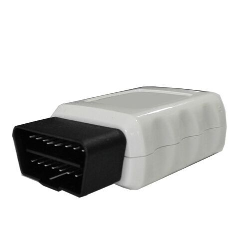

# GOTOP - VT-350

El GOTOP VT-350 es un rastreador GPS OBD pensado para ofrecer un seguimiento vehicular y una gestión de flotas sencillos. El dispositivo se conecta al puerto OBD II del vehículo y utiliza antenas GSM y GPS integradas para reportar posición y movimiento. Admite seguimiento bajo demanda o en intervalos regulares vía SMS o GPRS y entrega coordenadas, velocidad, rumbo, lecturas de odómetro e información de kilometraje que permiten mantener visibilidad en tiempo real de sus vehículos y flotas.

Al ser un dispositivo compatible con Plaspy, el VT-350 puede enviar sus datos de ubicación y alertas a Plaspy para su supervisión y generación de informes centralizados. Cuando se conecta mediante los protocolos estándar SMS o GPRS, las actualizaciones de posición y los eventos del VT-350 pueden aprovecharse en Plaspy para mejorar la supervisión operativa, activar alertas por geocerca y exceso de velocidad, y conservar un historial de kilometraje y desplazamientos para los administradores de flota.

## Puntos clave

- Conexión plug-in al puerto OBD II para un despliegue rápido y sin complicaciones.
- Antenas GSM y GPS integradas para posicionamiento satelital y comunicación celular.
- Soporta seguimiento bajo demanda por SMS y reportes continuos por GPRS.
- Proporciona coordenadas de ubicación, velocidad, rumbo e información del odómetro.
- Alertas incorporadas por exceso de velocidad, entrada o salida de geocercas, movimiento y pérdida de alimentación.
- Posibilidad de visualizar ubicaciones en servicios de mapas para verificación visual.

## Cómo funciona con Plaspy

Al integrarse con Plaspy, el VT-350 forma parte de un flujo de trabajo de seguimiento gestionado que añade contexto y visibilidad a los reportes brutos del dispositivo. Plaspy recibe las actualizaciones de posición y los mensajes de eventos del VT-350 para mostrar mapas consolidados, alertas y registros accesibles para operadores y administradores de flota.

- Visualice la ubicación en tiempo real y el historial reciente de recorridos de los vehículos equipados con VT-350 en los mapas de Plaspy.
- Reciba y gestione alertas del equipo, como exceso de velocidad, activación de geocercas, movimiento y pérdida de energía, dentro de los canales de notificación de Plaspy.
- Agregue informes de odómetro y kilometraje en Plaspy para revisión periódica y reportes operativos.
- Utilice los informes de Plaspy para analizar patrones de movimiento de los vehículos y generar resúmenes para la supervisión de la flota.
- Filtre y busque la actividad de dispositivos VT-350 para apoyar tareas de despacho y verificación de rutas.

## Casos de uso típicos

- Seguimiento de vehículos de flota para pequeñas y medianas empresas que requieren una implementación simple.
- Monitoreo de autos de renta para verificar ubicación y kilometraje entre arrendamientos.
- Supervisión de vehículos de reparto y servicio donde las actualizaciones periódicas y las alertas mejoran el control operativo.
- Recuperación ante robo y alertas de movimiento cuando ocurre una salida inesperada del vehículo o pérdida de alimentación.
- Monitoreo básico del comportamiento del conductor centrado en eventos de velocidad e historial de rutas.

## Por qué elegir este rastreador con Plaspy

El VT-350 es una opción práctica para organizaciones que buscan una solución de rastreo OBD que minimice el tiempo de instalación. Su capacidad para reportar ubicación y un conjunto esencial de datos del vehículo mediante GSM y GPS lo hace adecuado para operadores de flotas que necesitan visibilidad constante y alertas básicas sin integrar hardware complejo.

Combinado con Plaspy, los reportes del VT-350 pasan a formar parte de un entorno centralizado de monitoreo e informes. Plaspy recopila las actualizaciones del dispositivo, muestra alertas y ofrece mapas e información histórica que ayudan a los equipos a gestionar los vehículos de manera más eficiente. Si su prioridad es un despliegue rápido y un reporte de posición confiable con manejo de alertas integrado, el VT-350 junto con Plaspy es una opción sensata.

Para obtener más información sobre cómo Plaspy funciona con rastreadores de vehículo como el GOTOP VT-350 visite https://www.plaspy.com y explore las funciones de la plataforma. Las especificaciones del producto, disponibilidad y detalles del fabricante pueden cambiar con el tiempo, por lo que le recomendamos verificar la información técnica vigente en el sitio oficial de GOTOP https://www.gotop.cc/ antes de comprar.
