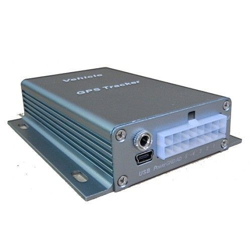

# GOTOP - VT-380A

El GOTOP VT-380A es un dispositivo de rastreo GPS/GPRS para vehículos, diseñado para el seguimiento en tiempo real y la gestión de flotas. Emplea un módulo GPS integrado para obtener la posición y utiliza la conectividad GSM para transmitir esos datos a un teléfono móvil o servidor especificado. La unidad incorpora memoria interna para almacenar coordenadas cuando no hay conexión GPRS o cuando se configura para registrar posiciones a intervalos definidos. Opcionalmente, se puede conectar un micrófono al habitáculo del vehículo para monitoreo donde la normativa lo permita.

Este modelo es compatible con Plaspy, lo que lo convierte en una opción viable para organizaciones que desean combinar el hardware GOTOP con el software de gestión de flotas de Plaspy. Plaspy puede recibir las actualizaciones de ubicación del VT-380A, las subidas de posiciones almacenadas, los eventos de identificación de conductor y las notificaciones de alarma para ofrecer visibilidad consolidada, informes y supervisión operativa de flotas mixtas.

## Características principales

- Rastreo vehicular en tiempo real vía GPS y GPRS para visibilidad continua de la ubicación
- Memoria interna para almacenar datos de ubicación cuando la conectividad de red se interrumpe
- Solución de ID de conductor mediante tarjetas RFID inductivas y un lector externo para asignación de choferes
- Comportamiento integrado de alarma que puede armarse y cortar combustible y alimentación cuando no está presente la tarjeta del conductor
- Notificaciones de alarma enviadas al teléfono y al servidor para rápida detección de incidentes de seguridad
- Entrada opcional para micrófono para monitoreo de cabina según sea necesario

## Cómo funciona con Plaspy

Cuando se integra con Plaspy, el VT-380A envía mensajes de posición y estado que Plaspy muestra y gestiona dentro de sus herramientas de monitoreo de flota. Plaspy procesa los mensajes del dispositivo para ofrecer seguimiento unificado, alertas y reproducción histórica junto con otros activos de la flota.

- Mostrar la ubicación del vehículo y sus movimientos recientes en los mapas de Plaspy para monitoreo en vivo
- Asociar los eventos de ID de conductor del VT-380A con registros de conductores y bitácoras de viaje
- Subir las coordenadas almacenadas en caché cuando se restablece la conectividad para mantener un historial de ubicación continuo
- Exponer eventos de alarma del rastreador como notificaciones y alertas en la plataforma para una respuesta rápida
- Incluir dispositivos VT-380A en reportes y dashboards operativos de Plaspy para supervisión de flota

## Casos de uso habituales

- Monitoreo de la ubicación de vehículos para operaciones logísticas y de reparto
- Autenticación y responsabilidad del conductor mediante tarjetas de ID RFID
- Prevención y recuperación ante robos mediante armado automático y notificaciones de alarma
- Reconstrucción de rutas y análisis histórico de ubicaciones tras viajes o incidentes
- Supervisión de autos corporativos, flotas de alquiler, taxis y vehículos de servicio

## Por qué elegir este rastreador con Plaspy

El VT-380A combina el rastreo GPS estándar con funciones prácticas como el almacenamiento de datos interno y la identificación de conductor, características que responden bien a las necesidades de gestión de flotas. Estas capacidades ayudan a mantener el historial de ubicación durante conexiones intermitentes y facilitan el seguimiento a nivel de conductor para el control operativo. Los comportamientos antirrobo y la mensajería de alarmas añaden además una capa de seguridad que Plaspy puede visibilizar junto con otros eventos de la flota.

Si usted está evaluando dispositivos para usar con Plaspy, el VT-380A es una opción sólida cuando necesita rastreo persistente, asociación de conductores e informes de alarma en un rastreador vehicular compacto. Conozca más sobre Plaspy en el sitio principal https://www.plaspy.com. Las especificaciones del producto, la disponibilidad y los detalles del fabricante pueden cambiar con el tiempo, por lo que le recomendamos verificar las especificaciones y características actuales en el sitio oficial de GOTOP https://www.gotop.cc/ antes de la compra.
