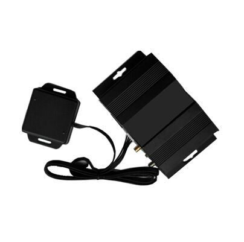

# GOTOP - VT-391

El GOTOP VT-391 es un rastreador GPS versátil diseñado para la gestión de flotas y la seguridad vehicular. Integra el reporte de posición con un módulo WiFi incorporado y soporte opcional para cámara, de modo que la ubicación y los datos de conducción se pueden registrar junto con imágenes. El VT-391 también cuenta con identificación de conductor por RFID, una ranura para tarjeta SD de gran capacidad para almacenamiento local, audio bidireccional, múltiples entradas analógicas para monitoreo de combustible y una variedad de alarmas configurables para eventos como frenadas bruscas, accidentes y exceso de velocidad.

Como dispositivo compatible con Plaspy, el VT-391 es apropiado para organizaciones que buscan seguimiento integrado, alertas y evidencia registrada desde una única plataforma. Plaspy puede recibir y presentar las actualizaciones de ubicación, alertas de eventos, informes de kilometraje e información de identificación de conductor del VT-391, ofreciendo visibilidad y supervisión operativa de la flota y aprovechando las funciones de almacenamiento y cámara del equipo para aportar contexto adicional.

## Características principales

- Conectividad WiFi integrada para transmisión local de datos y comunicaciones flexibles
- Soporte para cámara a bordo que permite adjuntar fotos a eventos de ubicación y conducción
- Identificación de conductor por RFID para reconocimiento automático y flujos antirrobo
- Almacenamiento local expandible con soporte para tarjeta SD de hasta 64 GB para registros e imágenes
- Múltiples entradas analógicas y digitales para monitoreo de combustible y sensores externos
- Audio bidireccional y conjunto de alarmas de seguridad que incluyen SOS, detección de movimiento, geocercas y exceso de velocidad
- Actualizaciones OTA e informes de kilometraje para facilitar el mantenimiento y los registros operativos

## Cómo funciona con Plaspy

Al integrarse con Plaspy, el VT-391 suministra la posición del vehículo, eventos y medios de apoyo a la plataforma Plaspy, donde los equipos pueden monitorear la actividad y generar reportes. Plaspy consolida los datos del dispositivo en mapas, alertas y registros históricos para que los administradores de flota obtengan una vista unificada del estado de los vehículos e incidentes.

- Seguimiento de ubicación en tiempo real e histórico mostrado en los mapas de Plaspy para supervisión de rutas
- Mapeo de eventos y alarmas como SOS, rupturas de geocerca, frenadas bruscas y alertas de exceso de velocidad
- Registros de identificación de conductor mediante logs RFID para asociar viajes con el personal
- Asociación de fotos y medios locales para aportar contexto visual a incidentes e inspecciones
- Informes de kilometraje y de viajes para apoyar análisis operativos y planificación de mantenimiento
- Informes del estado de sensores y entradas para monitorear niveles de combustible y condiciones de dispositivos externos

## Casos de uso típicos

- Monitoreo de rutas y seguimiento de kilometraje para operaciones de transporte y reparto
- Seguridad vehicular y flujos anti robo mediante identificación RFID y alertas de movimiento
- Supervisión del comportamiento del conductor con alarmas por frenadas bruscas, aceleraciones y accidentes
- Captura de evidencia visual para incidentes, inspecciones o comprobantes de entrega mediante la cámara
- Monitoreo de combustible y telemetría operativa usando las entradas analógicas para seguimiento de consumo

## Por qué elegir este rastreador con Plaspy

El VT-391 combina un conjunto amplio de funciones con conectividad flexible y almacenamiento local, lo que lo convierte en una opción práctica para flotas que requieren algo más que un simple reporte de ubicación. Su soporte para cámara e identificación de conductor por RFID aporta capas adicionales de información operativa y seguridad que se integran de forma natural con las herramientas de monitoreo e informes de Plaspy.

Si desea explorar cómo el VT-391 puede encajar en su despliegue y gestionarse a través de Plaspy, conozca más sobre Plaspy en el sitio principal https://www.plaspy.com. Las especificaciones del producto, disponibilidad y detalles del fabricante pueden cambiar con el tiempo; para obtener la información técnica más actualizada verifique las especificaciones en el sitio oficial del fabricante https://www.gotop.cc/.
