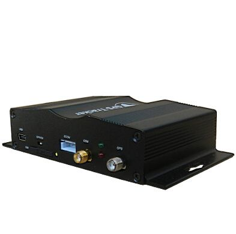

# GOTOP - VT-393

El GOTOP VT-393 es un rastreador GPS diseñado para la gestión de flotas y la seguridad vehicular. Integra un procesador ARM9 de alto rendimiento con funciones orientadas a ofrecer reportes de posición confiables y registro de actividades. Entre sus capacidades destacadas se encuentran el soporte de cámara para tomar fotografías con datos de ubicación y de conducción, almacenamiento ampliado mediante ranura para tarjeta SD y una variedad de entradas y salidas para conectar señales del vehículo y accesorios.

Como dispositivo compatible con Plaspy, el VT-393 puede integrarse en un flujo de trabajo de seguimiento de flotas para aportar visibilidad de ubicación, notificaciones de eventos y captura de medios cuando esté disponible. Usted podrá aprovechar el VT-393 para reunir datos de ubicación, alertas e imágenes registradas en una plataforma unificada de monitoreo e informes, sin depender de detalles técnicos especulativos.

## Aspectos principales

- Soporte de cámara que asocia imágenes con ubicación y datos de conducción para documentación visual
- Diseño basado en ARM9 para rendimiento consistente y operación confiable en uso de flota
- Amplio almacenamiento local con soporte para tarjetas SD de gran capacidad para conservar registros y fotos
- Múltiples entradas analógicas y digitales para monitorear señales relacionadas con combustible y otros datos vehiculares
- Soporte integrado para comunicación bidireccional que permite la interacción entre gestor y conductor
- Capacidad de actualización remota vía GPRS para mantener el software del equipo al día cuando esté disponible

## Cómo funciona con Plaspy

El VT-393 puede enviar a Plaspy información de ubicación, eventos y medios para mejorar la visibilidad y supervisión operativa de la flota. Una vez que el rastreador esté configurado para comunicarse con Plaspy, sus actualizaciones de posición, alertas e imágenes registradas podrán mostrarse junto con el resto de los activos de la flota para un monitoreo consolidado.

- Ubicación y movimiento del vehículo visibles en los mapas de Plaspy para revisión en tiempo real y análisis histórico
- Alertas como SOS, geocerca, exceso de velocidad, frenados bruscos y notificaciones de accidente dirigidas a Plaspy para atención inmediata
- Captura de imágenes asociadas a eventos o intervalos de tiempo disponibles en Plaspy como evidencia complementaria
- Reportes de kilometraje y registros de movimiento accesibles en Plaspy para análisis operativo y mantenimiento de registros
- Capacidades de control remoto y estados de entradas digitales expuestos en Plaspy para respaldar flujos de trabajo y acciones correctivas

## Casos de uso típicos

- Operadores de flota que documentan el comportamiento del conductor y incidentes con fotos georreferenciadas
- Empresas de paquetería y logística que rastrean kilometraje y desplazamientos para reportes operativos
- Seguridad vehicular y prevención de robos mediante RFID y alertas de movimiento integradas a una plataforma de monitoreo
- Flotas de servicio que monitorean entradas relacionadas con combustible y estado del vehículo para controlar costos
- Gerentes que utilizan comunicación bidireccional y alertas para coordinar a los conductores y responder a eventos

## Por qué elegir este rastreador con Plaspy

El VT-393 es una opción práctica para organizaciones que necesitan combinar captura de medios a bordo, entradas y salidas flexibles y alertas orientadas a eventos. Su mezcla de soporte de cámara, múltiples entradas y comunicación bidireccional puede aportar contexto valioso a los datos de ubicación cuando se integra con las funciones de reporte y monitoreo de Plaspy. Para equipos que dependen de evidencia visual o requieren conservar registros locales extensos, el VT-393 ofrece opciones de almacenamiento y puertos acordes con esas necesidades operativas.

Dado que Plaspy consolida el seguimiento, las alertas y los medios en una sola vista, combinar el VT-393 con Plaspy facilita convertir los datos brutos del equipo en información accionable para los gestores de flota. Si sus requerimientos incluyen documentación por imagen, alertas configurables y un conjunto capaz de entradas y salidas, el VT-393 es un modelo a considerar para integración con una solución de rastreo basada en Plaspy.

Aprenda más sobre Plaspy en el sitio principal https://www.plaspy.com y verifique las especificaciones y disponibilidad actuales del VT-393 con el fabricante en https://www.gotop.cc/ ya que los detalles del producto y las opciones de firmware pueden cambiar con el tiempo.
