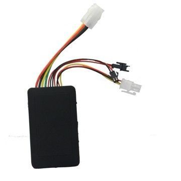

# GOTOP - VT-810

El GOTOP VT-810 es un rastreador vehicular compacto que integra un módulo GPS con comunicación GSM GPRS para ofrecer información de posición precisa y oportuna. Su tamaño reducido y diseño discreto lo hacen apto para instalaciones ocultas en diversos tipos de vehículos, y está pensado para entregar actualizaciones de ubicación continuas en aplicaciones de supervisión de flotas y prevención de robo. Cuando la señal satelital es limitada, el VT-810 puede recurrir a la localización por estaciones base GSM para mantener disponible la información de posición.

Como dispositivo compatible con Plaspy, el VT-810 puede enviar su flujo de ubicación a la plataforma Plaspy para su visualización en mapas, monitoreo y supervisión operativa. La integración con Plaspy permite a las empresas consolidar los datos de localización de sus vehículos en un único panel de seguimiento, facilitando el uso del VT-810 para visibilidad de flota, supervisión de rutas y reportes periódicos sin cambiar los procesos de gestión de datos de seguimiento.

## Características principales

- Diseño compacto y discreto, adecuado para montaje oculto en vehículos
- Posicionamiento GPS preciso para actualizaciones regulares de ubicación
- Localización por estaciones base GSM como respaldo cuando el GPS es limitado
- Reporte de ubicación en tiempo real hacia plataformas o números telefónicos preconfigurados
- Pensado para una integración sencilla con plataformas de seguimiento
- Opción práctica para monitoreo de flotas y seguimiento antirrobo

## Cómo funciona con Plaspy

El VT-810 envía su información de posición a una plataforma del sistema, que es la forma en que se integra con Plaspy para ofrecer visibilidad en tiempo real y registros históricos de ubicación. Una vez que el VT-810 está configurado para reportar a Plaspy, la plataforma puede procesar la transmisión de ubicaciones y presentarla junto con otros datos de la flota.

- Plaspy muestra las actualizaciones del VT-810 en mapas interactivos para monitoreo en vivo
- El flujo del dispositivo soporta visibilidad a nivel de flota y seguimiento vehículo por vehículo
- Plaspy puede usar los datos entrantes para activar alertas por movimiento o eventos de geocerca
- El historial de ubicación del VT-810 puede incluirse en reportes y resúmenes operativos
- Plaspy facilita centralizar los datos del VT-810 para despacho y supervisión

## Casos de uso típicos

- Gestión de flotas pequeñas y medianas que requieren actualizaciones regulares de ubicación
- Monitoreo antirrobo donde se prefiere una colocación discreta
- Rastreo de vehículos de alquiler para mantener visibilidad de la ubicación y movimientos
- Visibilidad en entregas y logística para supervisar rutas y responsabilidad
- Vehículos de propietarios donde se necesitan actualizaciones remotas de posición

## Por qué elegir este rastreador con Plaspy

El VT-810 es una opción práctica para organizaciones que necesitan un dispositivo de seguimiento compacto con posicionamiento GPS y respaldo GSM. Su diseño y capacidad de reporte lo hacen adecuado para los flujos de trabajo habituales de flotas y seguridad, y la compatibilidad con Plaspy permite integrar los datos de ubicación del VT-810 en una plataforma de seguimiento consolidada sin complejidad excesiva.

Debido a que el VT-810 puede entregar actualizaciones de posición confiables y está pensado para integrarse con plataformas del sistema, combina de forma natural con Plaspy para empresas que desean mapas, alertas y reportes centralizados. Si necesita un rastreador discreto que se alimente a una interfaz de gestión de flotas centralizada, el VT-810 junto con Plaspy ofrece un camino directo hacia una mejor visibilidad vehicular.

Para obtener más información sobre Plaspy y cómo funciona la compatibilidad con rastreadores en la práctica, visite https://www.plaspy.com. Las especificaciones del producto y los datos del fabricante pueden cambiar con el tiempo, por lo que le recomendamos verificar las especificaciones actuales y la disponibilidad en el sitio oficial de GOTOP https://www.gotop.cc/.
