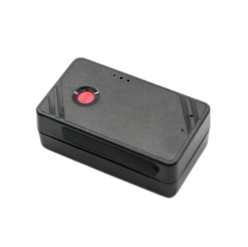

# GOTOP - W07

El GOTOP W07 es un mini rastreador GPS pensado para necesidades de seguimiento compactas e impermeables. Con unas dimensiones de 47 x 35 x 19 mm y un peso de 41 g, el W07 está diseñado para colocaciones discretas en personas, mascotas, equipaje y pequeños activos. Ofrece conectividad celular global y posicionamiento por satélite para entregar ubicaciones en tiempo real, reproducción de rutas y alertas de seguridad esenciales en un equipo portátil y de tamaño reducido.

Como dispositivo compatible con Plaspy, el W07 puede enviar sus actualizaciones de ubicación y notificaciones de alarma a Plaspy para monitoreo e informes. Su soporte para reportes por SMS, plataforma web y aplicación móvil, junto con enlaces a Google Maps, facilita una integración rápida en los flujos de trabajo de Plaspy, permitiendo que usted y su equipo vean posiciones en vivo, reciban alertas y revisen recorridos históricos sin configuraciones complejas.

## Aspectos destacados

- Compatible con Plaspy para actualizaciones de posición en tiempo real y reproducción de rutas históricas
- Diseño compacto e impermeable ideal para despliegues discretos
- Conectividad celular global y posicionamiento satelital para amplia cobertura
- Alertas prácticas como detección de movimiento y vibración, geocercas, exceso de velocidad y corte de alimentación
- Batería recargable diseñada para uso portátil prolongado
- Visualización sencilla vía notificaciones SMS, plataforma web y app móvil con enlaces de mapa
- Pensado para seguridad personal, rastreo de mascotas y protección de pequeños activos

## Cómo funciona con Plaspy

El W07 envía pings de ubicación periódicos y mensajes de eventos que Plaspy muestra como posiciones en vivo, alertas y rutas breadcrumb. Cuando el dispositivo notifica eventos de movimiento, violaciones de geocerca, batería baja o cambios de alimentación, Plaspy registra esos eventos para que los operadores puedan actuar y generar informes.

- La ubicación y la telemetría en tiempo real aparecen en Plaspy para visibilidad continua
- La reproducción de recorridos y las rutas históricas están disponibles en Plaspy para revisar incidentes posteriores
- Las alarmas de movimiento, corte de alimentación y batería baja se integran en Plaspy para flujos de trabajo de seguridad y antirobo
- Las alertas de geocerca y exceso de velocidad se presentan como disparadores configurables y notificaciones
- Los mensajes con enlaces a Google Maps permiten una visualización rápida con un toque mientras Plaspy muestra el historial completo de ubicaciones

## Casos de uso típicos

- Seguridad personal y monitoreo de trabajadores solos con ubicación en vivo y alertas
- Rastreo de mascotas o equipaje durante viajes con reproducción de rutas en Plaspy
- Monitoreo discreto de pequeños equipos y objetos portátiles de valor
- Supervisión de vehículos pequeños y microflotas como scooters, motonetas o repartos
- Detección y prevención de robos mediante alertas de movimiento y estado de alimentación

## Por qué elegir este rastreador con Plaspy

El W07 combina un diseño pequeño e impermeable con las funciones telemétricas necesarias para el seguimiento diario. Si usted utiliza Plaspy, el dispositivo ofrece una manera directa de añadir posiciones en tiempo real, eventos de geocerca y alarmas básicas a los paneles de monitoreo y a los procesos de generación de informes. Su tamaño compacto y los métodos de reporte estándar lo hacen una opción práctica cuando la instalación discreta y la fiabilidad en el reporte de ubicaciones son prioridades.

Para saber más sobre Plaspy y cómo el W07 puede integrarse en su sistema de monitoreo o gestión de flotas visite https://www.plaspy.com. Las especificaciones del producto y la disponibilidad pueden cambiar con el tiempo, por lo que le recomendamos verificar los detalles actuales con el fabricante en https://www.gotop.cc/.
