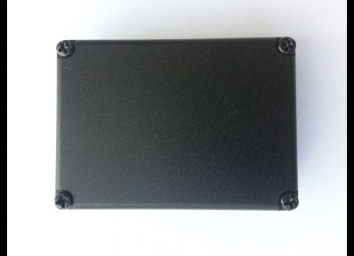

# GPSMarker - M130

El GPSMarker M130 es un rastreador GPS independiente y versátil, diseñado para ofrecer monitoreo de ubicación fiable en vehículos y activos portátiles. Integra un receptor GNSS multiconstelación con amplio número de canales para mejorar la precisión de coordenadas, y se entrega con una tarjeta SIM y un plan tarifario optimizados para supervisión en línea. El M130 proporciona larga duración de batería, modos periódicos de ahorro de energía y un conjunto de sensores y alarmas integrados para detección de movimiento, impactos, temperatura y notificaciones de pánico.

Como dispositivo compatible con Plaspy, el M130 puede enviar datos de ubicación y eventos a Plaspy para obtener visibilidad centralizada y gestión de flotas. Su modelo de operación sin suscripción reduce los costos recurrentes de plataforma, mientras que sus capacidades de telemetría y alerta lo convierten en una opción práctica para organizaciones que desean integrar el monitoreo a nivel de dispositivo en Plaspy para seguimiento, notificación de incidentes y supervisión básica del equipo.

## Características principales

- Sin tarifas de suscripción recurrentes por el dispositivo más allá del consumo de mensajes y datos
- Receptor GPS/GLONASS de 99 canales para mayor fiabilidad de coordenadas
- Larga duración de batería con funcionamiento de varios años y intervalos de activación configurables
- Tarjeta SIM incluida y tarifa optimizada para sistemas de monitoreo en línea
- Detección de movimiento y alertas por choque integradas para seguridad y notificación de incidentes
- Botón de pánico, sensor de temperatura y salidas de relé para control de dispositivos externos

## Integración con Plaspy

El M130 puede añadirse a Plaspy como un dispositivo a rastrear para proporcionar actualizaciones regulares de ubicación y notificaciones de eventos dentro de un espacio de trabajo centralizado de gestión de flotas o activos. Una vez conectado, Plaspy agrega datos de posición, alertas e información básica del estado del dispositivo para facilitar la supervisión en tiempo real y la revisión histórica.

- Visibilidad de ubicación en vivo y seguimiento en mapa dentro de Plaspy
- Alertas basadas en eventos enviadas a Plaspy por movimiento, choque, pánico y batería baja
- Reproducción de rutas históricas e historial de posiciones para revisiones operativas
- Lecturas de temperatura y alertas por umbral visibles en los informes de Plaspy
- Señales de control remoto a relés coordinadas a través de la plataforma cuando el dispositivo lo soporta
- Estado consolidado del dispositivo e informes para supervisión a nivel de flota

## Casos de uso típicos

- Monitoreo de la ubicación de vehículos de flota para enrutamiento y supervisión
- Rastreo de activos portátiles o de alto valor que requieren larga autonomía de batería
- Supervisión de equipos en sitios remotos con intervalos de mantenimiento prolongados
- Monitoreo de seguridad e incidentes con alertas por choque y notificaciones de pánico
- Control de temperatura de activos o carga sensible durante tránsito o almacenamiento

## Por qué elegir este rastreador con Plaspy

El GPSMarker M130 combina características prácticas a nivel de dispositivo con un modelo operativo orientado al ahorro, lo que lo hace apropiado para organizaciones que necesitan rastreo fiable sin costos recurrentes de suscripción. Su combinación de larga duración de batería, alarmas integradas y un plan SIM optimizado para monitoreo reduce la necesidad de mantenimiento en sitio y ofrece datos más consistentes para que Plaspy los procese.

Al integrarlo con Plaspy, el M130 forma parte de una única interfaz para conciencia de ubicación, alertas y generación de informes. Esto lo convierte en una buena opción para operadores que buscan una integración directa en los flujos de trabajo de flota y activos, manteniendo previsibilidad en costos y mantenimiento del dispositivo.

Si desea saber más sobre Plaspy y cómo puede gestionar dispositivos como el GPSMarker M130 visite https://www.plaspy.com. Las especificaciones del producto, su disponibilidad y los datos del fabricante pueden cambiar con el tiempo, por lo que le recomendamos verificar la información técnica actual en el sitio del fabricante https://gpsmarker.ru/.
