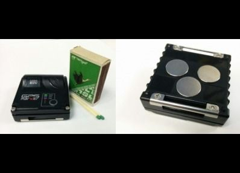

# GPSMarker - M80

El GPSMarker M80 es un rastreador GPS compacto diseñado para ofrecer monitoreo de ubicación confiable con énfasis en minimizar los costos recurrentes. Se entrega en una carcasa sellada con imanes para un montaje seguro y rápido, e incluye opción de micro SIM con una tarifa optimizada para sistemas de monitoreo en línea. El equipo integra un receptor GPS y GLONASS de 99 canales y soporta servicios de asistencia satelital para mejorar la adquisición de coordenadas y la fiabilidad. Permite actualizaciones de firmware gratuitas por GPRS y reporta una larga autonomía con intervalos de activación configurables y notificaciones de batería baja.

Como dispositivo compatible con Plaspy, el M80 es adecuado para organizaciones que requieren un seguimiento económico integrado en una plataforma centralizada de flotas. Sus sensores y funciones de alerta facilitan la visibilidad operativa cuando se empareja con Plaspy. Al transmitir ubicación, estado y mensajes de evento, el M80 aporta a Plaspy datos que pueden mostrarse en mapas, activar notificaciones e incluirse en reportes para apoyar procesos de gestión de flota y activos.

## Aspectos más relevantes

- No requiere tarifa de suscripción por el dispositivo; usted paga solo por SMS salientes y tráfico GPRS, lo que puede reducir los costos a largo plazo
- Carcasa sellada con imanes para montaje rápido y seguro sin hardware complejo
- Receptor GPS y GLONASS de 99 canales con soporte de asistencia satelital para mayor fiabilidad de posición
- Larga autonomía reportada con intervalos de activación configurables y notificaciones automáticas de batería baja
- Sensores integrados como detección de inicio de movimiento, detección de choque, monitoreo de revoluciones, sensor de temperatura y botón SOS de pánico
- Actualizaciones de firmware gratuitas vía GPRS para mantener el software del equipo sin acceso físico

## Cómo funciona con Plaspy

Cuando se usa con Plaspy, el M80 envía mensajes de ubicación y eventos que la plataforma puede presentar como posiciones en tiempo real, trayectos históricos y disparadores de alertas. Plaspy procesa los datos del rastreador para ofrecer una vista unificada del monitoreo de múltiples unidades y convertir los eventos del dispositivo en información operativa.

- Posición en tiempo real y trayectos históricos mostrados en los mapas de Plaspy para visibilidad de flotas y activos
- Alertas y notificaciones por eventos como batería baja, SOS, inicio de movimiento y detecciones de choque
- Reportes y análisis sobre viajes, paradas y actividad del dispositivo para apoyar decisiones operativas
- Monitoreo de temperatura y eventos de movimiento de carga para cargas sensibles
- Estado centralizado de dispositivos y monitoreo de baterías para planificar reemplazos y mantenimiento

## Casos de uso típicos

- Seguimiento de vehículos y activos móviles para despacho y supervisión de rutas
- Monitoreo de remolques y carga donde la larga autonomía y los sensores de movimiento son valiosos
- Seguimiento de equipos remotos en obras o sitios donde se prefiere evitar modelos de suscripción
- Casos de seguridad para trabajadores aislados usando la función SOS y alertas de choque
- Monitoreo de activos sensibles a la temperatura durante almacenamiento o tránsito

## Por qué elegir este rastreador con Plaspy

El GPSMarker M80 es una opción práctica para organizaciones que necesitan seguimiento a largo plazo y bajo costo con un conjunto sólido de sensores y gestión sencilla. Su modelo sin suscripción y su larga autonomía lo hacen atractivo para despliegues donde las tarifas recurrentes del dispositivo son una preocupación. La carcasa magnética sellada y la opción de SIM incluida simplifican la implementación en campo, mientras que la suite de sensores ayuda a capturar los eventos más comunes que los operadores desean monitorizar.

Emparejado con Plaspy, el M80 provee datos de ubicación y eventos que pueden transformarse en monitoreo visual, alertas y reportes operativos. Plaspy añade las capacidades de plataforma para organizar dispositivos, configurar notificaciones y analizar patrones de movimiento, de modo que los equipos puedan actuar con base en la información que suministra el M80.

Para obtener más información sobre Plaspy y cómo se soportan los rastreadores compatibles visite https://www.plaspy.com. Las especificaciones del producto, disponibilidad y datos del fabricante pueden cambiar con el tiempo, por lo que verifique las especificaciones y opciones actuales con el fabricante en https://gpsmarker.ru/.
