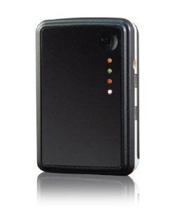

# Haicom - HI-602

El Haicom HI-602 es un dispositivo de rastreo todo en uno que combina posicionamiento GPS con varias opciones de comunicación, incluyendo SMS, GSM, DTMF y GPRS. Diseñado como una unidad compacta y recargable, el HI-602 permite el monitoreo de ubicación en tiempo real y es adecuado para seguir una amplia gama de objetos en movimiento, como pertenencias personales, motocicletas, paquetería o activos de pequeño tamaño. Se entrega con el software Haicom Tracking para PC y ofrece flexibilidad mediante opciones de personalización y colocación discreta.

Como modelo compatible con Plaspy, el HI-602 puede enviar actualizaciones de posición a Plaspy para su visualización en mapas y supervisión operativa. Sus múltiples modos de comunicación lo hacen adaptable a distintos flujos de trabajo de seguimiento, y el dispositivo puede utilizarse para ofrecer visibilidad continua o informes de posición bajo demanda dentro de Plaspy. Esta compatibilidad ayuda a organizaciones y particulares a centralizar los datos de seguimiento en vivo en una sola plataforma de gestión de flotas.

## Características principales

- Dispositivo todo en uno que soporta posicionamiento GPS y múltiples modos de comunicación como SMS, DTMF y GPRS
- Diseño compacto y recargable, ideal para seguimiento personal y monitoreo de pequeños activos
- Capacidad de ubicación en tiempo real para visualización en mapas y control de movimiento
- Modo DTMF que permite rastrear usando una SIM estándar con infraestructura mínima adicional
- Incluye software Haicom Tracking para PC que permite mapeo y monitoreo en vivo local
- Factor de forma personalizable para aplicaciones especiales o colocación discreta

## Cómo funciona con Plaspy

Cuando se integra con Plaspy, el HI-602 envía información de posición que Plaspy muestra y organiza para uso operativo. Plaspy puede consolidar las actualizaciones entrantes y presentarlas junto con otros dispositivos para una supervisión unificada de flotas o activos.

- Visualización en mapa en tiempo real de las posiciones reportadas por el HI-602
- Lista consolidada de dispositivos y monitoreo de estados dentro de Plaspy para visibilidad a nivel de flota
- Reproducción histórica y reportes básicos para revisar movimientos a lo largo del tiempo
- Alertas y manejo de eventos en Plaspy basados en actualizaciones del dispositivo o criterios definidos por el usuario
- Herramientas de supervisión operativa como filtros por ubicación y agrupamiento para apoyar flujos de trabajo

## Casos de uso típicos

- Seguimiento de pertenencias personales como mochilas o equipaje
- Monitoreo de vehículos pequeños o motocicletas para enrutamiento y seguridad
- Seguimiento de paquetes o cajas durante el tránsito para visibilidad de entregas
- Rastreo temporal o puntual de activos cuando se necesita un dispositivo recargable y compacto
- Situaciones donde es útil contar con seguimiento por DTMF o SMS como mecanismo de respaldo

## Por qué elegir este rastreador con Plaspy

El HI-602 es una opción práctica cuando necesita un rastreador compacto y versátil que funcione en distintos escenarios. Su combinación de posicionamiento GPS y múltiples opciones de comunicación ofrece alternativas sobre cómo recopilar y transmitir datos de posición a Plaspy. Para organizaciones que desean centralizar la visibilidad entre dispositivos diversos, agregar unidades HI-602 extiende la cobertura a pertenencias personales y activos pequeños para los que los dispositivos telemáticos más grandes no son adecuados.

Dado que Plaspy está orientado a consolidar datos de ubicación y presentarlos para la toma de decisiones operativas, el HI-602 encaja bien como fuente de actualizaciones de posición y de historial básico de movimiento. Si su caso de uso prioriza colocación discreta, operación con batería recargable y modos de reporte flexibles, el HI-602 junto con Plaspy es una opción sensata.

Para obtener más información sobre Plaspy y cómo puede mostrar datos de ubicación e informes del HI-602 visite https://www.plaspy.com. Tenga en cuenta que las especificaciones del producto, su disponibilidad y los datos del fabricante pueden cambiar con el tiempo; verifique las especificaciones técnicas y opciones actuales en el sitio oficial de Haicom en http://www.haicom.com.tw/.
