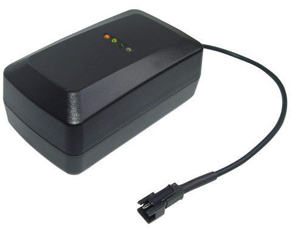

# Haicom - HI-604

El rastreador GPS Haicom HI-604 es una solución de localización de vanguardia que combina GPS, GSM, GPRS, SMS y DTMF en tiempo real. Este dispositivo de seguimiento multifunción le permite rastrear y controlar objetos en todo el mundo en tiempo real a través de un mapa. Puede verificar la ubicación en tiempo real utilizando el software de seguimiento de Haicom instalado en su PC o a través de transmisión de tono de marcación normal.

El HI-604 es altamente versátil y resistente. Su carcasa resistente al agua le permite funcionar en entornos duros y ásperos, y su batería de gran capacidad proporciona una fuente de alimentación independiente, incluso sin una fuente de alimentación externa. Además, cuenta con un sensor de movimiento que permite que el rastreador se apague por completo cuando no hay movimiento, lo que prolonga la duración de la batería. También viene con una fuerte fijación magnética para facilitar la sujeción.

Algunas de las características destacadas del Haicom HI-604 incluyen:

- Solución de seguimiento de activos con cobertura mundial
- Sensor de movimiento con modo de sueño profundo
- Batería de 5500 mAh para alimentación independiente
- Alta sensibilidad de GPS
- Carcasa impermeable para entornos difíciles
- Personalizaciones para diferentes aplicaciones de seguimiento
- Acceso 24/7 a la ubicación de sus activos
- Seguimiento en tiempo real a través de GPRS, DTMF o conexión a internet
- Supervisión completa de las operaciones y el historial de activos
- Aplicaciones en fuerzas de policía, investigaciones privadas, seguimiento de carga, lucha contra el robo y más

El HI-604 es una solución confiable y eficiente para el seguimiento de activos en tiempo real. Ya sea que necesite supervisar vehículos, equipos o cualquier otro objeto, este rastreador GPS le brinda la tranquilidad de saber dónde se encuentran sus activos en todo momento.

