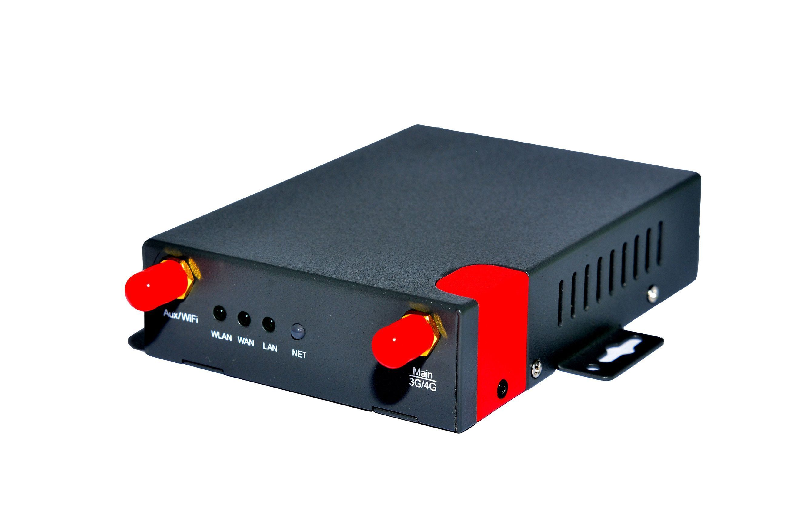

# Homtecs - H20

El Homtecs H20 es un router industrial 3G compacto diseñado para comunicaciones máquina a máquina y conectividad en sitios remotos. Construido para entornos exigentes, el H20 ofrece backhaul de banda ancha móvil con compatibilidad hacia atrás con generaciones anteriores de redes móviles, soporte integrado de Wi Fi y un conjunto reducido de puertos LAN y WAN para conectar dispositivos locales y cámaras. Su combinación de carcasa metálica robusta y funciones de gestión lo convierten en un dispositivo práctico para telemetría, CCTV, retail y otros escenarios M2M.

Como dispositivo compatible con Plaspy, el H20 puede actuar como una pasarela de comunicaciones fiable para despliegues relacionados con seguimiento y flotas cuando se utiliza junto con terminales GPS o equipos de telemetría. Plaspy puede recibir y gestionar datos de ubicación y operación que se transmiten a través de la conexión del H20, por lo que este router resulta útil cuando la presencia en línea constante, el acceso remoto y la conectividad IP estable son prioridades para una solución de monitoreo con Plaspy.

## Características principales

- Carcasa metálica compacta de grado industrial, diseñada para entornos exigentes
- Alto rendimiento de datos sobre redes 3G con compatibilidad hacia atrás y velocidades de hasta 21.6 Mbps
- Soporte Wi Fi integrado para conexión de dispositivos locales y opciones de despliegue flexibles
- Incluye un puerto LAN y un puerto WAN para integración de red sencilla en sitios remotos
- Funciones de alta disponibilidad como reinicio automático, watchdog y detección multilink para operación estable
- Soporte para SIMs con IP fija, DNS dinámico, VPNs y servicios de red comunes para facilitar el acceso y la gestión remotos

## Cómo funciona con Plaspy

El H20 proporciona conectividad IP persistente que Plaspy puede utilizar para recibir telemetría, actualizaciones de estado y datos de dispositivos en sitios remotos. Combinado con equipos habilitados con GPS o gateways de activos, el H20 mantiene esos equipos accesibles y asegura que Plaspy conserve visibilidad e informes en instalaciones distribuidas.

- Mantiene cámaras remotas, sensores y gateways conectados para que Plaspy pueda recolectar datos de ubicación y operación
- Habilita el acceso y la gestión remota de dispositivos desde Plaspy para tareas de diagnóstico y monitoreo
- Admite SIMs con IP fija o DNS dinámico para preservar la alcanzabilidad por parte de los servidores y alertas de Plaspy
- Proporciona un canal de comunicaciones resiliente que reduce las brechas de datos en los informes y paneles de Plaspy
- Facilita el registro centralizado y la generación de reportes de estado dentro de Plaspy para supervisión operativa

## Casos de uso típicos

- Backhaul para CCTV en ubicaciones remotas donde las cámaras requieren una conexión móvil estable para enviar video, estado y telemetría
- Enlaces de telemetría y SCADA para sitios de servicios públicos y energía que necesitan conectividad persistente
- Conectividad para retail y puntos de venta en ubicaciones sin internet cableado
- Sitios temporales o móviles que precisan internet gestionado y fiable para dispositivos y sensores
- Aplicaciones de gateway donde el H20 ofrece acceso de red para rastreadores GPS y terminales de telemetría

## Por qué elegir este dispositivo con Plaspy

Aunque el Homtecs H20 es un router de comunicaciones y no un rastreador GPS independiente, su papel como pasarela robusta y siempre en línea lo convierte en un compañero práctico en despliegues Plaspy que requieren conectividad remota confiable. Las organizaciones que necesitan enlaces IP resilientes para cámaras, sensores o gateways de borde encontrarán útiles el diseño industrial y las funciones de gestión del H20 para mantener las fuentes de datos en Plaspy estables y consistentes.

Elegir el H20 con Plaspy es especialmente recomendable cuando la fiabilidad de la conexión es prioritaria y las funciones de seguimiento o telemetría son proporcionadas por terminales GPS o equipos en sitio que reenvían datos a través de un router local. Su soporte para SIMs con IP fija, DNS dinámico y opciones VPN ayuda a mantener la alcanzabilidad y simplifica la integración dentro de los flujos de trabajo de Plaspy.

Para obtener más información sobre el uso de Plaspy con dispositivos compatibles, visite https://www.plaspy.com. Las especificaciones del producto y los datos del fabricante pueden cambiar con el tiempo, por lo que le recomendamos verificar la información actual en el sitio oficial de Homtecs http://www.homtecsm2m.com/.
