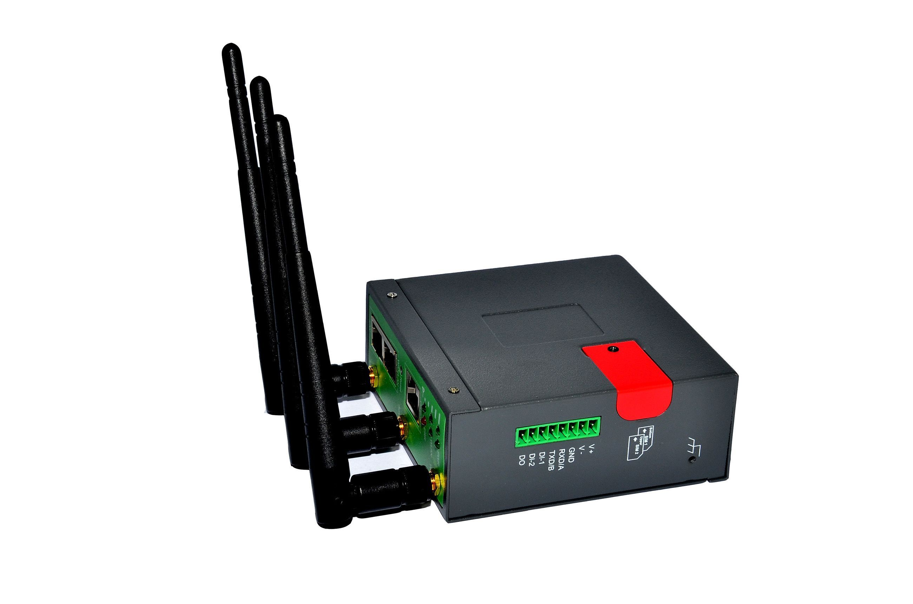

# Homtecs - H21

El enrutador HomtecsM2M H21 3G es una solución de comunicación inalámbrica de Internet diseñada para aplicaciones industriales. Utiliza la red de banda ancha móvil HSPA+ para proporcionar una transmisión conveniente y de alta velocidad. Con velocidades de hasta 21.6 Mbps, este enrutador ofrece conectividad HSPA+ de alta velocidad, así como conectividad estándar HSPA, EDGE y GPRS.

El HomtecsM2M H21 3G Router es ideal para aplicaciones en sectores como M2M, CCTV, seguridad, medios, energía, servicios públicos, comercio minorista y transporte. Puede ser utilizado con tarjetas SIM IP fijas o SIM de datos normales, y también es compatible con DNS dinámico. Las comunicaciones de datos móviles utilizando enrutadores incorporados se están convirtiendo rápidamente en una herramienta esencial para las soluciones de comunicaciones basadas en el campo de los proveedores.

Este enrutador está diseñado para mantenerse en línea y conectado, con características que garantizan una comunicación remota confiable y segura. Además, cuenta con una carcasa robusta y resistente, y viene con dos antenas de montaje magnético para una mejor recepción de señal.

Características destacadas:

- Diseño robusto industrial y carcasa de metal compacta
- Alta velocidad de datos a través de la red 3G, compatible con 2.5G hacia atrás
- Resistencia a la interferencia electromagnética, al calor y capacidad de radiación
- Soporte para múltiples VPN y protocolos de red
- Soporte para funciones como DHCP, DNS, Firewall, NAT, DMZ host, entre otros
- Conexión WiFi 802.11b/g/n con velocidad de datos de hasta 21.6 Mbps
- Puertos LAN, WAN y de consola, así como puertos GPIO
- Montaje en carril DIN para una fácil instalación
- Siempre en línea, reinicio automático en caso de desconexión
- Admite APN y VPDN para acceso a redes privadas inalámbricas
- Administración local y remota a través de diferentes interfaces
- Resistente a golpes y vibraciones

El enrutador HomtecsM2M H21 3G también ofrece funciones opcionales avanzadas, como soporte para redes 4G, capacidad de GPS para administración de flotas, módulo dual SIM para cambio rápido entre redes, y funciones de comunicación en serie. Además, se puede personalizar y se aceptan pedidos OEM/ODM.

Tenga en cuenta que este enrutador está diseñado como una solución de nivel de entrada para aplicaciones sencillas de supervisión y administración remotas. Si necesita utilizar funciones avanzadas o de conmutación por error, se recomienda ponerse en contacto con el proveedor antes de realizar la compra.

