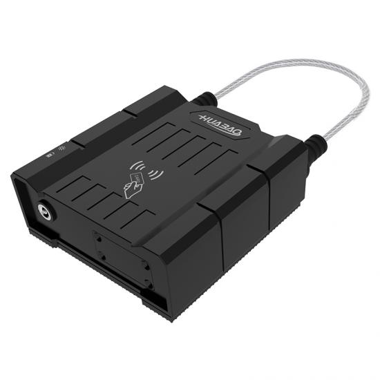

# Huabao - HB-A1L

La cerradura electrónica esclava HB-A1L es un dispositivo de cierre resistente, conectado por Bluetooth, diseñado para ofrecer seguridad en puertas y gestión centralizada para flotas logísticas. Como unidad esclava pensada para emparejarse con una cerradura maestra con GPS, la HB-A1L extiende la protección antirrobo y el control de acceso en vehículos con múltiples puertas, como cisternas y camiones caja, al reportar el estado del cierre y los eventos de alarma para su monitoreo consolidado.

Al reenviar lecturas RFID, alarmas de manipulación y corte de cadena, y el estado de la batería al maestro GPS emparejado, la HB-A1L es una opción práctica para operadores que desean que los eventos de cierre y los registros de acceso sean visibles en una única plataforma de gestión de flotas. Cuando se integra con Plaspy a través del dispositivo maestro, la HB-A1L aporta telemetría de cerraduras en tiempo real a los paneles y alertas de Plaspy, lo que la hace relevante para flotas que buscan un control unificado de rastreo y seguridad.

## Características principales

- Integración compatible con Plaspy que reenvía el estado de la cerradura y las alarmas a una plataforma centralizada para seguimiento y gestión en tiempo real.
- Emparejamiento esclavo Bluetooth 4.0PLUS con un maestro GPS, permitiendo que un maestro gestione múltiples unidades HB-A1L en vehículos con varias puertas.
- Protección robusta con impermeabilidad IP67 y diseño a prueba de explosiones ATEX, adecuado para entornos con carga peligrosa.
- Acceso RFID integrado compatible con ISO IEC 14443 Tipo A y B para lecturas de tarjetas de operador y registro de accesos.
- Detección de manipulación y corte de cadena con alarmas de apertura ilegal para mejorar los tiempos de respuesta ante robos.
- Gran capacidad de batería principal con alertas de batería baja para sostener operación prolongada entre intervenciones de mantenimiento.
- Diseño mecánico de alta resistencia con carcasa retardante de llama y opciones de cadena resistente para protección segura de la carga.

## Cómo funciona con Plaspy

La HB-A1L opera como una esclava Bluetooth que envía eventos de puertas y alarmas de seguridad a un maestro GPS HB-A1Lm emparejado. El maestro agrega los eventos de la cerradura, los registros RFID y el estado del dispositivo, asocia esos registros con la ubicación y la telemetría del vehículo, y luego envía los datos combinados a Plaspy para que los operadores dispongan de una vista unificada del estado de seguridad y la flota.

- Correlación de ubicación en tiempo real — los eventos de la cerradura se muestran junto con la posición GPS del maestro para que las acciones se tomen con contexto geográfico.
- Visibilidad inmediata de alarmas — las alarmas de apertura ilegal y corte de cadena se reenvían a Plaspy para notificaciones oportunas y seguimiento de incidentes.
- Registro de accesos — las lecturas RFID y los eventos de acceso de operadores aparecen en Plaspy para auditorías y supervisión operativa.
- Informes de batería y estado — el nivel de la batería principal y las alertas de batería baja son visibles en la plataforma para ayudar a planificar el mantenimiento.
- Gestión de desbloqueo remoto — comandos autorizados de desbloqueo remoto pueden enviarse a través del maestro emparejado y gestionarse desde la plataforma o la aplicación.
- Telemetría consolidada de la flota — los datos de la cerradura se combinan con la telemetría del vehículo proporcionada por el maestro para informes operativos más completos.

## Casos de uso típicos

- Protección antirrobo de flotas para camiones cisterna y otros vehículos de carga peligrosa que requieren hardware con certificación ATEX.
- Camiones caja y remolques refrigerados con múltiples puertas donde un único maestro GPS gestiona varias cerraduras esclavas.
- Entregas con control de acceso donde tarjetas RFID autorizan a personal permitido y los eventos quedan registrados.
- Protección de carga de alto valor mediante detección de corte de cadena y alarmas por manipulación para reducir riesgos de pérdida y desvío.
- Planificación de mantenimiento y monitoreo de salud del dispositivo usando el nivel de batería y datos de alerta enviados a una plataforma central.

## Por qué elegir este rastreador con Plaspy

Emparejar la HB-A1L con Plaspy ofrece a los operadores de flota una forma escalable de añadir seguridad a nivel de puerta al rastreo vehicular basado en GPS. La cerradura esclava mantiene el dispositivo compacto y rentable, mientras que el maestro GPS aporta ubicación y conectividad de red, permitiendo a Plaspy presentar eventos de seguridad integrados, registros de acceso y telemetría del vehículo en una sola interfaz.

Para equipos centrados en la eficiencia operativa y la prevención de robos, la HB-A1L ofrece protección física robusta, control de acceso y alertas accionables. Integrada a través de Plaspy, esta combinación ayuda a reducir los tiempos de respuesta, simplificar las auditorías y centralizar la gestión de flotas con múltiples puertas sin añadir hardware celular a cada cerradura.

Conozca más sobre cómo Plaspy puede mostrar eventos de cerraduras, registros de acceso y telemetría de flota en el sitio principal de Plaspy https://www.plaspy.com. Las especificaciones del producto y la disponibilidad pueden cambiar con el tiempo, por lo que le recomendamos verificar los detalles técnicos y certificaciones vigentes en el sitio del fabricante https://www.huabaotelematics.com/.
