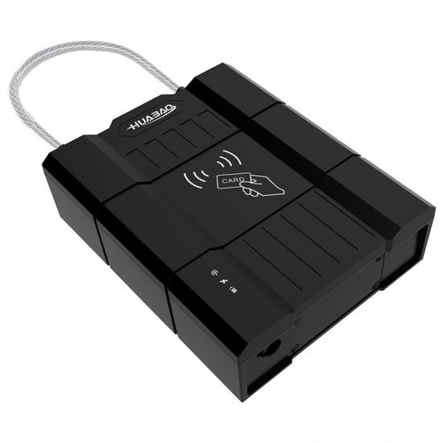

# Huabao - HB-A1Lm

El HB-A1Lm es un rastreador GPS 4G de alta resistencia integrado con una cerradura electrónica diseñada para contenedores, remolques, plataformas y camiones de caja. Combina el seguimiento de ubicación con funciones anti robo dedicadas, como alarmas por manipulación y corte de cadena, además de múltiples opciones de apertura, incluyendo RFID y Bluetooth. Diseñado para uso exterior, el equipo prioriza la durabilidad y una larga vida operativa para la protección de carga en logística.

Como dispositivo totalmente compatible con Plaspy, el HB-A1Lm puede gestionarse como un nodo de seguridad y seguimiento dentro de las operaciones de flota en Plaspy. Su reporte de ubicación y eventos en tiempo real, junto con el reenvío de alarmas y el registro de aperturas, lo hacen apropiado para visibilidad centralizada de la flota, alertas por geocerca y flujos remotos de desbloqueo coordinados desde la plataforma Plaspy.

## Características principales

- Compatibilidad total con Plaspy para seguimiento en tiempo real, alarmas e historial de eventos integrado en los flujos de gestión de flota.
- Caja robusta con grado de protección IP67 y carcasa retardante a la llama, adecuada para entornos de contenedores y remolques.
- Múltiples métodos de apertura como RFID y Bluetooth, además de control remoto vía plataforma y comandos SMS para mayor flexibilidad operativa.
- Alarmas anti robo dedicadas como detección de apertura ilegal, alarma por corte de cadena y alertas por manipulación o desmontaje para mayor seguridad.
- Batería de gran capacidad de 15,200 mAh diseñada para larga autonomía en espera, soportando operaciones de larga distancia y reduciendo intervalos de mantenimiento.
- Soporte ampliable para múltiples puertas con la posibilidad de emparejar cerraduras esclavas para monitoreo y control sincronizado entre compartimientos.
- Soporte opcional de sensores y telemetría de largo alcance, como sensores Bluetooth para temperatura y humedad y radio de largo alcance para despliegues especializados.

## Cómo funciona con Plaspy

Cuando se conecta a Plaspy, el HB-A1Lm informa ubicación y estado de seguridad para que los equipos operativos y de seguridad puedan monitorear activos y responder a eventos desde una sola plataforma. Plaspy centraliza la telemetría del dispositivo, almacena historiales de apertura y muestra alertas para apoyar la respuesta a incidentes y los flujos de cumplimiento.

- Actualizaciones de ubicación y telemetría en tiempo real en Plaspy para visibilidad continua del activo y monitoreo de rutas.
- Reenvío inmediato de eventos de seguridad como apertura ilegal, manipulación y alarma por corte de cadena hacia las alertas de la plataforma.
- Reporte del estado de batería y alimentación con notificaciones de batería baja capturadas en la plataforma para planificación proactiva de mantenimiento.
- Registro de eventos de apertura por RFID y Bluetooth y comandos remotos de desbloqueo desde la plataforma para control de acceso auditado.
- Telemetría de sensores como temperatura y humedad disponible en los paneles de Plaspy para el monitoreo de carga refrigerada o sensible.
- Registro de eventos de cerraduras esclavas y múltiples puertas para coordinar el control anti robo en un mismo vehículo o contenedor.

## Casos de uso típicos

- Monitoreo anti robo de contenedores y remolques con alarmas por corte de cadena y manipulación integradas en las alertas de Plaspy.
- Gestión de camiones de caja con varias puertas y tanques emparejando la cerradura principal con cerraduras esclavas para control y registro sincronizados.
- Envíos refrigerados que requieren telemetría de temperatura o humedad combinada con seguimiento de ubicación para garantizar la integridad de la cadena de suministro.
- Inspecciones aduaneras y operaciones con carga de alto valor donde se requieren auditorías de apertura y registros de acceso.
- Operaciones remotas de flota que consolidan datos de rutas, geocercas y eventos de seguridad en una única consola de gestión.

## Por qué elegir este rastreador con Plaspy

El HB-A1Lm ofrece una combinación orientada a propósito de construcción robusta, larga duración de batería y múltiples métodos de acceso que encajan bien en flotas gestionadas con Plaspy. Su diseño está enfocado en la seguridad de contenedores y remolques, por lo que resulta una opción práctica para operadores logísticos que necesitan funcionalidad de cerradura física y visibilidad continua en un solo dispositivo.

Emparejado con Plaspy, el HB-A1Lm ayuda a centralizar eventos de seguridad, auditorías de apertura y telemetría junto con otros datos de la flota para apoyar operaciones eficientes y la respuesta ante incidentes. Para organizaciones que requieren control escalable de múltiples puertas, monitoreo basado en sensores o hardware reforzado para uso exterior, este rastreador con cerradura compatible con Plaspy proporciona una base sólida para una logística segura y conectada.

Learn more about Plaspy on the main website https://www.plaspy.com. Product specifications, availability and manufacturer details can change over time; verify current specifications and options on the official manufacturer site https://www.huabaotelematics.com/ before making procurement or deployment decisions.
