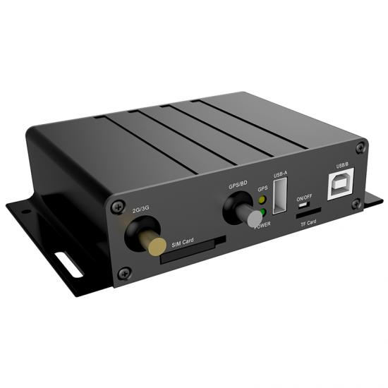

# Huabao - HB-A3B

El HB-A3B es un rastreador y unidad de control de grado vehicular diseñado para implementaciones que requieren control de velocidad forzado, registro de cumplimiento y seguimiento en tiempo real confiable. El equipo combina posicionamiento GNSS con comunicaciones celulares y salidas de control locales dedicadas para detectar eventos de exceso de velocidad, generar alarmas, registrar recorridos y accionar intervenciones activas como relés o limitación por control electrónico. Está pensado para flotas comerciales, transporte de pasajeros e instalaciones reguladas donde la auditabilidad y el control operacional son prioritarios.

Como dispositivo compatible con Plaspy, el HB-A3B envía a la plataforma actualizaciones continuas de ubicación, alertas de eventos y registros almacenados desde zonas sin cobertura. Al integrarse con Plaspy, la telemetría y las capacidades de control del equipo pueden mostrarse en paneles centralizados, flujos de trabajo de alertas automatizadas e informes de cumplimiento, permitiendo a los gestores de flota y a los reguladores supervisar el comportamiento y coordinar acciones sin modificar la arquitectura del vehículo.

## Características principales

- Diseño de grado vehicular con soporte para limitación de velocidad y funciones de gobernador en despliegues enfocados en cumplimiento.
- Posicionamiento GNSS combinado con comunicaciones celulares para reporte de ubicación y eventos en tiempo real.
- Salidas de control activas para acciones por relé o actuación electrónica (drive-by-wire) para implementar cortes de combustible o limitación de velocidad.
- Detección de eventos integral: estado de ignición, exceso de velocidad, entrada SOS, corte de antena y alarmas por manipulación de alimentación.
- Registro de viajes a bordo y almacenamiento en búfer offline para conservar registros de conducción durante interrupciones de cobertura y subirlos posteriormente.
- Soporte opcional para monitoreo de combustible y impresora para flotas que requieren control de consumo e impresiones físicas de viajes.
- Tolerancias de hardware robustas aptas para entornos de vehículos comerciales y amplios rangos de temperatura de operación.

## Cómo funciona con Plaspy

Cuando se integra con Plaspy, el HB-A3B entrega fijaciones de ubicación, cambios de estado y eventos de alarma a la plataforma para que los equipos puedan supervisar vehículos en tiempo real, reproducir históricos y generar evidencia de cumplimiento. Plaspy procesa la telemetría del dispositivo para disparar notificaciones, llenar paneles de control y mantener registros de auditoría incluso cuando los vehículos atraviesan áreas sin cobertura.

- Las actualizaciones de ubicación y telemetría en tiempo real se muestran en los mapas de Plaspy y se usan para reproducción histórica y análisis de rutas.
- El monitoreo de ignición y del estado de conducción ayuda a correlacionar el uso del vehículo, los ciclos de trabajo y el comportamiento del conductor en los informes de Plaspy.
- Las alarmas por exceso de velocidad, SOS, corte de antena y manipulación de alimentación generan alertas inmediatas para la respuesta operativa y el registro de incidentes.
- El almacenamiento en búfer del dispositivo garantiza que Plaspy reciba los datos completos del viaje una vez que los vehículos regresen a cobertura, preservando la continuidad de auditoría.
- Los datos de monitoreo de combustible de un sensor opcional pueden redirigirse a Plaspy para análisis de consumo y flujos de trabajo de detección de hurto.
- Las acciones de limitación de velocidad implementadas por el equipo pueden coordinarse con los flujos de trabajo de Plaspy para apoyar procesos remotos de cumplimiento y recuperación.

## Casos de uso típicos

- Gestión de flotas y gobernanza de velocidad para autobuses, ómnibus y camiones comerciales que requieren control de velocidad auditable.
- Instalaciones vehiculares reguladas por gobierno donde es obligatorio imponer y registrar el uso de limitadores de velocidad.
- Operaciones de renta, logística y transporte de largo recorrido que necesitan mitigación de exceso de velocidad, registros de viaje para facturación y retención de datos en zonas remotas.
- Flujos de trabajo de antirrobo y recuperación que dependen de entradas SOS y alarmas por manipulación para activar acciones coordinadas de inmovilización.
- Programas de monitoreo de combustible y control de costos operativos que usan sensores opcionales para alimentar telemetría de consumo y análisis.

## Por qué elegir este rastreador junto a Plaspy

El HB-A3B es una opción práctica para organizaciones que necesitan tanto gobernanza activa de velocidad como telemática completa en una sola unidad vehicular. Su combinación de seguimiento en tiempo real, detección de eventos, salidas de control activas y almacenamiento interno se alinea con las capacidades de Plaspy en monitoreo centralizado, alertas e informes de cumplimiento, proporcionando a los operadores un medio para aplicar políticas y conservar registros listos para auditoría.

Para flotas y operadores regulados, emparejar el HB-A3B con Plaspy ayuda a consolidar telemetría, alarmas e historiales de viaje en una única plataforma para supervisión y generación de informes. El diseño del dispositivo enfatiza la captura confiable de datos y las acciones de control, mientras que Plaspy ofrece los paneles y los flujos de trabajo para actuar sobre esa información.

Para saber más sobre Plaspy y cómo se gestionan los dispositivos compatibles en la plataforma, visite https://www.plaspy.com. Las especificaciones del producto, la disponibilidad y los detalles del fabricante pueden cambiar con el tiempo, por lo que le recomendamos verificar la información técnica actual en el sitio oficial de Huabao https://www.huabaotelematics.com/.
