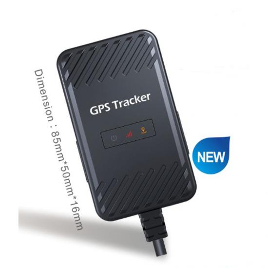

# Huabao - HB-A5D

El rastreador de vehículos GPS impermeable HB-A5D 4G de Huabao es un dispositivo confiable y fácil de instalar diseñado para automóviles privados y motocicletas. Con su bajo consumo de energía y rendimiento estable, este rastreador es una excelente opción para diversos proyectos.

Equipado con un módulo de red 2G+4G, el rastreador HB-A5D garantiza el seguimiento de ubicación en tiempo real y la transmisión de datos. Cuenta con una antena GPS/GSM incorporada para una posición precisa y cálculo de kilometraje. El dispositivo se puede configurar a través de GPRS/SMS, lo que permite una fácil personalización y gestión.

Una de las características destacadas del rastreador HB-A5D es su clasificación de impermeabilidad IP65, lo que lo hace adecuado para su uso en condiciones climáticas adversas. Además, ofrece soporte para accesorios opcionales como un relé para corte remoto de combustible, un sensor de temperatura y un sensor de combustible.

Diseñado para industrias como logística, transporte de pasajeros a larga distancia, alquiler de vehículos y servicios de taxi, el rastreador HB-A5D ofrece una variedad de funcionalidades útiles. Estas incluyen geovallado, detección de encendido, alarma de apagado de energía, alarma de baja potencia, alarma de exceso de velocidad y puerto serie IO/AD para conectar sensores de temperatura o combustible. El dispositivo también cuenta con una batería de respaldo para un funcionamiento ininterrumpido.

Con sus características avanzadas y construcción duradera, el rastreador de vehículos GPS impermeable HB-A5D 4G es una excelente opción para cualquier persona que busque mejorar la seguridad y eficiencia de sus vehículos.

### Características destacadas:

- Seguimiento de ubicación en tiempo real
- Soporte de red de datos 2G+4G
- Antena GPS/GSM incorporada
- Cálculo de kilometraje
- Configuración a través de GPRS/SMS
- Geovallado
- Detección de encendido
- Corte remoto de combustible \(Relé\)
- Alarma de apagado de energía
- Batería de respaldo
- Alarma de baja potencia
- Alarma de exceso de velocidad
- Puerto serie IO/AD \(Sensor de temperatura o combustible\)
- Actualizaciones OTA \(Over-the-Air\)

