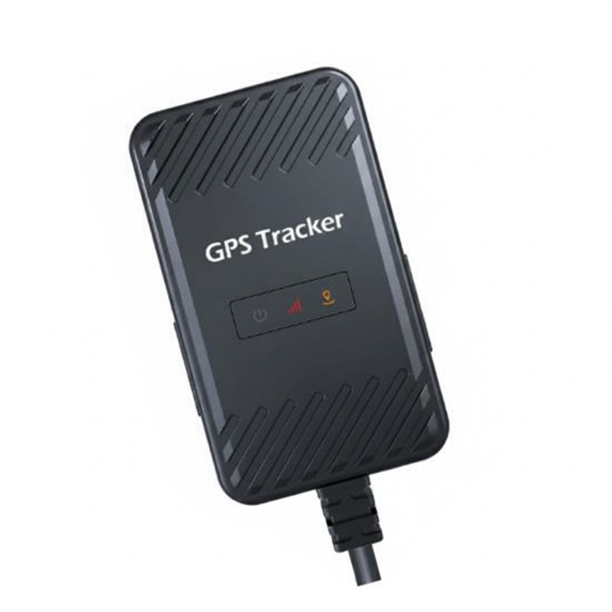

# Huabao - HB-A5D

El HB-A5D es un rastreador vehicular compacto 4G y resistente al agua de Huabao, pensado tanto para automóviles particulares y motocicletas como para flotas comerciales exigentes. Integra antenas de posicionamiento internas, una carcasa con protección IP65 y conectividad celular dual 2G/4G para ofrecer reportes continuos de ubicación y telemetría. El equipo está diseñado para proporcionar seguimiento en tiempo real y reportes de movilidad confiables en logística, transporte de pasajeros, alquileres y taxis.

Como dispositivo compatible con Plaspy, el HB-A5D puede enviar ubicaciones, eventos de estado y telemetría básica de sensores a la plataforma Plaspy para visibilidad y supervisión operativa. Su diseño orientado a conectividad estable, bajo consumo y configuración remota lo convierte en una opción práctica para gestores de flota que desean integrar dispositivos en Plaspy para monitoreo, alertas e informes históricos.

## Características principales

- Rastreador compatible con Plaspy que proporciona seguimiento en tiempo real y telemetría para gestión de flotas y protección de activos.
- Carcasa resistente con clasificación IP65 adecuada para uso vehicular y en exteriores.
- Conectividad celular dual con soporte 2G y 4G para amplia cobertura y reportes constantes.
- Posicionamiento GPS y BDS con alta sensibilidad reportada y buen desempeño en arranque en frío para fijaciones de ubicación fiables.
- Entradas para el vehículo y salida de relé para detección de encendido y control remoto tipo inmovilizador cuando se configura.
- Batería de respaldo integrada para conservar la última ubicación conocida ante pérdida de alimentación principal y soportar operación en espera breve.
- Mantenimiento remoto, incluyendo actualizaciones OTA y configuración vía GPRS o SMS, que simplifican el despliegue a gran escala.

## Cómo funciona con Plaspy

Al conectarse a Plaspy, el HB-A5D transmite datos de posición, eventos de estado y lecturas de sensores que Plaspy procesa en vistas de mapa, notificaciones de alerta e informes históricos. Plaspy convierte la telemetría entrante en información operativa y alertas configurables para que los equipos puedan monitorear vehículos, responder a excepciones y analizar la actividad a lo largo del tiempo.

- Las actualizaciones de ubicación y movimiento en tiempo real aparecen en los mapas y paneles en vivo de Plaspy para una conciencia situacional inmediata.
- El estado de encendido y los eventos de pérdida de alimentación se muestran como eventos discretos en Plaspy para apoyar flujos de trabajo antirobo y respuestas rápidas.
- Alarmas como exceso de velocidad, entrada o salida de geocerca y batería baja se entregan a Plaspy para notificación y escalamiento.
- La telemetría de sensores externos, por ejemplo de combustible o temperatura, puede recibirse y analizarse en Plaspy para monitoreo operacional.
- El control de relé soportado por el dispositivo puede integrarse en los flujos de comandos de Plaspy para acciones remotas autorizadas.
- La configuración remota y las actualizaciones de firmware OTA reducen la necesidad de intervención física al administrar flotas distribuidas.

## Casos de uso típicos

- Antirrobo y recuperación de vehículos, donde las alertas en tiempo real y el control remoto tipo inmovilizador mejoran la seguridad.
- Transporte de pasajeros y flotas de autobuses de larga distancia que requieren seguimiento continuo, reporte de kilometraje y monitoreo de exceso de velocidad.
- Logística y transporte de mercancías peligrosas que demandan hardware robusto con protección contra agua y conectividad fiable.
- Servicios de alquiler y taxis que dependen de detección de encendido, geocercas y registros históricos de rutas para facturación y resolución de disputas.
- Monitoreo de combustible y vigilancia de cargas sensibles a temperatura mediante entradas de sensores externos para telemetría e informes.

## Por qué elegir este rastreador con Plaspy

El HB-A5D equilibra un diseño resistente con funciones telemáticas prácticas, lo que lo convierte en una opción adecuada para organizaciones que necesitan seguimiento vehicular confiable integrado en Plaspy. Su carcasa impermeable, compatibilidad con un amplio rango de voltaje de entrada y opciones de integración de sensores soportan diversos tipos de vehículos y entornos operativos sin añadir complejidad innecesaria.

Emparejado con Plaspy, el HB-A5D forma parte de una solución telemática manejable: los dispositivos informan ubicación y eventos a Plaspy, donde los gestores de flota pueden configurar alertas, revisar datos históricos y ejecutar controles remotos según lo permitido. Para equipos que buscan hardware compacto con capacidades de mantenimiento remoto e integración de telemetría sencilla, el HB-A5D ofrece un ajuste práctico.

Learn more about Plaspy and how compatible devices are used for fleet management at https://www.plaspy.com. Product specifications, availability and manufacturer details can change over time; verify current specifications and documentation on the official Huabao site https://www.huabaotelematics.com/ before purchase or deployment.
