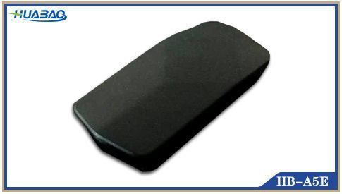

# Huabao - HB-A5E

El Huabao HB-A5E es un rastreador GPS compacto para vehículos diseñado para automóviles particulares y motocicletas. Ofrece posicionamiento y seguimiento en tiempo real en un formato reducido y está pensado para usuarios que requieren monitoreo de ubicación sencillo y funciones básicas de seguridad. El equipo incluye detección de ignición e inmovilización, lo que lo hace adecuado para propietarios que desean mayor control sobre el uso del vehículo.

Como dispositivo compatible con Plaspy, el HB-A5E puede enviar información de ubicación y estado a la plataforma de gestión de flotas y activos Plaspy. Esa compatibilidad permite a usuarios particulares y operadores de flota ver datos de posición en vivo, monitorear el estado de ignición e incluir vehículos equipados con HB-A5E en informes, alertas y flujos operativos de Plaspy. La integración con Plaspy convierte las funciones básicas del dispositivo en visibilidad accionable para equipos.

## Aspectos destacados

- Diseño compacto y de instalación sencilla, ideal para autos particulares y motocicletas
- Seguimiento y posicionamiento GPS en tiempo real para visibilidad continua de la ubicación
- Detección de ignición para supervisar eventos de arranque y apagado del vehículo
- Función de inmovilización que ayuda en disuasión de robos y control remoto en escenarios de recuperación
- Conjunto de funciones simple que satisface las necesidades de propietarios individuales y pequeñas flotas

## Cómo funciona con Plaspy

Al conectarse a Plaspy, el HB-A5E proporciona actualizaciones de ubicación y estado que la plataforma agrega y presenta mediante mapas, alertas e informes. Plaspy transforma los datos del dispositivo en información operativa, permitiendo supervisión y acciones administrativas desde una interfaz central.

- Mostrar ubicaciones en tiempo real de vehículos y motocicletas en los mapas de Plaspy para supervisión continua
- Registrar y revisar el historial de movimientos y reproducir rutas dentro de las herramientas de informes de Plaspy
- Rastrear eventos de ignición encendida/apagada para detectar patrones de uso y arranques no autorizados
- Exponer eventos de inmovilización y el estado del dispositivo en alertas y registros de actividad
- Usar notificaciones de Plaspy y reportes programados para mantener la conciencia operativa

## Casos de uso típicos

- Monitoreo de seguridad para vehículos y motocicletas particulares por parte de propietarios que desean visibilidad de ubicación
- Supervisión de pequeñas flotas donde los rastreadores compactos facilitan la instalación y el seguimiento
- Flujos de trabajo de disuasión y recuperación de robos que combinan inmovilización y datos de ubicación
- Seguimiento del uso de vehículos de empresa para controlar eventos de ignición y desplazamientos
- Programas de alquiler o uso compartido que requieren reportes de posición y monitoreo de estado sencillos

## Por qué elegir este rastreador con Plaspy

El HB-A5E es una opción práctica para organizaciones e individuos que buscan un rastreador discreto y fácil de desplegar para autos particulares y motocicletas. Sus funciones principales—posicionamiento en tiempo real, detección de ignición e inmovilización—se alinean con el enfoque de Plaspy en visibilidad, alertas e informes operativos básicos. En conjunto con Plaspy, el dispositivo puede ofrecer seguimiento de ubicación y monitoreo de estado sin añadir complejidad innecesaria.

Si desea saber más sobre cómo usar el HB-A5E en Plaspy, visite https://www.plaspy.com para explorar las capacidades de la plataforma y las opciones de integración, y verifique las especificaciones actuales y disponibilidad en el sitio del fabricante https://www.huabaotelematics.com/. Las especificaciones y la disponibilidad pueden cambiar con el tiempo, por lo que recomendamos consultar la documentación más reciente del fabricante.
