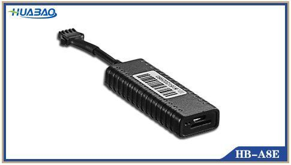

# Huabao - HB-A8E

El Huabao HB-A8E es un mini rastreador GPS compacto pensado para montaje discreto y uso sencillo. El fabricante lo describe como un dispositivo de rendimiento estable y fácil instalación, ideal para vehículos particulares y motocicletas cuando se necesita un tamaño reducido y colocación poco visible. Entre sus características principales se encuentran el posicionamiento GPS en tiempo real, detección de ignición y una antena integrada que favorece la recepción de señal.

Al ofrecer ubicación en vivo, detección de ignición y función de inmovilización, el HB-A8E encaja naturalmente con plataformas de seguimiento en la nube. El modelo es compatible con Plaspy, por lo que empresas y propietarios particulares pueden centralizar la visibilidad de sus activos, supervisar el estado del vehículo y gestionar inmovilizaciones y alertas junto con otros dispositivos de su flota.

## Características principales

- Diseño miniatura y discreto, apto para instalación oculta en autos y motocicletas
- Seguimiento y posicionamiento GPS en tiempo real para visibilidad continua de la ubicación
- Detección de ignición para monitorear el estado encendido/apagado y patrones de uso
- Capacidad de inmovilización remota para respuesta ante robo y control de uso no autorizado
- Antena integrada para mantener recepción de señal más consistente en distintos entornos
- Rendimiento descrito como estable y una instalación sencilla para despliegues rápidos

## Cómo funciona con Plaspy

Usado junto con Plaspy, el HB-A8E puede enviar información de ubicación y estado a la plataforma, de modo que administradores y propietarios vean los dispositivos en mapas y informes. Plaspy puede agregar datos del HB-A8E junto con otros equipos compatibles para ofrecer un monitoreo unificado y supervisión operacional.

- Visualización de ubicación en vivo en los mapas de Plaspy para seguimiento en tiempo real de vehículos y motocicletas
- Indicadores de estado por cambios de ignición que ayudan a supervisar el uso y comportamiento del conductor
- Acciones de inmovilización remota disponibles desde la plataforma cuando el dispositivo lo soporta
- Alertas y notificaciones por eventos como movimiento, cambios de ignición o violaciones de geocerca
- Historial de rutas e informes para revisar recorridos y analizar operaciones

## Casos de uso habituales

- Monitoreo antirrobo de vehículos particulares con colocación discreta e inmovilización remota
- Rastreo de motocicletas donde el tamaño y la posibilidad de ocultamiento son prioritarios
- Supervisión de pequeñas flotas para empresas que requieren ubicación en tiempo real y estado de ignición
- Control de vehículos empresariales para detectar uso no autorizado o funcionamiento fuera de horario
- Protección de activos cuando se prefieren dispositivos GPS compactos para ocultamiento

## Por qué elegir este rastreador con Plaspy

El HB-A8E es una opción práctica para quienes necesitan un rastreador pequeño y discreto que aún ofrezca funciones básicas de localización y control. Su combinación de posicionamiento en tiempo real, detección de ignición e inmovilización lo hace útil tanto para propietarios particulares como para organizaciones que requieren seguridad y monitoreo de uso. Integrar el HB-A8E con Plaspy permite incorporar los datos del dispositivo en un contexto operativo más amplio, brindando visibilidad centralizada en flotas mixtas y alertas e informes consistentes.

Si sus necesidades primarias son tamaño reducido, reporte de ubicación confiable e inmovilización remota dentro de una implementación con Plaspy, el HB-A8E merece consideración. Dado el conjunto conciso de funciones descritas por el fabricante, las organizaciones deberían evaluar si el dispositivo cumple sus requisitos operativos y de monitoreo antes de adquirirlo.

Para obtener más información sobre la gestión de rastreadores compatibles con Plaspy, visite https://www.plaspy.com. Las especificaciones del producto, la disponibilidad y los datos del fabricante pueden cambiar con el tiempo, por lo que le recomendamos verificar la información técnica y la compatibilidad actual con el fabricante en https://www.huabaotelematics.com/ antes de tomar decisiones de compra.
