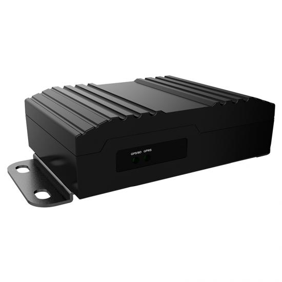

# Huabao - HB-A9S

El HB-A9S es un rastreador GPS 4G de alta gama pensado para flotas de vehículos que requieren telemetría robusta y capacidad multimedia. Combina conectividad celular con un punto de acceso WiFi integrado y puertos ampliables para periféricos como cámaras, lectores de tarjetas y sensores de combustible. El dispositivo también incorpora funciones habituales de flotas, como detección de encendido (ACC), entrada SOS y opciones de corte remoto o limitación de velocidad mediante relé para soporte de seguridad y control operativo.

Como rastreador compatible con Plaspy, el HB-A9S envía actualizaciones de posición en tiempo real, datos CANBus y cargas multimedia a la plataforma. La integración con Plaspy permite a los gestores de flota ver información de localización, revisar material de incidentes, configurar alertas y generar reportes, de modo que el seguimiento, la supervisión de conductores y los flujos de trabajo de seguridad queden centralizados en un único entorno de gestión de flotas.

## Aspectos Destacados

- Rastreador GPS 4G compatible con Plaspy, diseñado para aplicaciones de flota y carga multimedia.
- Punto de acceso WiFi integrado para conectividad de pasajeros y apoyo en la transmisión de multimedia.
- Interfaces ampliables para cámaras, sensores de combustible, lectores de tarjetas y otros periféricos.
- Soporte de telemetría CANBus para mostrar parámetros del vehículo como velocidad y nivel de combustible.
- Opciones de control remoto, incluyendo corte de combustible o alimentación y limitación de velocidad por relé.
- Soporte completo de alarmas, incluyendo geocerca, exceso de velocidad, detección de encendido ACC y entrada SOS.

## Cómo funciona con Plaspy

Al conectarse a Plaspy, el HB-A9S transmite coordenadas GPS, telemetría y eventos de alarma a la plataforma a través de la red celular. Plaspy procesa los datos de posición y los archivos multimedia asociados para que los operadores puedan monitorizar la actividad en tiempo real, reproducir viajes e investigar incidentes con imágenes o clips de vídeo vinculados a eventos.

- Actualizaciones de ubicación en tiempo real y reproducción histórica de viajes visibles en los paneles de Plaspy.
- Telemetría CANBus y de sensores mostrada junto con los datos de posición para facilitar el control de combustible y el estado del vehículo.
- Eventos de alarma como SOS, violación de geocerca, exceso de velocidad y corte de energía generan alertas inmediatas en Plaspy para una respuesta rápida del operador.
- Cargas multimedia desde cámaras emparejadas vinculadas a eventos e incidentes para agilizar investigaciones y aportar evidencia.
- Acciones remotas, como corte de combustible o alimentación y limitación de velocidad, se ejecutan a través del rastreador y quedan registradas en los logs de eventos de Plaspy.
- Eventos de encendido ACC y estado del conductor entregados como registros individuales para control de turnos y análisis de comportamiento.

## Casos de Uso Típicos

- Flotas de autobuses y transporte de pasajeros que requieren WiFi para usuarios, evidencia multimedia de incidentes y supervisión de conductores.
- Empresas de alquiler de autos y servicios de movilidad compartida que usan detección de encendido, geocercas y cortes remotos para mitigación de robo y cumplimiento contractual.
- Transporte de larga distancia donde la telemetría CANBus, el control de combustible y el material de incidentes apoyan el cumplimiento normativo y el análisis post evento.
- Flotas que integran múltiples sensores y periféricos, como medidores de nivel de combustible, indicadores de peso o lectores de tarjetas para telemetría operativa.
- Despliegues de vehículos de alta seguridad que requieren alertas SOS, limitación de velocidad y capacidad de inmovilización remota.

## Por qué elegir este rastreador con Plaspy

El HB-A9S es una opción práctica para organizaciones que necesitan un solo equipo que combine seguimiento en tiempo real, telemetría vehicular y evidencia multimedia. Su soporte para integración de periféricos y las subidas asistidas por WiFi aumentan el valor de los registros de eventos en Plaspy, ayudando a los equipos operativos a resolver incidentes y supervisar el rendimiento de los conductores de forma más eficiente. Las funciones de control remoto y los múltiples tipos de alarma ofrecen palancas adicionales para aplicar políticas de seguridad y operativas.

Al estar confirmado como compatible con Plaspy, el HB-A9S puede incorporarse a los flujos de trabajo existentes de Plaspy para mapas, alertas e informes sin necesidad de rehacer procesos en la plataforma. El dispositivo está pensado para entornos de flota mixtos en los que la telemetría, el multimedia y la capacidad de intervención remota son importantes, y Plaspy proporciona la vista centralizada y los reportes necesarios para convertir esos datos en información accionable.

Para obtener más información sobre cómo Plaspy soporta rastreadores de flota como el HB-A9S visite https://www.plaspy.com . Las especificaciones del producto, su disponibilidad y los detalles del fabricante pueden cambiar con el tiempo, por lo que le recomendamos verificar las especificaciones técnicas actuales y la compatibilidad de accesorios en el sitio del fabricante https://www.huabaotelematics.com/.
