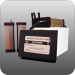

# HunterPro - CP60-COUNTER

El HunterPro CP60-COUNTER es un rastreador GPS diseñado para empresas de transporte de pasajeros que necesitan monitorizar los ascensos y descensos. Combina el seguimiento de ubicación con el conteo de pasajeros y transmite los datos en tiempo real, de modo que usted puede visualizar los flujos de pasajeros y la posición de los vehículos desde un sistema central. El dispositivo utiliza GPRS para una entrega de datos segura y confiable y está pensado para operar en entornos de transporte.

Como dispositivo compatible con Plaspy, el CP60-COUNTER puede enviar su información de ubicación y el conteo de pasajeros a Plaspy, lo que permite a los responsables de flota y despachadores obtener una visión consolidada. Plaspy muestra los datos del CP60-COUNTER junto con otros activos de la flota, ayudando a los equipos a supervisar la ocupación, los movimientos de los vehículos y métricas operativas básicas desde una misma plataforma.

## Aspectos clave

- Diseñado específicamente para monitorizar transporte de pasajeros y el conteo de ascensos y descensos
- Transmisión de datos en tiempo real a sistemas centrales mediante GPRS
- Informes de ubicación precisos para visibilidad de rutas y flota
- Construido para operar de forma fiable en entornos de transporte
- Interfaz amigable para acceso sencillo a datos de pasajeros y ubicación
- Facilita la gestión de pasajeros y la supervisión operativa

## Cómo funciona con Plaspy

Al integrarlo con Plaspy, el CP60-COUNTER proporciona datos de ubicación y conteo de pasajeros que Plaspy ingiere y muestra en contexto con la información de la flota. Esto le permite a usted supervisar de forma centralizada, generar informes sencillos y mantener la supervisión operativa sin necesidad de múltiples sistemas separados.

- Mostrar ubicaciones de vehículos en vivo y el historial de posiciones recientes en los mapas de Plaspy
- Presentar los conteos de ascenso y descenso junto al estado del vehículo para una evaluación rápida
- Crear alertas y notificaciones en Plaspy basadas en eventos de ubicación o umbrales de pasajeros
- Generar informes que combinen datos de pasajeros e historiales de viaje para análisis operativos
- Usar los paneles de Plaspy para monitorear múltiples unidades CP60-COUNTER a lo largo de la flota

## Casos de uso típicos

- Flotas de buses urbanos e interurbanos rastreando flujos de pasajeros y recorridos
- Servicios de traslado que gestionan niveles de embarque y asignación de vehículos
- Programas de transporte escolar controlando el conteo de estudiantes durante los viajes
- Servicios de transporte para eventos y recintos coordinando carga y despacho
- Operadores privados que requieren datos consolidados de ubicación y pasajeros

## Por qué elegir este rastreador con Plaspy

El HunterPro CP60-COUNTER es una opción práctica para organizaciones centradas en operaciones de pasajeros. Sus fortalezas principales son el conteo de pasajeros y la consistencia en el reporte de ubicación, lo que aporta a los responsables de flota información accionable sobre ocupación y movimiento de vehículos. Al integrarlo con Plaspy, esos flujos de datos forman parte de una vista operativa más amplia que facilita la supervisión, la elaboración de informes y la toma de decisiones.

Si usted utiliza Plaspy y necesita una solución directa para monitorizar pasajeros junto con el rastreo de flota, el CP60-COUNTER puede ser un dispositivo útil para su conjunto de herramientas. El rastreador se describe como fiable y de manejo sencillo, y la integración de sus datos en Plaspy reduce la necesidad de consolidar información manualmente entre sistemas.

Para obtener más información sobre Plaspy y cómo puede trabajar con dispositivos como el HunterPro CP60-COUNTER visite https://www.plaspy.com. Las especificaciones del producto, la disponibilidad y los detalles del fabricante pueden cambiar con el tiempo, así que verifique la información actual con el fabricante en http://hunterpro.com.tw/.
