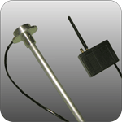

# HunterPro - CP60-FUEL

El HunterPro CP60-FUEL es un rastreador GPS diseñado específicamente para medir el nivel de combustible en los tanques de unidades de transporte. Emplea una sonda coaxial en la que un tubo metálico exterior y un electrodo central conforman una sonda capacitiva cuya capacidad varía según la altura del combustible. El equipo convierte esa variación de capacidad en pulsos digitales, lo que permite una correlación fiable entre la capacidad medida y el volumen de combustible una vez completada la calibración del tanque.

Como dispositivo compatible con Plaspy, el CP60-FUEL puede enviar datos de nivel de combustible a Plaspy para ofrecer visibilidad combinada de ubicación y combustible en toda la flota. Esta integración es útil para operaciones que requieren supervisión centralizada de volúmenes de combustible junto con el seguimiento habitual de vehículos, y ayuda a los gestores de flota a integrar lecturas de combustible en los paneles, reportes y alertas de Plaspy.

## Aspectos clave

- Diseñado específicamente para la medición de nivel de combustible en tanques de unidades de transporte
- La sonda coaxial tipo condensador ofrece una relación lineal entre la altura del combustible y la capacidad medida
- Circuitería interna que convierte los cambios de capacidad en pulsos digitales para un procesamiento sencillo
- Procedimiento de calibración del tanque que permite mapear la salida del sensor al volumen real para mayor precisión
- Diseño pensado para uso rutinario en escenarios de monitoreo de flota
- Compatible con Plaspy para supervisión centralizada de flota y combustible

## Cómo funciona con Plaspy

Al integrarse con Plaspy, el CP60-FUEL aporta información de nivel de combustible calibrada que Plaspy puede mostrar junto con datos de ubicación y recorrido. Esto permite a los operadores de flota supervisar los volúmenes de combustible en contexto y aprovechar las funciones de la plataforma para rastrear cambios a lo largo del tiempo o detectar eventos inesperados.

- Mostrar tendencias de nivel de combustible en los paneles de Plaspy por vehículo
- Combinar datos de ubicación y combustible para analizar consumo en función de rutas y uso
- Generar reportes con el historial de volumen de combustible para contabilidad y conciliación
- Configurar alertas por caídas bruscas o desviaciones en niveles de combustible para apoyar la respuesta operativa
- Usar la visibilidad de Plaspy para comparar métricas de combustible entre vehículos de la flota y optimizar procesos

## Casos de uso típicos

- Monitoreo de volúmenes de combustible en camiones y unidades de transporte para controlar el consumo
- Conciliación de combustible para la contabilidad y supervisión operativa de la flota
- Detección de cambios inusuales en el nivel de combustible que puedan indicar pérdidas o necesidades de mantenimiento
- Integración de datos de combustible con reportes de rutas y uso para planificación operativa
- Monitoreo centralizado de combustible en flotas mixtas mediante los paneles de Plaspy

## Por qué elegir este rastreador con Plaspy

El CP60-FUEL es una opción práctica para organizaciones que necesitan mediciones enfocadas del nivel de combustible combinadas con la detección de ubicación de la flota. Su enfoque basado en sonda y la necesidad de calibración del tanque lo hacen apropiado cuando es importante mapear con precisión el volumen, por ejemplo en logística, transporte y flotas de servicio en campo.

Al emparejarse con Plaspy, el CP60-FUEL permite que los equipos integren las mediciones de combustible en el mismo entorno donde gestionan rutas, activos y reportes. Esta alineación simplifica los flujos de trabajo relacionados con el combustible y facilita que las partes interesadas accedan a una visión consistente del estado del combustible a nivel de flota sin tener que gestionar sistemas separados.

Para más información sobre Plaspy y cómo pueden utilizarse dispositivos compatibles en operaciones de flota visite https://www.plaspy.com. Las especificaciones y la disponibilidad de producto pueden cambiar con el tiempo, por lo que le recomendamos verificar los detalles técnicos y la documentación más recientes en el sitio del fabricante http://hunterpro.com.tw/ antes de tomar decisiones de despliegue.
