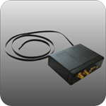

# HunterPro - CP60-TEMP

El HunterPro CP60-TEMP es un rastreador GPS diseñado para el monitoreo de temperatura en camiones refrigerados, contenedores y espacios de almacenamiento. Integra posicionamiento por GPS con sensores de temperatura y lectura remota de datos para que los operadores supervisen y gestionen las condiciones térmicas a lo largo de la cadena de frío. Este equipo está pensado para ofrecer visibilidad continua de la temperatura de la carga junto con la información de ubicación, apoyando el control de calidad de productos perecederos.

Como dispositivo compatible con Plaspy, el CP60-TEMP puede aportar datos de temperatura y ubicación a la plataforma Plaspy para una supervisión consolidada de flotas y activos. Integrar este rastreador con Plaspy permite a los equipos operativos visualizar tendencias de temperatura, recibir alertas por cambios de condición e incluir el estado térmico en procesos de enrutamiento e informes, todo desde un entorno de monitoreo centralizado.

## Aspectos destacados

- Diseñado específicamente para el monitoreo de temperatura en camiones refrigerados, contenedores y almacenes
- Monitoreo de temperatura en tiempo real y lectura remota de datos para visibilidad continua
- Combina seguimiento de ubicación con datos térmicos para una supervisión integrada de la cadena de frío
- Ayuda a mantener condiciones óptimas para alimentos, productos farmacéuticos y otros perecederos
- Permite supervisión remota desde una estación centralizada para reducir inspecciones manuales
- Útil para documentar condiciones de temperatura en reportes operativos y de calidad

## Cómo funciona con Plaspy

Cuando se conecta a Plaspy, el CP60-TEMP entrega actualizaciones de temperatura y ubicación que Plaspy transforma en vistas accionables para gerentes de flota y equipos logísticos. Plaspy muestra los datos del dispositivo en paneles y líneas de tiempo para que los equipos monitoreen las condiciones de la carga junto con los movimientos de los vehículos.

- Visualización centralizada de lecturas de temperatura y ubicación de activos en los paneles de Plaspy
- Alertas y notificaciones configurables según umbrales de temperatura y cambios de condición
- Informes históricos para auditorías de la cadena de frío y revisiones de cumplimiento
- Vistas operativas combinadas para enrutamiento, monitoreo de estado y manejo de excepciones
- Monitoreo agregado a nivel de flota para identificar problemas de temperatura recurrentes o rutas de riesgo

## Casos de uso típicos

- Supervisión de flotas de camiones refrigerados en trayectos de larga distancia y entregas de última milla
- Seguimiento de la temperatura dentro de contenedores durante el transporte y operaciones de cross-dock
- Vigilancia continua de temperatura en cámaras frías y centros de distribución
- Garantizar la integridad térmica en envíos farmacéuticos y suministros sensibles
- Proveer evidencia térmica para control de calidad e informes regulatorios

## Por qué elegir este rastreador con Plaspy

El CP60-TEMP es una opción práctica para organizaciones que necesitan visibilidad combinada de ubicación y temperatura. Su enfoque en activos refrigerados lo hace relevante para la distribución de alimentos, la logística de frío y el transporte farmacéutico, donde mantener temperaturas controladas es fundamental. En conjunto con Plaspy, el dispositivo puede integrarse en una visión operativa más amplia que vincule los datos de condiciones térmicas con los movimientos de la flota y los informes.

Dado que la información pública sobre revisiones específicas de hardware y funciones puede ser limitada, los equipos deberían evaluar el CP60-TEMP por su capacidad declarada para monitorear temperatura con lectura remota y verificar requisitos detallados contra la información del fabricante y las opciones de integración con Plaspy.

Para obtener más información sobre Plaspy y cómo dispositivos compatibles como el CP60-TEMP encajan en una estrategia de monitoreo de flotas visite https://www.plaspy.com. Las especificaciones del producto, la disponibilidad y los datos del fabricante pueden cambiar con el tiempo, por lo que confirme las especificaciones técnicas actuales y la compatibilidad en la documentación del fabricante en http://hunterpro.com.tw/.
