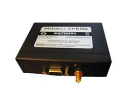

# HunterPro - CP60G

El HunterPro CP60G es un rastreador GPS de bajo costo diseñado principalmente para el seguimiento y la recuperación de vehículos. Combina posicionamiento por GPS con comunicación GSM GPRS para enviar actualizaciones de ubicación y reportes de eventos. El equipo se presenta en una caja plástica resistente, incluye antenas GPS y GSM, una batería de respaldo para mantener el rastreo y entradas para eventos habituales del vehículo como ignición, pánico y estado de puertas. Si el proyecto lo requiere, hay opciones para antenas fijas y sensores externos como combustible y temperatura para telemetría adicional.

Como modelo compatible con Plaspy, el CP60G puede enviar datos de ubicación y eventos a una plataforma centralizada de gestión de flotas para monitorización e informes. Su combinación de reportes periódicos, modo de suspensión para ahorrar energía y entradas digitales para eventos del vehículo lo convierten en una opción práctica para organizaciones que necesitan visibilidad rastreada sin un elevado gasto en hardware. Plaspy puede ingerir los datos del dispositivo y mostrarlos junto con la información del resto de la flota para apoyar operaciones, recuperaciones y supervisión.

## Aspectos clave

- Rastreador rentable, adecuado para despliegues a gran escala y proyectos con presupuesto limitado
- Posicionamiento GPS junto con comunicación GSM GPRS para cobertura en amplias zonas
- Soporte total cuatribanda GSM para mayor conectividad regional
- Batería de respaldo incluida para mantener el rastreo durante cortes de energía
- Múltiples entradas digitales con funciones predefinidas para ignición, pánico y puertas
- Reporte de posición basado en tiempo y modo de suspensión para equilibrar informes y consumo energético
- Carcasa plástica duradera con antenas GPS y GSM incluidas y opciones para sensores adicionales

## Cómo funciona con Plaspy

Al conectarse a Plaspy, el CP60G transmite posiciones y mensajes de eventos a la plataforma, donde los datos se visualizan, registran y analizan. Plaspy recopila la información enviada por el rastreador y la pone a disposición mediante mapas, líneas de tiempo e informes que ayudan a los equipos a gestionar vehículos y responder a incidentes.

- Visualización de ubicación en tiempo real y casi en tiempo real en los mapas de Plaspy para visibilidad de la flota
- Alertas y notificaciones basadas en eventos como ignición, pánico y actividad de puertas
- Reproducción histórica de rutas e informes para investigaciones de recuperación y cumplimiento
- Visión general a nivel de flota y monitoreo de estado para mejorar la toma de decisiones operativas
- Soporte para datos de sensores externos, como combustible y temperatura, cuando esas opciones están conectadas

## Casos de uso típicos

- Prevención de pérdidas y monitoreo de recuperación para aseguradoras
- Seguimiento y control de flotas de alquiler de vehículos
- Gestión de flotas pequeñas y medianas para entregas y servicios de campo
- Servicios de rastreo operados por empresas de seguimiento
- Flujos de trabajo de recuperación y respuesta ante robos que requieren historial de posiciones

## Por qué elegir este rastreador con Plaspy

El CP60G es un rastreador sencillo y orientado al valor que cubre casos donde se necesita un reporte de ubicación fiable y monitoreo básico de eventos. Su combinación de posicionamiento GPS, conectividad GSM y entradas digitales ofrece los elementos esenciales que requieren muchas operaciones de flota y recuperación, manteniendo un costo contenido. Para organizaciones que ya usan Plaspy, el CP60G se puede integrar para aportar los datos de ubicación y eventos que generan visibilidad e informes en la plataforma.

Si desea evaluar el CP60G para su flota, Plaspy puede ayudar a presentar los datos del dispositivo junto con otros activos para ofrecer una vista operativa unificada. Conozca más sobre Plaspy en el sitio principal https://www.plaspy.com. Las especificaciones y la disponibilidad del producto pueden cambiar con el tiempo, por lo que le recomendamos verificar los detalles actuales y las opciones de accesorios en el sitio del fabricante http://hunterpro.com.tw/ antes de tomar decisiones de compra.
