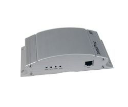

# Intellitrack - Intellitrac X8

El localizador GPS de vehículos IntelliTrac X8 es el modelo más potente y con mejores prestaciones de la marca IntelliTrack. Este dispositivo ha ganado gran reputación en todo el mundo debido a su gran rendimiento y es ideal para la gestión de flotas y la recuperación de vehículos.

El IntelliTrac X8 cuenta con una serie de características destacadas que lo convierten en una opción confiable y eficiente. Entre ellas se encuentran:

- Blackbox: El X8 está equipado con una blackbox que registra y almacena datos importantes sobre el vehículo, como la velocidad, la ubicación y el kilometraje.
- Gestión remota vía GPRS: Con el IntelliTrac X8, es posible gestionar y monitorear la flota de vehículos de forma remota a través de la red GPRS.
- Sensores ADC: Este localizador GPS cuenta con sensores ADC \(Convertidor Analógico-Digital\) que permiten medir y monitorear variables como la temperatura, la presión y la humedad.
- Comunicación a través de TCP: El X8 utiliza el protocolo TCP para la comunicación de datos, lo que garantiza una transmisión segura y confiable.
- Comunicación a través de UDP: Además del TCP, el IntelliTrac X8 también es compatible con el protocolo UDP, lo que permite una comunicación rápida y eficiente.

Estas características hacen del IntelliTrac X8 una opción ideal para empresas que buscan mejorar la gestión de su flota de vehículos y garantizar la seguridad de sus activos. Con este localizador GPS, es posible tener un control total sobre la ubicación y el rendimiento de los vehículos, lo que se traduce en una mayor eficiencia operativa y una reducción de costos.

