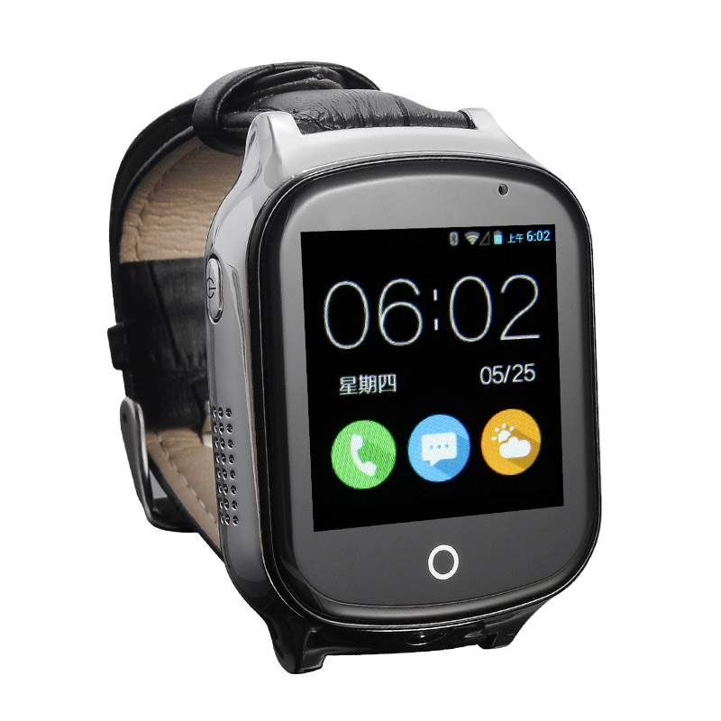

# iStartek - PT19

El PT19 3G GPS Tracker Watch es un wearable compatible con Plaspy diseñado para una seguridad personal fiable y seguimiento en tiempo real. Construido alrededor del posicionamiento en múltiples modos \(GPS, BeiDou, AGPS, Wi‑Fi y LBS\), el PT19 ofrece fijaciones de ubicación rápidas en entornos urbanos, interiores y a cielo abierto, e integra con Plaspy para supervisión simplificada, gestión de alarmas y reproducción histórica de rutas.

Ligero y diseñado específicamente para el cuidado de niños y personas mayores, el PT19 combina llamadas SOS, voz bidireccional, monitoreo de voz remoto y captura de fotos a demanda en un formato compacto con pantalla táctil de 1.54". Al emparejarse con Plaspy, el PT19 se convierte en un dispositivo de telemetría de acción inmediata — proporcionando ubicación en tiempo real, alertas y datos de estado en un único panel para cuidadores, equipos de seguridad o implementaciones de telemetría con dispositivos mixtos.

## Key Highlights

- Rastreador GPS portátil compatible con Plaspy para un seguimiento en tiempo real fiable e integración rápida en paneles de monitorización existentes.
- Posicionamiento multimodal \(GPS, BeiDou, AGPS, Wi‑Fi y LBS\) para ubicaciones precisas en exteriores y posicionamiento operativo en interiores.
- Botón SOS dedicado y llamada SOS de un solo toque para alertas de emergencia inmediatas y coordinación de respuestas.
- Voz bidireccional y monitoreo de voz remoto — mantente conectado o verifica el estado de forma discreta cuando sea necesario.
- Capturas remotas de cámara/fotos para verificación de la situación y recopilación de pruebas bajo demanda.
- Geocerca configurable, informes programados y reproducción de rutas históricas \(hasta tres meses\) para auditoría y revisión.
- Diseño compacto y ligero \(46 x 36 x 16 mm, 40 g\) con batería de respaldo de 600 mAh para la conveniencia de uso diario.

## How It Works with Plaspy

Cuando el PT19 se registre en su cuenta de Plaspy, transmitirá datos de ubicación y eventos a través de redes celulares a la plataforma de Plaspy utilizando protocolos TCP/UDP/SMS estándar. Plaspy ingiere mensajes de telemetría y alarmas, lo que habilita el rastreo en tiempo real, alertas automatizadas e informes históricos sin necesidad de desarrollo de integraciones a medida. El posicionamiento multimodal del reloj garantiza que Plaspy reciba la mejor fuente de ubicación disponible — GNSS en exteriores, Wi‑Fi en interiores y LBS cuando sea necesario.

- Actualizaciones de ubicación en tiempo real entregadas a Plaspy para monitoreo continuo y visualización en mapa.
- Eventos de SOS y alarmas reenviados a Plaspy para notificación inmediata y flujos de escalamiento.
- Los eventos de voz bidireccional y el monitoreo de voz remoto aparecen en los registros del cliente de Plaspy y en las alertas para la conciencia situacional.
- Capturas remotas de cámara disponibles a través de cuentas vinculadas a Plaspy para la verificación de incidentes o el contexto de la ubicación.
- Informes programados, alertas de geocerca y reproducción de rutas históricas accesibles en Plaspy para auditoría y coordinación de cuidados.

## Technical Overview

| Conectividad | Celular WCDMA y GSM; admite TCP/UDP/SMS |
| --- | --- |
| Bandas | WCDMA 900 / 2100 MHz; GSM 850 / 900 / 1800 / 1900 MHz |
| Potencia y batería | Batería de respaldo de 600 mAh — ~1 día con informes cada 1 minuto, ~2–3 días con informes cada 10 minutos |
| Interfaces y controles | 1 botón SOS dedicado, pantalla táctil, micrófono y altavoz integrados, soporte de cámara remota, carga magnética por acoplamiento |
| GNSS | GPS + BeiDou + AGPS con chipset MTK de alta sensibilidad \(sensibilidad de adquisición ~‑148 dBm, de seguimiento ~‑165 dBm; TTFF frío &lt;36s, cálido &lt;15s, caliente &lt;2s\). Precisión típica en exteriores 5–20 m; Wi‑Fi 20–100 m; LBS 100–1000 m. |
| Bluetooth | No especificado en la descripción del producto |
| Gestión remota | Compatible con aplicaciones móviles Android/iOS y clientes de red basados en ordenador; admite parámetros de red globales |
| Factor de forma | Reloj wearable — 46 x 36 x 16 mm; 40 g; 1.54" pantalla táctil; G‑sensor |

## Use Cases

- Seguridad infantil y monitoreo escolar — geocercas y informes programados mantienen informados a los padres sobre llegadas y salidas.
- Cuidado de personas mayores y respuesta ante emergencias — botón SOS, voz bidireccional y monitoreo remoto aceleran la respuesta de cuidadores ante caídas o eventos súbitos.
- Seguridad personal para trabajadores solitarios — rastreo en tiempo real y capturas de cámara a demanda proporcionan verificación en situaciones inciertas.
- Monitoreo de activos o objetos de valor a corta distancia donde se prefiere un localizador portátil — tamaño compacto para un uso discreto.
- Seguimiento sensible a la salud con conteo de pasos y configuraciones de podómetro personalizables para la telemetría de la actividad diaria.

## Why Choose This Tracker with Plaspy

The PT19 pairs the convenience of a lightweight wearable with Plaspy’s robust platform to create a focused personal‑safety and telemetry solution. Its multi‑mode positioning and MTK GNSS performance give Plaspy high‑quality location data across environments, while SOS, two‑way audio and remote camera features provide action‑able alerts and evidence when incidents occur. Integrating PT19 devices into Plaspy lets families, caregivers and small organizations consolidate telemetry in one place — improving response times, maintaining historical records, and simplifying device management.

While the PT19 is optimized for personal tracking rather than vehicle telemetry \(it does not list vehicle ignition or immobilizer interfaces in its specification\), it still contributes valuable real‑time tracking and telemetry data to Plaspy. That makes it easy to run mixed deployments — combining wearable trackers with vehicle or asset trackers in a single Plaspy account for unified situational awareness and centralized alerts.

