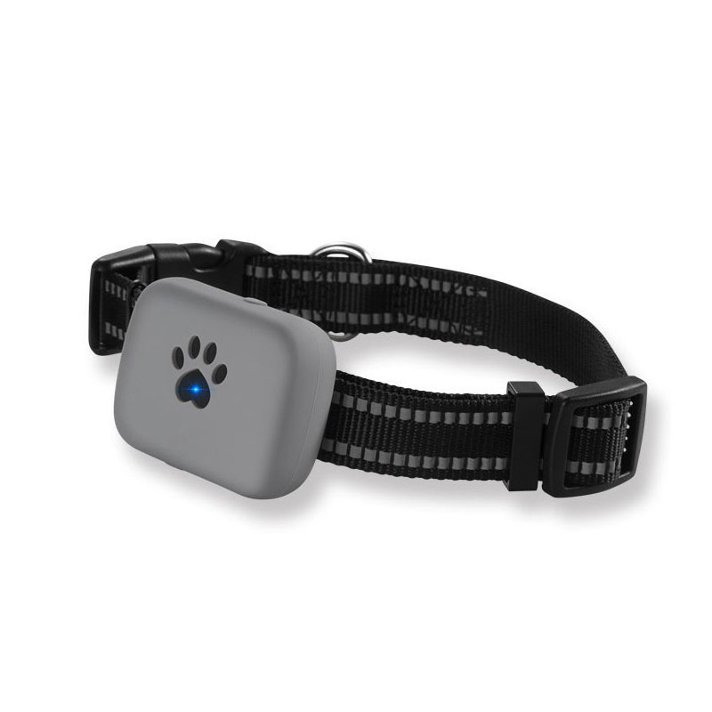

# iStartek - PT21

El PT21, el dispositivo de rastreo por GPS más compacto de un OEM consolidado, es un rastreador GPS compacto compatible con Plaspy, diseñado para mascotas, activos pequeños y un rastreo personal discreto. Al combinar posicionamiento híbrido GPS, LBS y Wi‑Fi con comunicaciones 2G/GPRS, el PT21 ofrece seguimiento en tiempo real fiable, monitorización de voz y funcionalidad SOS en un paquete diminuto e impermeable, ideal para protección en movimiento.

Diseñado para una autonomía prolongada y uso diario exigente, el PT21 es una opción práctica cuando necesitas fijaciones de ubicación precisas, una integración sencilla con Plaspy y un coste operativo reducido \(sin cuota de servidor del fabricante — solo cargos de SIM/datos\). Su audio bidireccional, gestión inteligente de energía y funciones de geocerca/alertas facilitan añadir protección de activos compacta y capacidades anti‑robo a tus flujos de telemetría e informes de Plaspy.

## Aspectos Clave

- Compatible con Plaspy: informes estándar TCP/UDP/SMS para una integración fluida en el seguimiento en tiempo real y alertas de Plaspy.
- Posicionamiento híbrido \(GPS + LBS + Wi‑Fi\) para fijaciones más rápidas y una mejor cobertura interior/exterior.
- Audio bidireccional y monitorización de voz, además de un botón de llamada de emergencia SOS para seguridad personal discreta y verificaciones remotas.
- Larga autonomía de la batería \(1000mAh Li‑ion — hasta 15 días en espera\) y gestión inteligente de energía para despliegues prolongados.
- Carcasa robusta con clasificación IP67 impermeable para uso en mascotas, equipaje y durante actividades deportivas.
- Reproducción de rutas históricas de hasta 3 meses, informes programados por hora/distancia/kilometraje, geocerca y alarmas de batería baja.
- Bajo coste operativo — utiliza redes 2G/GPRS existentes y requiere sólo una SIM \(GPRS recomendado, mínimo ~30MB/mes\).

## Cómo Funciona con Plaspy

El PT21 comunica la ubicación y el estado a través de 2G/GPRS usando TCP, UDP o SMS. Cuando se empareja con Plaspy, esas transmisiones estándar proporcionan actualizaciones de posición en tiempo real, alertas e historial de rutas para monitoreo, informes y respuesta ante incidentes. Plaspy ingiere la telemetría del dispositivo para obtener seguimiento continuo en tiempo real y notificaciones de eventos sin middleware adicional.

- Actualizaciones de ubicación y telemetría en tiempo real vía GPRS \(TCP/UDP\) o SMS a Plaspy para una visualización inmediata en el mapa.
- Audio bidireccional y alertas SOS — utiliza Plaspy para detectar eventos de emergencia y enlazar con los datos de ubicación grabados.
- Eventos de geocerca, alarmas de batería baja y informes programados \(por hora, distancia o kilometraje\) aparecen como alertas accionables en Plaspy.
- Reproducción de rutas históricas \(hasta 3 meses\) disponible dentro de Plaspy usando los informes almacenados del dispositivo para análisis o trazabilidad.
- Los formatos de reporte estándar y los canales TCP/UDP permiten una configuración sencilla en la página de configuración del dispositivo de Plaspy; no se requiere protocolo propio.

## Resumen Técnico

| Conectividad | 2G / GPRS / GSM \(SMS, TCP, UDP\) |
| --- | --- |
| Bandas | GSM 850 / 900 / 1800 / 1900 MHz |
| Energía y Batería | 1000mAh Li‑ion battery; up to 15 days standby, ~2 days typical working time \(normal use\) |
| Interfaces | Micrófono y altavoz integrados \(audio bidireccional\), botón de emergencia SOS, carga magnética, antenas celulares y GNSS internas |
| GNSS | Conjunto MTK de alta sensibilidad GNSS; precisión de posicionamiento GPS de 5–15 m \(exterior\); TTFF: Cold &lt;26s, Warm &lt;15s, Hot &lt;2s |
| Bluetooth | No incluido / no se describen sensores BLE |
| Gestión Remota | Aplicación móvil y plataforma web \(compatibles con iOS y Android\) para monitorización y reproducción histórica; el dispositivo admite informes y alertas programados |
| Formato | Rastreador compacto y ligero para uso personal/activo con clasificación IP67 de impermeabilidad |

## Casos de Uso

- Rastreo de mascotas \(gatos, perros\) con tamaño discreto, carcasa impermeable y larga autonomía para uso diario.
- Seguridad personal discreta y protección para trabajadores aislados — botón SOS y audio bidireccional para comprobaciones ante emergencias.
- Protección de equipaje y pequeños activos — se puede acoplar a maletas o equipos para generar alertas anti‑robo e historial de rutas.
- Actividades al aire libre y deportivas que requieren un rastreador pequeño y resistente, con actualizaciones de telemetría ocasionales.
- Rastreo de equipos y herramientas pequeños en una flota ligera o contexto de obra — complementa la gestión de flotas de Plaspy para activos pequeños.

## Por qué Elegir este Rastreador con Plaspy

Para organizaciones e individuos que necesitan un rastreador GPS compacto y fiable que se integre con Plaspy para seguimiento en tiempo real y telemetría, el PT21 ofrece un equilibrio práctico entre tamaño, autonomía y funcionalidad. Su posicionamiento híbrido y el rápido TTFF de GNSS proporcionan fijaciones de ubicación confiables, mientras el audio bidireccional y SOS añaden seguridad y utilidad anti‑robo. La clasificación IP67 y la carga magnética facilitan su despliegue en mascotas, equipaje y activos portátiles sin mantenimiento frecuente.

Como el PT21 utiliza protocolos TCP/UDP/SMS comunes y un reporting GPRS estándar, la integración con Plaspy es directa: Plaspy puede mostrar ubicaciones en tiempo real, generar alertas de geocerca y de batería baja, y reproducir hasta tres meses de rutas para auditorías o investigaciones. Si su despliegue requiere telemetría adicional como monitorización de combustible, encendido o control de inmovilizador, o soporte de sensores Bluetooth, Plaspy admite otros rastreadores compatibles diseñados para esas funciones; el PT21 está optimizado para rastreo en formato compacto, monitorización de voz y alertas de emergencia.

