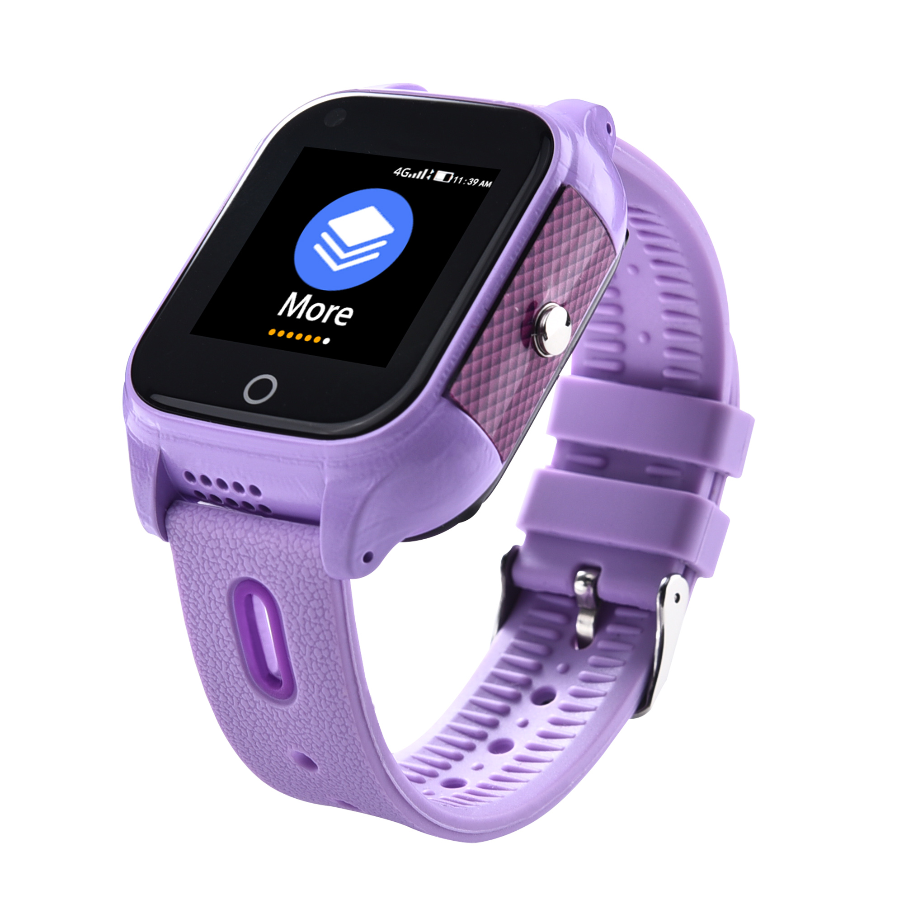

# iStartek - PT28

El iStartek PT28 es un reloj GPS 4G compacto diseñado para la seguridad personal y el seguimiento confiable en tiempo real. Combina posicionamiento multimodal con soporte AGPS para ofrecer actualizaciones frecuentes de ubicación y un historial de rutas, además de comunicación de voz bidireccional y una tecla SOS para emergencias. El PT28 está concebido como una solución portátil para la monitorización individual, con carcasa resistente al agua y un diseño ligero con pantalla táctil pensado para el uso diario.

Como dispositivo compatible con Plaspy, el PT28 puede enviar datos de ubicación, eventos y telemetría directamente a la plataforma Plaspy para monitoreo, alertas e informes. Esta compatibilidad lo convierte en una opción práctica para cuidadores y administradores que buscan seguimiento transparente sin integraciones complejas, mientras que los acuerdos de servidor del fabricante pueden reducir las tarifas periódicas de plataforma, dejando principalmente los costos del SIM por llamadas y datos.

## Aspectos destacados

- Compatible con Plaspy para seguimiento en tiempo real integrado, alertas e informes de historial de rutas.
- Posicionamiento multimodal: GPS, Beidou, Wi Fi y LBS con AGPS para fijaciones más rápidas y mejor precisión.
- Tecla SOS para llamada de emergencia y voz bidireccional para comunicación directa y respuesta rápida.
- Diseño IP67 resistente al agua con pantalla táctil IPS de 1.30 pulgadas y formato ligero y portátil.
- Telemetría de frecuencia cardíaca y conteo de pasos, y hasta tres meses de historial de rutas almacenado para revisión.
- Cámara integrada y monitoreo de voz remoto para mayor conocimiento de la situación.
- Opción de servidor provista por el fabricante que puede reducir costos continuos de plataforma, aunque siguen aplicando los gastos de SIM y datos.

## Cómo funciona con Plaspy

El PT28 transmite datos de ubicación y eventos a Plaspy para que la plataforma muestre posiciones en vivo, active alertas y almacene recorridos históricos para su análisis. Plaspy procesa la transmisión de ubicación del reloj, los eventos SOS y la telemetría disponible para apoyar el monitoreo, la respuesta a incidentes y la elaboración de informes. Los pasos de registro y autorización conectan el flujo de datos del dispositivo a Plaspy y habilitan las funciones de la plataforma para cuidadores y operadores.

- Actualizaciones de ubicación en tiempo real y telemetría visibles en los paneles y mapas de Plaspy.
- Eventos SOS y llamadas de emergencia presentados como alertas para notificación y respuesta inmediata.
- Almacenamiento y exportación de rutas históricas hasta por tres meses para revisión post evento.
- Monitoreo de voz remoto y llamadas bidireccionales registrados como eventos para facilitar la evaluación situacional.
- Alertas de geocercas y notificaciones de movimiento para apoyar la vigilancia perimetral y la supervisión operativa.

## Casos de uso típicos

- Monitoreo infantil y seguridad parental con alertas SOS y capacidad de comunicación bidireccional.
- Cuidado de adultos mayores y chequeos de bienestar mediante compartición de ubicación y telemetría de salud.
- Seguimiento de actividades al aire libre donde el rastreo portátil resistente al agua y el historial de rutas son valiosos.
- Uso en viajes e internacional con conectividad celular para operadores que necesitan visibilidad remota.
- Seguimiento temporal de personal para equipos pequeños y supervisión de trabajadores solitarios en labores de campo.

## Por qué elegir este rastreador con Plaspy

El PT28 facilita el seguimiento personal al combinar funciones de hardware diseñadas para uso en la muñeca con la visibilidad que ofrece la plataforma Plaspy. Su posicionamiento multimodal y las fijaciones asistidas por AGPS ayudan a mejorar el tiempo de obtención de la primera posición y la precisión en el día a día, mientras que la tecla SOS, la comunicación bidireccional y el historial de rutas almacenado brindan a cuidadores y administradores herramientas prácticas para responder y revisar incidentes. La opción de servidor proporcionada por el fabricante puede simplificar los costos de plataforma, dejando el consumo de llamadas y datos del SIM como el gasto operativo principal.

Si usted está evaluando rastreadores portátiles para la monitorización de personas en lugar de telemática vehicular, el PT28 es una opción compatible con Plaspy a considerar para despliegues orientados a la seguridad. Conozca más sobre Plaspy en el sitio principal https://www.plaspy.com. Las especificaciones del producto, la disponibilidad y los detalles del fabricante pueden cambiar con el tiempo, así que verifique las especificaciones y el soporte vigentes en el sitio oficial del fabricante https://istartek.com/.
